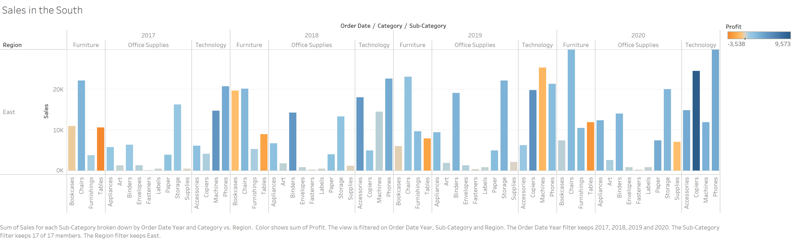
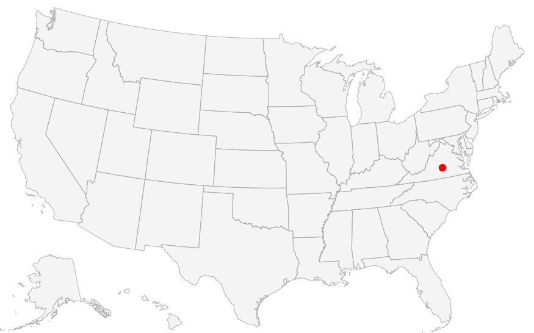
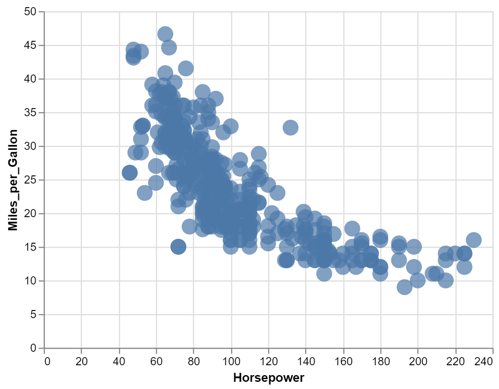
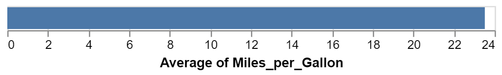

```{r setup, include=FALSE}
knitr::opts_chunk$set(echo = TRUE)
```

CS 625, Fall 2020


## Git, GitHub

1. *What is your GitHub username?*

  Nageshbvrch

2. *What is the URL of your remote GitHub repo (created through Mr. Kennedy's exercises)?*

  git@github.com: https://github.com/Nageshbvrch/cs625-fall-2020

## R

The command below will load the tidyverse package.  If you have installed R, RStudio, and the tidyverse package, it should display a list of loaded packages and their versions.
```{r}
library(tidyverse)
```

## R Markdown 

1. *Create an ordered bulleted list with at least 3 items*

  My Courses:

  * CS625: Data Visualization
  
  * CS620: Data Science
  
  * STAT603: Statistics for Data Science
  

2. *Write a paragraph that demonstrates the use of italics, bold, bold italics, and code.*

   I am **Nagesh Bheesetty**. I have mastered _**mathematics**_ and I like to explore new concepts and update my skills as and up to date. I understood _Data Visualization_ is one of the best means to update my skill set, because it involves a lot analytic skills.
   
```{r}  
  print("I Just started my coding")
```
 
```{r}
 ShortName = 'NASH'
```

3. *Create an example of a fenced code block.*

```{r}
 ShortName = 'NASH'
```

S.No | Name
---- | ----
1 | Anu
2 | Trivani
3 | Trupti
4 | Nash
 

4. *Create a level 4 heading*

#### My Courses: CS625,CS620, STAT603 
  

## R 

#### Data Visualization Exercises

1. *Run ggplot(data = mpg). What do you see?*

```{r}
ggplot(data = mpg)
```
   
    I could  see nothing. It just moved to next input entry.
   
   
2. *How many rows are in mpg? How many columns?*

    There are 234 rows and 11 columns.  "234 X 11"

  

3. *What does the drv variable describe? Read the help for ?mpg to find out.*
   
   The "drv" variable describes the type of drive train, where f = front-wheel drive, r = rear wheel drive, 4 = 4wd

4. *Make a scatterplot of hwy vs cyl.*

```{r}
 ggplot(data = mpg) + 
  geom_point(mapping = aes(x = cyl, y = hwy, color = class))
```

5. *What happens if you make a scatterplot of class vs drv? Why is the plot not useful?*

```{r}
 ggplot(data = mpg) + 
  geom_point(mapping = aes(x = class, y = drv, color = class))
```
The plot is not useful because there is no proper comparison between the attributes on x and y axis. 

#### Workflow: basics Exercises

1. *Why does this code not work?*

```r
my_variable <- 10
my_varıable
```
The code does not work because in the my_variable "i" is typed as "1" and r should be {r}.

```{r}
my_variable <- 10
my_variable
```
2. *Tweak each of the following R commands so that they run correctly:*

```r
library(tidyverse)

ggplot(data = mpg) + 
  geom_point(mapping = aes(x = displ, y = hwy))

fliter(mpg, cyl = 8)
filter(diamond, carat > 3)
```

```{r}
library(tidyverse)

ggplot(data = mpg) + 
  geom_point(mapping = aes(x = displ, y = hwy))

filter(mpg, cyl == 8)
filter(diamonds, carat > 3)
```

3. *Press Alt + Shift + K. What happens? How can you get to the same place using the menus?*

  I could see Keyboard Shortcut  Quick references. A list all    shortcut keys, this is very helpful.

## Tableau

*Insert your the image of your final bar chart here*
  
  Sales in the East

  

1. *What conclusions can you draw from the chart?*

We could distinguish the sales of various products in different regions and analyze which product sales has increased and dropped year by year.


## Observable and Vega-Lite

### A Taste of Observable

1. *In the "New York City weather forecast" section, try replacing `Forecast: detailedForecast` with `Forecast: shortForecast`. Then press the blue play button  or use Shift-Return to run your change. What happens?*


 I have noticed that the weather forecast table above reacted, displaying a shortForecast instead of the detailedForecast that it is contained previously. The information under forecast is short.
 

1. *Under the scatterplot of temperature vs. name, try replacing `markCircle()` with `markSquare()`. Then press the blue play button  or use Shift-Return to run your change. What happens? How about `markPoint()`?*


 
The circles in the graph changes to squares.

1. *Under "Pick a location, see the weather forecast", pick a location on the map.  Where was the point you picked near?*

 
The weather forecast displayed the city and state of the coordinates of the point selected on the map and the weather forecast ot the selected city.

**Forecasted temperature chart for Farmville, VA**

1. *The last visualization on this page is a "fancy" weather chart embedded from another notebook.  Click on the 3 dots next to that chart and choose 'Download PNG'.  Insert the PNG into your report.*


### Charting with Vega-Lite

1. *Pass an option of { size: 200 } to markCircle().*



1. *Try markSquare instead of markCircle.*


1. *Try markPoint({ shape: 'diamond' }).*


1. *Change Horsepower to Acceleration*


1. *Swap what fields are displayed on the x- and y-axis* 


1. *Change Name to Origin.*


1. *Remove the vl.y().fieldN("Origin") line.*


1. *Replace count() with average("Miles_per_Gallon").*



## References

*Insert the list of sites you used as references as an unordered list with named links here.  This is required.*

https://r4ds.had.co.nz/model-intro.html

https://observablehq.com/@observablehq/a-taste-of-observable

https://r4ds.had.co.nz/data-visualisation.html#exercises

https://observablehq.com/@observablehq/vega-lite


https://help.tableau.com/current/guides/get-started-tutorial/en-us/get-started-tutorial-home.htm

https://www.earthdatascience.org/courses/earth-analytics/document-your-science/add-images-to-rmarkdown-report/

https://r4ds.had.co.nz/introduction.html#the-tidyverse

https://r4ds.had.co.nz/r-markdown.html

https://r4ds.had.co.nz/introduction.html#running-r-code
