Homework 1
================
Nagesh Bheesetty

CS 625, Fall 2020

## Git, GitHub

1.  *What is your GitHub username?*

Nageshbvrch

2.  *What is the URL of your remote GitHub repo (created through
    Mr. Kennedy’s exercises)?*

<git@github.com>: <https://github.com/Nageshbvrch/cs625-fall-2020>

## R

The command below will load the tidyverse package. If you have installed
R, RStudio, and the tidyverse package, it should display a list of
loaded packages and their versions.

``` r
library(tidyverse)
```

    ## Warning: package 'tidyverse' was built under R version 4.0.3

    ## -- Attaching packages --------------------------------------- tidyverse 1.3.0 --

    ## v ggplot2 3.3.2     v purrr   0.3.4
    ## v tibble  3.0.3     v dplyr   1.0.2
    ## v tidyr   1.1.2     v stringr 1.4.0
    ## v readr   1.3.1     v forcats 0.5.0

    ## Warning: package 'ggplot2' was built under R version 4.0.3

    ## -- Conflicts ------------------------------------------ tidyverse_conflicts() --
    ## x dplyr::filter() masks stats::filter()
    ## x dplyr::lag()    masks stats::lag()

## R Markdown

1.  *Create an ordered bulleted list with at least 3 items*

My Courses:

  - CS625: Data Visualization

  - CS620: Data Science

  - STAT603: Statistics for Data Science

<!-- end list -->

2.  *Write a paragraph that demonstrates the use of italics, bold, bold
    italics, and code.*
    
    I am **Nagesh Bheesetty**. I have mastered ***mathematics*** and I
    like to explore new concepts and update my skills as and up to date.
    I understood *Data Visualization* is one of the best means to update
    my skill set, because it involves a lot analytic skills.

<!-- end list -->

``` r
  print("I Just started my coding")
```

    ## [1] "I Just started my coding"

``` r
 ShortName = 'NASH'
```

3.  *Create an example of a fenced code block.*

<!-- end list -->

``` r
 ShortName = 'NASH'
```

| S.No | Name    |
| ---- | ------- |
| 1    | Anu     |
| 2    | Trivani |
| 3    | Trupti  |
| 4    | Nash    |

4.  *Create a level 4 heading*

#### My Courses: CS625,CS620, STAT603

## R

#### Data Visualization Exercises

1.  *Run ggplot(data = mpg). What do you see?*

<!-- end list -->

``` r
ggplot(data = mpg)
```

<!-- -->

    I could  see nothing. It just moved to next input entry.

2.  *How many rows are in mpg? How many columns?*
    
    There are 234 rows and 11 columns. “234 X 11”

3.  *What does the drv variable describe? Read the help for ?mpg to find
    out.*
    
    The “drv” variable describes the type of drive train, where f =
    front-wheel drive, r = rear wheel drive, 4 = 4wd

4.  *Make a scatterplot of hwy vs cyl.*

<!-- end list -->

``` r
 ggplot(data = mpg) + 
  geom_point(mapping = aes(x = cyl, y = hwy, color = class))
```

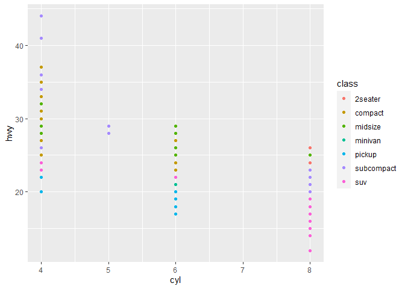<!-- -->

5.  *What happens if you make a scatterplot of class vs drv? Why is the
    plot not useful?*

<!-- end list -->

``` r
 ggplot(data = mpg) + 
  geom_point(mapping = aes(x = class, y = drv, color = class))
```

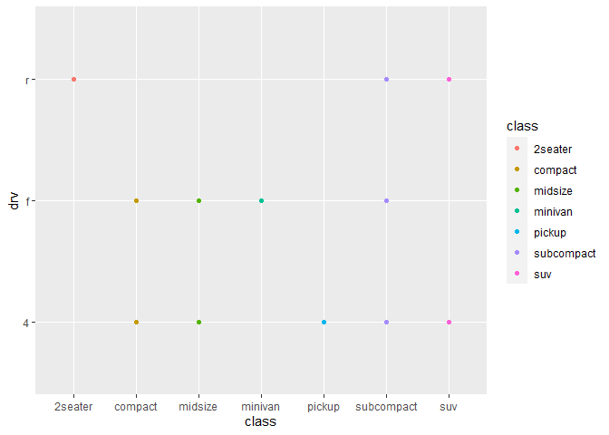<!-- --> The plot is
not useful because there is no proper comparison between the attributes
on x and y axis.

#### Workflow: basics Exercises

1.  *Why does this code not work?*

<!-- end list -->

``` r
my_variable <- 10
my_varıable
```

The code does not work because in the my\_variable “i” is typed as “1”
and r should be {r}.

``` r
my_variable <- 10
my_variable
```

    ## [1] 10

2.  *Tweak each of the following R commands so that they run correctly:*

<!-- end list -->

``` r
library(tidyverse)

ggplot(data = mpg) + 
  geom_point(mapping = aes(x = displ, y = hwy))

fliter(mpg, cyl = 8)
filter(diamond, carat > 3)
```

``` r
library(tidyverse)

ggplot(data = mpg) + 
  geom_point(mapping = aes(x = displ, y = hwy))
```

<!-- -->

``` r
filter(mpg, cyl == 8)
```

    ## # A tibble: 70 x 11
    ##    manufacturer model     displ  year   cyl trans  drv     cty   hwy fl    class
    ##    <chr>        <chr>     <dbl> <int> <int> <chr>  <chr> <int> <int> <chr> <chr>
    ##  1 audi         a6 quatt~   4.2  2008     8 auto(~ 4        16    23 p     mids~
    ##  2 chevrolet    c1500 su~   5.3  2008     8 auto(~ r        14    20 r     suv  
    ##  3 chevrolet    c1500 su~   5.3  2008     8 auto(~ r        11    15 e     suv  
    ##  4 chevrolet    c1500 su~   5.3  2008     8 auto(~ r        14    20 r     suv  
    ##  5 chevrolet    c1500 su~   5.7  1999     8 auto(~ r        13    17 r     suv  
    ##  6 chevrolet    c1500 su~   6    2008     8 auto(~ r        12    17 r     suv  
    ##  7 chevrolet    corvette    5.7  1999     8 manua~ r        16    26 p     2sea~
    ##  8 chevrolet    corvette    5.7  1999     8 auto(~ r        15    23 p     2sea~
    ##  9 chevrolet    corvette    6.2  2008     8 manua~ r        16    26 p     2sea~
    ## 10 chevrolet    corvette    6.2  2008     8 auto(~ r        15    25 p     2sea~
    ## # ... with 60 more rows

``` r
filter(diamonds, carat > 3)
```

    ## # A tibble: 32 x 10
    ##    carat cut     color clarity depth table price     x     y     z
    ##    <dbl> <ord>   <ord> <ord>   <dbl> <dbl> <int> <dbl> <dbl> <dbl>
    ##  1  3.01 Premium I     I1       62.7    58  8040  9.1   8.97  5.67
    ##  2  3.11 Fair    J     I1       65.9    57  9823  9.15  9.02  5.98
    ##  3  3.01 Premium F     I1       62.2    56  9925  9.24  9.13  5.73
    ##  4  3.05 Premium E     I1       60.9    58 10453  9.26  9.25  5.66
    ##  5  3.02 Fair    I     I1       65.2    56 10577  9.11  9.02  5.91
    ##  6  3.01 Fair    H     I1       56.1    62 10761  9.54  9.38  5.31
    ##  7  3.65 Fair    H     I1       67.1    53 11668  9.53  9.48  6.38
    ##  8  3.24 Premium H     I1       62.1    58 12300  9.44  9.4   5.85
    ##  9  3.22 Ideal   I     I1       62.6    55 12545  9.49  9.42  5.92
    ## 10  3.5  Ideal   H     I1       62.8    57 12587  9.65  9.59  6.03
    ## # ... with 22 more rows

3.  *Press Alt + Shift + K. What happens? How can you get to the same
    place using the menus?*

I could see Keyboard Shortcut Quick references. A list all shortcut
keys, this is very helpful.

## Tableau

*Insert your the image of your final bar chart here*

Sales in the East

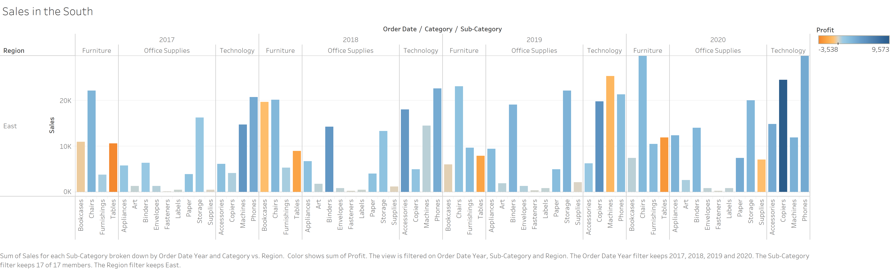

1.  *What conclusions can you draw from the chart?*

We could distinguish the sales of various products in different regions
and analyze which product sales has increased and dropped year by year.

## Observable and Vega-Lite

### A Taste of Observable

1.  *In the “New York City weather forecast” section, try replacing
    `Forecast: detailedForecast` with `Forecast: shortForecast`. Then
    press the blue play button or use Shift-Return to run your change.
    What happens?*

I have noticed that the weather forecast table above reacted, displaying
a shortForecast instead of the detailedForecast that it is contained
previously. The information under forecast is short.

1.  *Under the scatterplot of temperature vs. name, try replacing
    `markCircle()` with `markSquare()`. Then press the blue play button
    or use Shift-Return to run your change. What happens? How about
    `markPoint()`?*

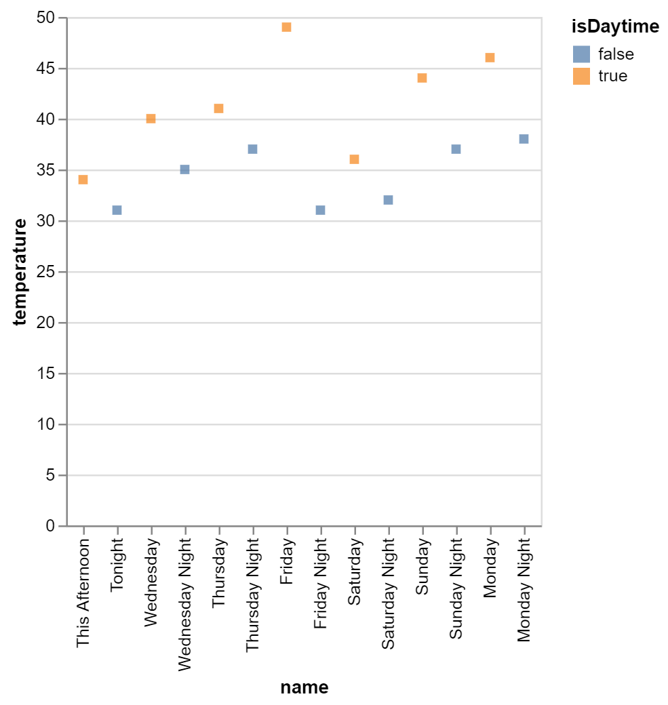 The
circles in the graph changes to squares.

1.  *Under “Pick a location, see the weather forecast”, pick a location
    on the map. Where was the point you picked near?*

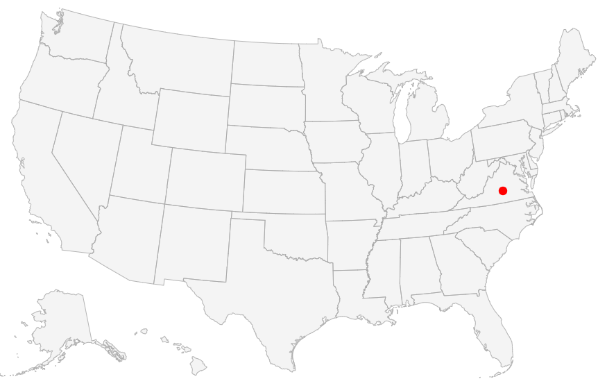 The weather
forecast displayed the city and state of the coordinates of the point
selected on the map and the weather forecast ot the selected city.

**Forecasted temperature chart for Farmville, VA**

1.  *The last visualization on this page is a “fancy” weather chart
    embedded from another notebook. Click on the 3 dots next to that
    chart and choose ‘Download PNG’. Insert the PNG into your report.*


### Charting with Vega-Lite

1.  *Pass an option of { size: 200 } to markCircle().*

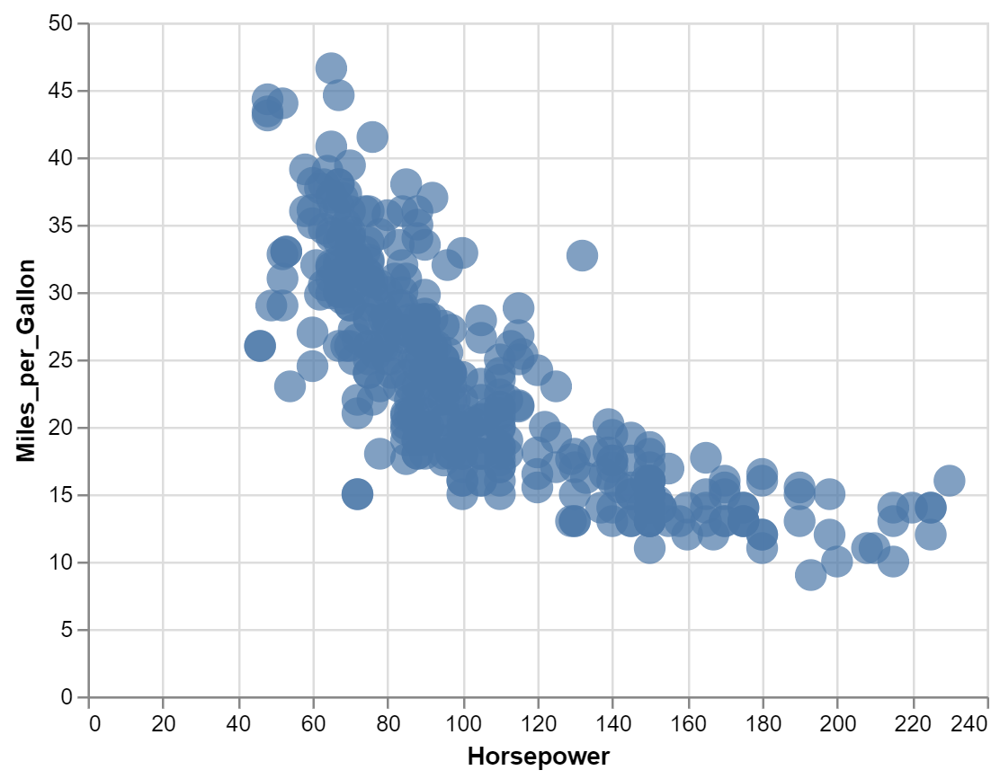

1.  *Try markSquare instead of markCircle.*

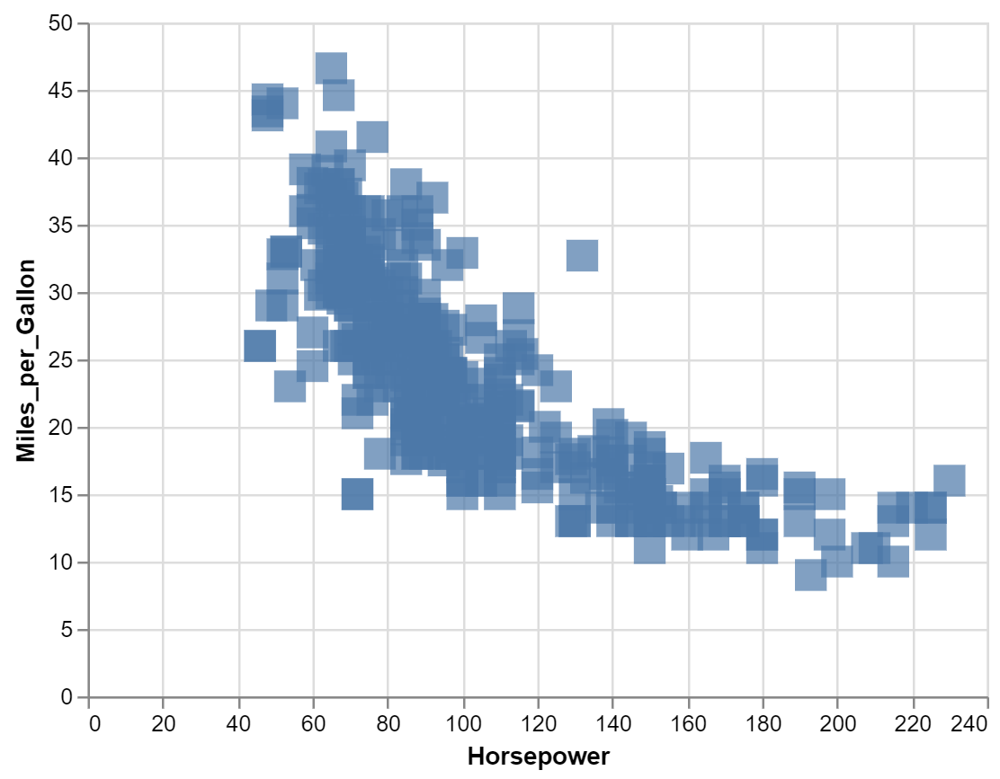

1.  *Try markPoint({ shape: ‘diamond’ }).*

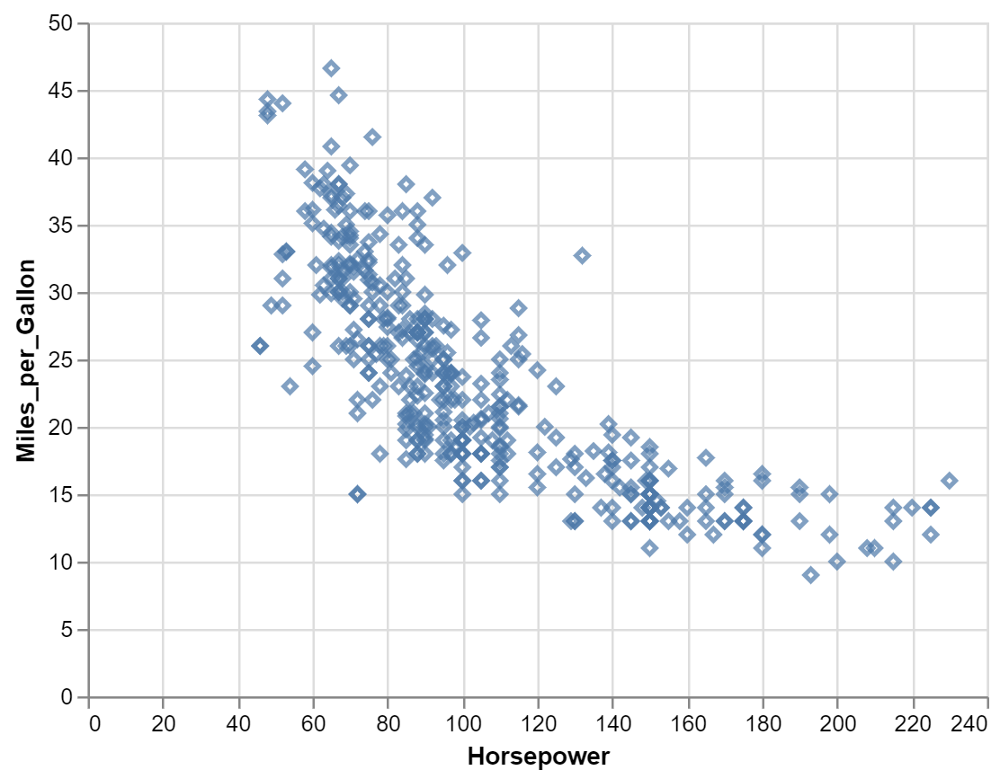

1.  *Change Horsepower to Acceleration*

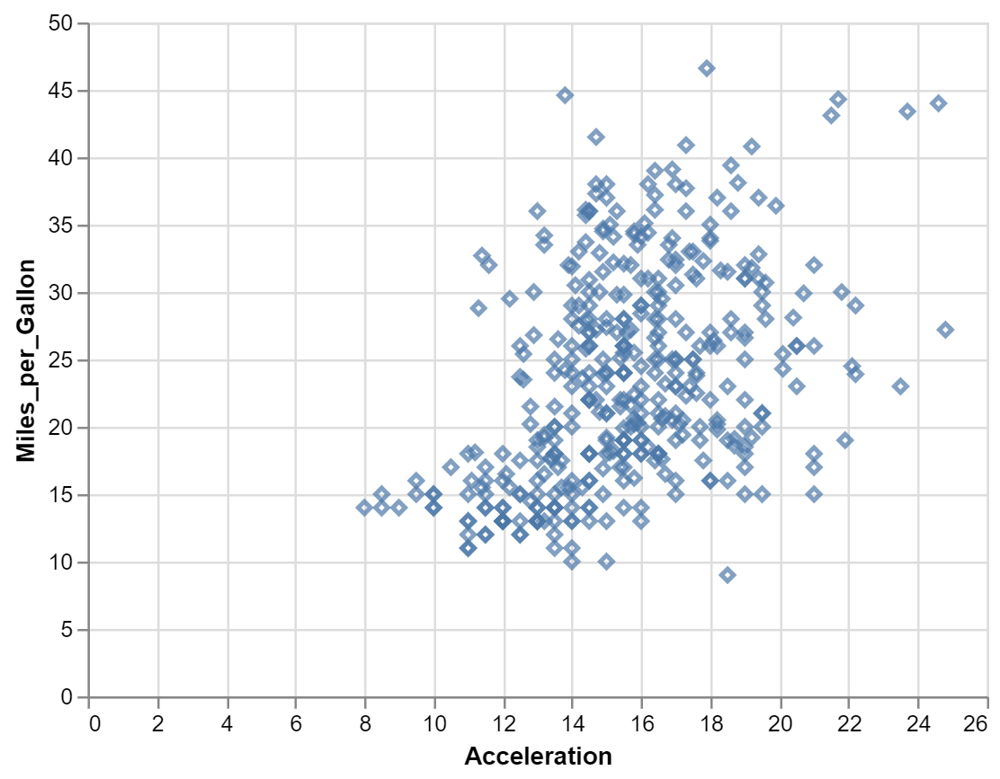

1.  *Swap what fields are displayed on the x- and y-axis*


1.  *Change Name to Origin.*

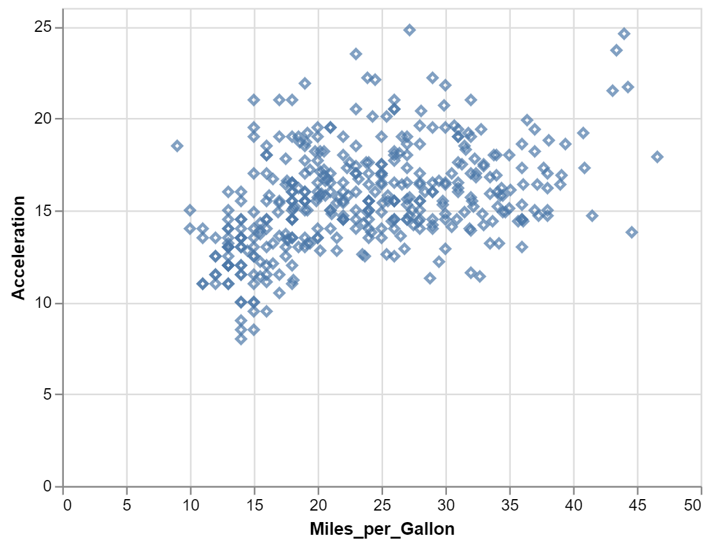

1.  *Remove the vl.y().fieldN(“Origin”) line.*

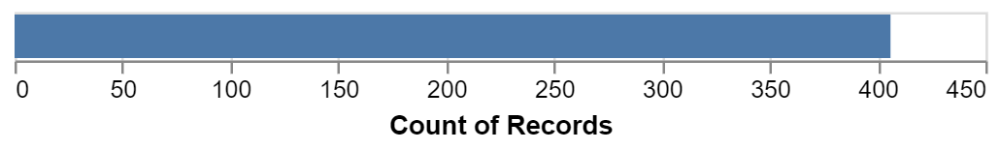

1.  *Replace count() with average(“Miles\_per\_Gallon”).*

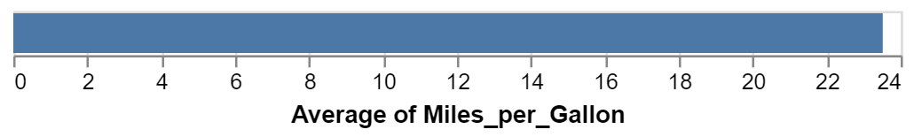

## References

*Insert the list of sites you used as references as an unordered list
with named links here. This is required.*

<https://r4ds.had.co.nz/model-intro.html>

<https://observablehq.com/@observablehq/a-taste-of-observable>

<https://r4ds.had.co.nz/data-visualisation.html#exercises>

<https://observablehq.com/@observablehq/vega-lite>

<https://help.tableau.com/current/guides/get-started-tutorial/en-us/get-started-tutorial-home.htm>

<https://www.earthdatascience.org/courses/earth-analytics/document-your-science/add-images-to-rmarkdown-report/>

<https://r4ds.had.co.nz/introduction.html#the-tidyverse>

<https://r4ds.had.co.nz/r-markdown.html>

<https://r4ds.had.co.nz/introduction.html#running-r-code>
