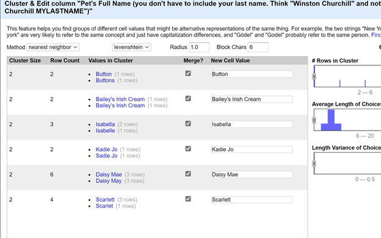

Homework 2
================
Nagesh Bheesetty

CS 625, Fall 2020

## Git, GitHub

### Part-1:

The data set consists of 1784 rows and the 6 visible columns:

| S.No. | Time stamp | Kind of pets | Pets full name | Pets every day name | Pets Breeds |
| ----- | ---------- | ------------ | -------------- | ------------------- | ----------- |

I Initially made a mistake in the process of cleaning the data. I was
attracted by first question “How many kinds of pets are there?” and I
started cleaning the column “What kind of pets?”.

I finally understood that the task is not about finding Dogs or cats, it
is all about cleaning the data. In the process of cleaning the data I
performed several operations and and functions in different steps.

The date in each of the columns has a lot of mess.

The most common errors in the cells are:

  - Spell check
  - Repeated Names
  - Lower case and Upper case
  - Extra symbols
  - many more

I could identify the above errors and I made all possible changes using
several steps to make the data as clean as possible.

#### \* Step-1: Cluster and Edit in Edit cells

#### \* Step-2: (Facet –\> Text facet)

#### \* Step-3: Value.replace(“Present Value”, “new value”)

#### \* Step-4: If(not(value == " some name“),”required name", value)

#### \* Step-5: toNumber(value.replace(“month”,""))/12.0

``` p
Step-1,2,and 3: I learned them in the class tutorial.
Step-4: I learned it from one of my friends.
Step-5: I found it in online sources.
```

#### Step-1: (Cluster and Edit)

After uploading the data set in the openRefine, In each of the columns,
I choose “Cluster and Edit” in “Edit cells”. This feature helped in
finding different groups of cells that might have alternative
representation of same type. In this feature I found there are three
main methods.

  - key collision
  - nearest neighbor-levenshtein
  - nearest neighbor-ppm I am attaching a copy of one each from
    different edits.


#### Edit cells –\> Cluster and Edit –\> key collision

*This is a default view on the when I choose Cluster and Edit.*

By performing this operation tones of redundant data has been grouped
and replaced with unique names.


#### Edit cells –\>Cluster and Edit–\>nearest neighbor-levenshtein

I further choose the nearest neighbor and ppm, by which the many other
nearest names were clustered.

``` p
I performed the same operations on other coulmns and I could clean most of the data.
```



#### Edit cells –\> Cluster and Edit –\> nearest neighbor-ppm


*By performing this operation, the number of pet choices reduced to 35.*

#### Step-2: (Facet –\> Text facet)

I performed **Facet–\>Test Facet** to clean the cells in the columns
that contain *“What kind of pet is this”* and *“Pets Breeds”*. I
initially started with “What kind of Pets” and I have to perform several
edits to clean the data. In this stage I manually edited a lot of
choices and after a several steps I found that I can perform some easy
methods to clean a lot of data with a simple commands.


In this step I found the pets names and pets breeds were misplaced. \* I
found them on the internet (Google search)and replaced them with
appropriate names. \* For example I understood “Katze” is Cat in German.
\* Gerbil is a mouse (Rodent family) \* There are a few names common for
dogs and cats, I could figure it out by their breed names. \* In the
choices others, I could find the pet type by looking through the pets
breed.

 There is one choice(Row) which has
3 dogs and one cat. I Choose Edit cells and split cells. So I could
split one row in to 4 rows.

 

``` p
Now the number of rows are 1787.
```


 I understood tortoise belongs to
turtle family, so I combined them.

I combined all the fish in one family.

 After finishing the kind of pets,
I cleaned the pets breeds. In this stage I have to repeat the similar
operations and cleaning methods to clean the data.

I found that Labrador and Labrador retriever are same, so I replaced
them and made them as one. For this I used Value.replace() and replaced
most of them.

 I found there are different
versions of Shih Tzu in breeds and I could replace all of them with one
simple formula.

By using *if(not(value == “ some name which is not in the list”), “
Required name”, value)*

Now, 34 cells have been replaced with Shih Tzu.

 I replace all the empty cells
with “Unknown”.

 Next, I started working with the
age which I intentionally kept it for final cleaning because I
understood there is no consistence in the age.

``` p
I have decided to convert all the numbers to years and for this I looked for formulas to convert all the numbers to years.
```

The age column has information in different forms: \* Years ( yrs, y,
Years, years etc.,) \* months (mo, mos, etc.,) \* weeks \* A lot of
symbols \* in words ( seven eight) \* many more

I initially identified Non\_numeric data and cleaned the data to
maintain numeric consistency.

After these operations I have 105 non-numeric values.


I used value.replace() and converted some of the data in to numenric.

``` p
value.replace("½",".5").replace("1/2",".5").replace(",",".").replace("old","")
```


I converted months and weeks to years by using formulas.

``` p

toNumber(value.replace("weeks","").replace("week","").replace(" ",""))/52.0
```

I am now left with 42 Non-Number cells, so I performed.

``` p
toNumber(value.replace("months","").replace("mos","").replace("mo",""))/12
```


Initially I could not replace the symbol . However, I could finally
delete it.

## 

## *This is the end of my data cleaning. The remaining part consists of answers to the questions based on the related outputs.*

# Part-2:

### 1\. How many types (kinds) of pets are there?

It appears as if there are 20 kinds of pets, but “Others” are filtered
that are not pets (ex: car, server..). Excluding ‘Others’, *there are 19
kinds of pets in total*.


### 2\. How many dogs?

There are *1131 dogs* in total as shown in below figure.


### 3\. How many breeds of dogs?

I chose dogs option under “What kind of pets” column, then under pets
breed, I chose facets –\>text facets it the output showed 243 choices
for dog breeds. Excluding the “Unknown” option, there are *242 dog
breeds in total*.


### 4\. What’s the most popular dog breed?

I chose dogs option under “What kind of pets” column, then under pets
breed, I chose facets –\>text facets it the output showed 243 choices
for dog breeds. By clicking on the “Choices” and choosing the “sort by
count” option gave the list of dogs along with their numbers. As shown
in the image below, \*\_“Golden Retriever” is the most popular dog
breed\*\_.


### 5\. What’s the age range of the dogs?

I have manipulated “age” data so that all the ages can be converted into
years. In the “Pets age” column I chose “Sort” option and selected the
“number” and “largest first” options. As shown in the picture the
largest age is 22 years. When the option “reverse” is selected in the
sort, the smallest age of dogs is 0.04 years. *Finally the age range is
22 years to 0.04 years*.

 

### 6\. What’s the age range of the guinea pigs?

The age range of guinea pigs is *1 year to 5 years*.


### 7\. What is the oldest pet?

By sorting the pets age from largest value to the least value, the
oldest pet is a *Cat with an age of 24 years*.


### 8\. Which are more popular, betta fish or goldfish? How many of each?

*Betta fish are 14 and gold fish are 9. Evidently, “Betta fish” are more
popular*.


### 9\. What’s the most popular everyday name for a cat?

By choosing the “Sort by name” option, *“Kitty” is the most popular
everyday name for a a cat*.


### 10\. What’s the most popular full name for a dog?

*The most popular full name for a dog is Maggie*


## References

*Insert the list of sites you used as references as an unordered list
with named links here. This is required.*

<https://r4ds.had.co.nz/model-intro.html>

<https://observablehq.com/@observablehq/a-taste-of-observable>

<https://r4ds.had.co.nz/data-visualisation.html#exercises>

<https://observablehq.com/@observablehq/vega-lite>

<https://help.tableau.com/current/guides/get-started-tutorial/en-us/get-started-tutorial-home.htm>

<https://www.earthdatascience.org/courses/earth-analytics/document-your-science/add-images-to-rmarkdown-report/>

<https://r4ds.had.co.nz/introduction.html#the-tidyverse>

<https://r4ds.had.co.nz/r-markdown.html>

<https://r4ds.had.co.nz/introduction.html#running-r-code>
