```{r setup, include=FALSE}
knitr::opts_chunk$set(echo = TRUE)
```

CS 625, Fall 2020


### Part-1:

# Reports:

The file "VDH-COVID-19-PublicUseDataset-Tests_by-LabReportDate" was downloaded from the provided source and uploaded the same in the excel, Tableau, and Vega-lite. I was not able to replicate the same in the R.


_**Question1**_:

_How does the percentage of positive PCR tests over time compare for Norfolk, Chesapeake, and Virginia Beach?_

Before heading to generate graphs for question 1, I filtered data according to the requirements. I choose Norfolk, Virginia Beach, and Chesapeake within the given period.
According to the data, the COVID cases were reported from Jan-2020, however, for Norfolk, Virginia Beach, and Chesapeake the cases were reported from March-2020.
I could choose the appropriate marks and channels to generate an idiom as line graph.


I found working on the excel to be convenient for data visualization and was able to identify the marks and channels clearly. The color concentrations are easy to manipulate.


## Tableau:

I found Tableau to be user-friendly as well.  On the Tableau, I could choose the required axis and labels, but I could not generate the output as expected for all the questions. The following are the problems I faced while working on Tableau.
I could not generate all the variety of graphs on the Tableau as I could do on the spreadsheet. I was not able to slice the required rows on the tableau. I found the color channels options are limited or they were selected by default.


_I must work more and get familiarize with the tableau._


_Though the total data shows that the number of PCR tests are encountered from January 2020, however for the selected health districts “Norfolk, Virginia Beach and Chesapeake" the tests were encountered from March-2020._ 


I could upload the file in the Vega-lite, I could generate an output to see the header of the table.
I could make a line graph and bar graph. I am still not familiar in generating mixed graphs which I could do on the excel spreadsheet.


### Step-1:

I used spreadsheet (PIVOT tables) to generate graphs. 
First, the *idiom* I used to compare the three chosen cities (Norfolk, Virginia beach, and Chesapeake) is a **“Mixed-graph”**.

### Mixed Graph:
A stacked bar-graph and a line graph.


I chose a stacked bar-graph to compare the number of PCR tests encountered and the number of positive PCR tests encountered.
A line graph to compare the percentage of positive PCR tests encountered in the selected three health districts.

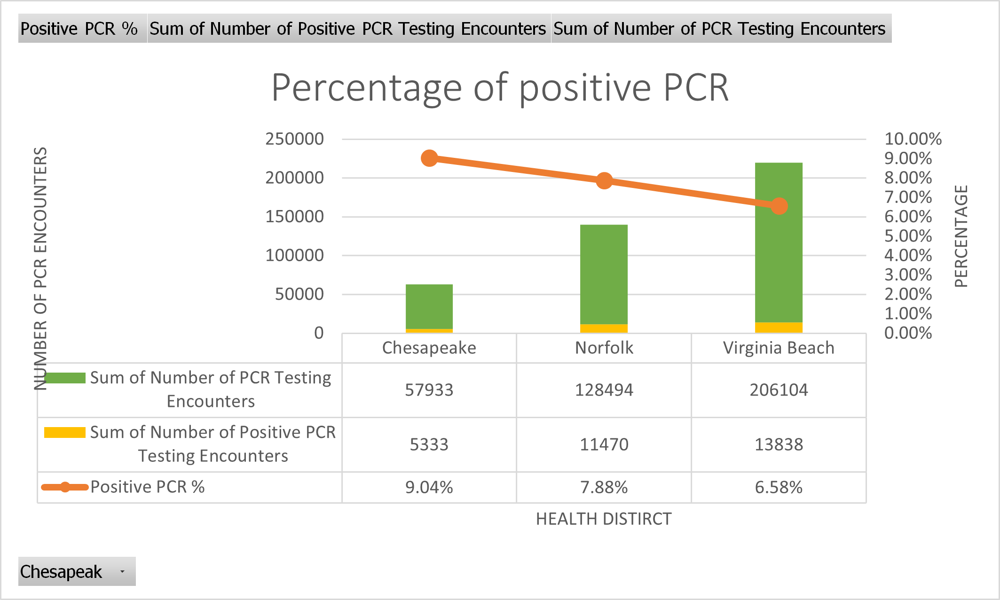


The above graph shows the sum of number of positive PCR testing encounters (shown in blue color) against sum of number of PCR testing counters (shown in orange color). In the graph, it appears as if Virginia Beach has highest number of positive cases, but if we observe analytically, Chesapeake has highest number of positive PCR test versus PCR tests. Nevertheless, Virginia Beach has highest number of PCR tests and positive PCR tests, followed by Norfolk, and then Chesapeake. However, the percentage of positive PCR tests encountered in Chesapeake is much greater followed by Norfolk and Virginia Beach.

_In either of the cases Norfolk stands in the center of Chesapeake and Virginia Beach._

#### Observations:

In the above mixed graph, I could compare the number of PCR tests encountered, the number of positive PCR tests encountered and the percentage of positive PCR tests that are mentioned in the three health districts "**Norfolk, Virginia Beach, and Chesapeake**". 

#### Marks and channels:

*x-axis*: The three health districts "Norfolk, Virginia Beach and Chesapeake"

*y-axis (left)*: Number of PCR tests encountered.

*y-axis (Right)*: Percentage of positive PCR tests encountered in the three health districts.

*Colors*: I chose yellow and green colors *channel* for stacked graph since they are contrast colors to distinguish, the line color is auto chosen.


#### Remarks:

  * The trend in each month is missing.
  * The percentage of positive PCR tests cannot be assessed for each month in the given period.

### Step-2: 

For the next graph, I have taken the percentages of sum of positive PCR tests for Chesapeake, Norfolk, and Virginia Beach on monthly duration basis, starting from March 20th. 
I calculated the percentages by dividing the positive PCR testing encounters over the number of PCR testing encounters. 
The color code specifically shows the comparison of three cities for each month.


Before heading to generate graphs for question 1, I filtered data according to the requirements. I choose Norfolk, Virginia Beach, and Chesapeake within the given period.
According to the data, the COVID cases were reported from Jan-2020, however, for Norfolk, Virginia Beach, and Chesapeake the cases were reported from march-2020.
I could choose the appropriate marks and channels to generate an idiom as line graph.

I used spreadsheet (PIVOT tables) to generate graphs. 
First, the idiom I used to compare the three chosen cities (Norfolk, Virginia beach, and Chesapeake) is a “Bar-graph”.


The above graph shows the sum of number of positive PCR testing encounters (shown in blue color) against sum of number of PCR testing counters (shown in orange color). In the graph, it appears as if Virginia Beach has highest number of positive cases, but if we observe analytically, Chesapeake has highest number of positive PCR test versus PCR tests. Nevertheless, Virginia Beach has highest number of PCR tests and Positive PCR tests, followed by Norfolk, and then Chesapeake.


For the next graph, I have taken the percentages of sum of positive PCR tests for Chesapeake, Norfolk, and Virginia Beach on monthly duration basis, starting from March 20th. 
I calculated the percentages by dividing the positive PCR testing encounters over the number of PCR testing encounters. 
The color code specifically shows the comparison of three cities for each month.


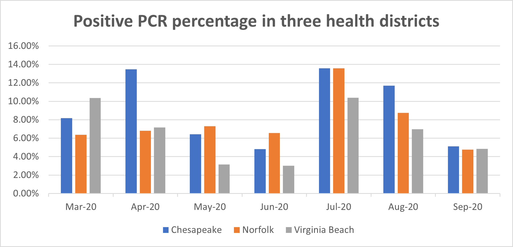


Above graph indicates that during March, Virginia Beach has highest percentage of positive PCR test cases but was the lowest of the three health districts in the later months. After March, during some months Chesapeake has highest percentage and for some months Norfolk has the highest. Interestingly, in the month of July all the three health districts have surge in the positive percentage. We might assume that phase-2 lock-down release might have contributed to this surge. In the month of September-2020 almost all the three health districts remained the same.

#### Marks and channels:

*x-axis*: Months from March through September"

*y-axis*: Percentage of number of PCR tests encountered.

*Colors*: The colors were auto chosen, and I felt they are distinguishable.


#### Observations:

In this bar graph, I could observe the percentage of PCR tests encountered for each month, but it is not so easy to distinguish the percentage change in consecutive months and the other months. 


#### Remarks:

  * The trend in comparing the positive PCR throughout the months is unclear.
  * The percentage of positive PCR tests cannot be easily compared for different months in the given period.


### Step-3: 

I realized that a line graph would be more appropriate to make a perfect trend and I created three different line charts. In the first one I created is comparing the trend, however I could not identify the numbers very clearly.
In the second graph I eliminated the blank spaces and the **outliers**, so that the trend is clearer.
Finally, I filtered the data averaging the month wise data in which the trend is more appropriate.


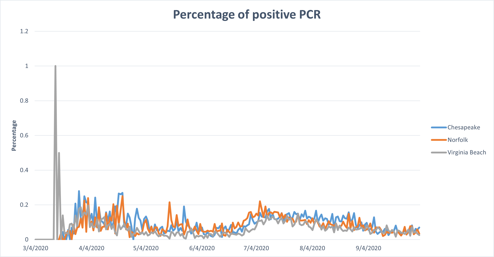


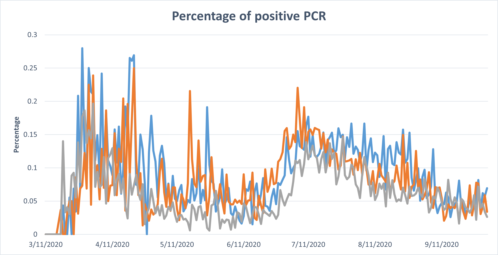


Above graph indicates that during March Virginia beach has highest percentage of positive PCR test cases, but was the lowest of the three health districts in the later months. After March, during some months Chesapeake has highest percentage and for some months Norfolk has the highest. Interestingly, in the month July all of the three health districts has surge in the positive percentage. We might make an assumption that phase 2 lockdown release might have contributed to this surge.  


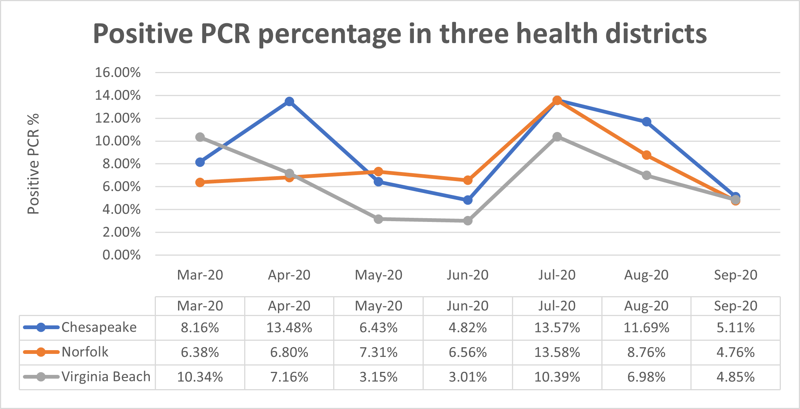


In the above three graphs the trend in the percentage of positive PCR tests encountered form March to September is very significant. 

#### Marks and channels:

*x-axis*: Months from March through September.

*y-axis*: Percentage of number of PCR tests encountered.

*Colors*: The colors were auto chosen, and I felt they are distinguishable.


#### Observations:

  * In this line graphs, I could observe the percentage of positive PCR tests encountered for each month and it is easy to distinguish the percentage change in consecutive months and the other months.
  * All the three health districts started with different percentage of positive PCR tests.
  * In the month of April, the positive PCR tests for Chesapeake spiked up.
  * In the month of July, the percentage of positive PCR tests spiked up for all the three health districts.
  * July through September the trend went down for all the health districts.
  * In the month of September all the three health districts were almost the same, approximately 5%.
  


## Tableau:

I recreated the same **line graph** using _Tableau_ and the trend is almost the same and the colors were auto selected, and they were almost the same colors as in the spreadsheet.


## Tableau:


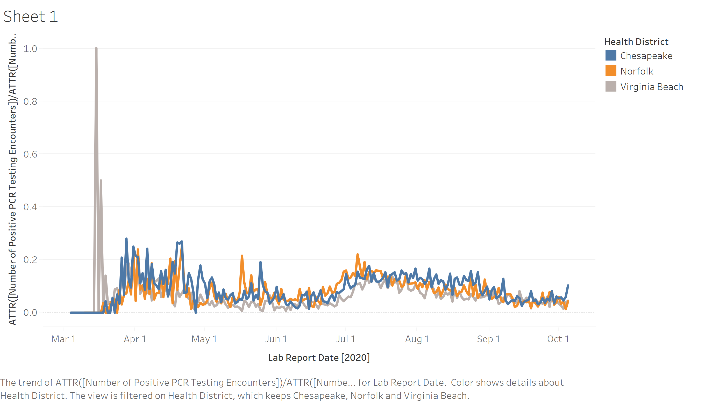
https://prod-useast-a.online.tableau.com/#/site/oducs625/views/part1_solution/Sheet1?:iid=1

## Vega-lite:

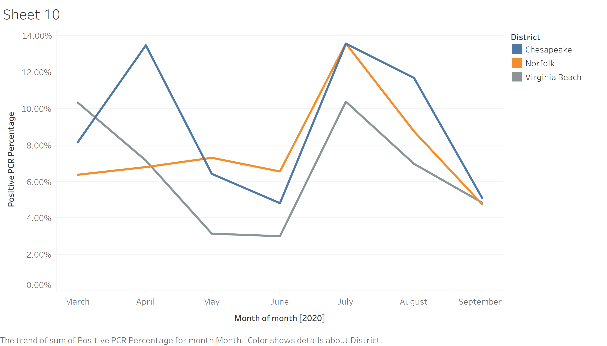

## Vega-lite:

I further recreated the same **line graph** using _Vega-Lite_ and the trend is almost the same and the colors were auto selected, and they were almost the same colors as in the spreadsheet. However, the graph is stretched, and it does not look appealing.


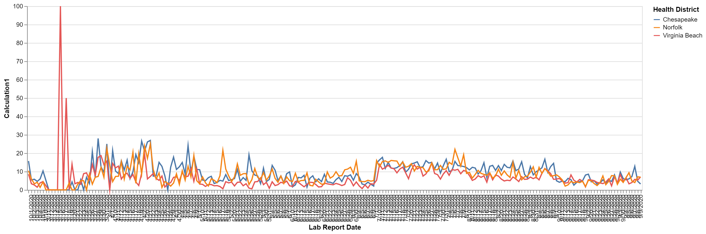


**Observations:**

* In this view the x-axis is very illegible and I could not identify the values.
* The colors were auto chosen, and I could recreate the colors that are visible in _"Spreadsheet"_ and _"Tableau"_


I further went forward to recreate the graphs in different idioms to visualize the data and understood the line graphs were most appropriate. 


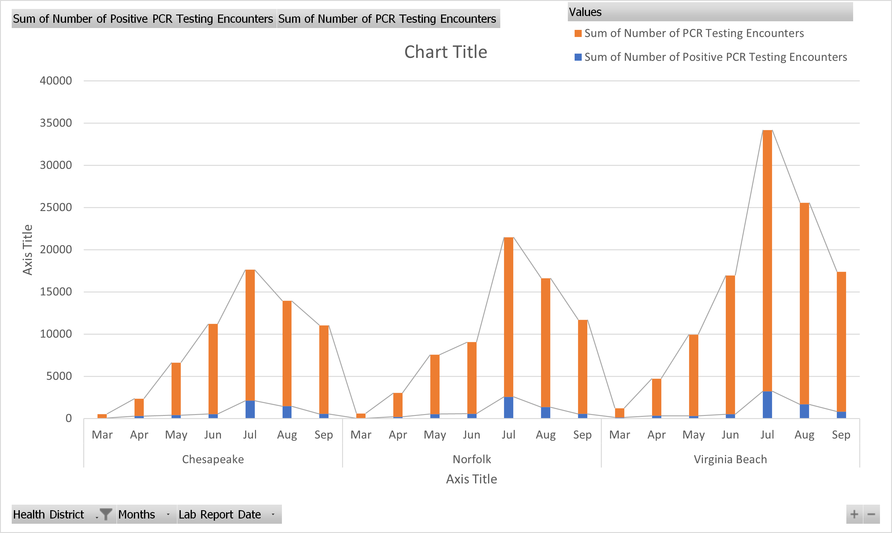

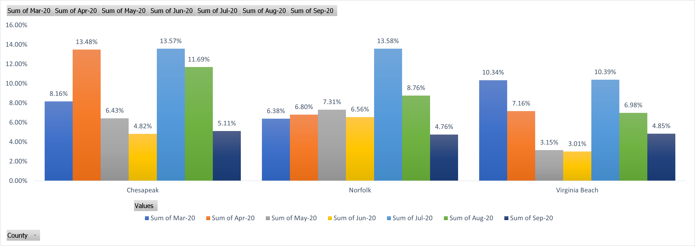

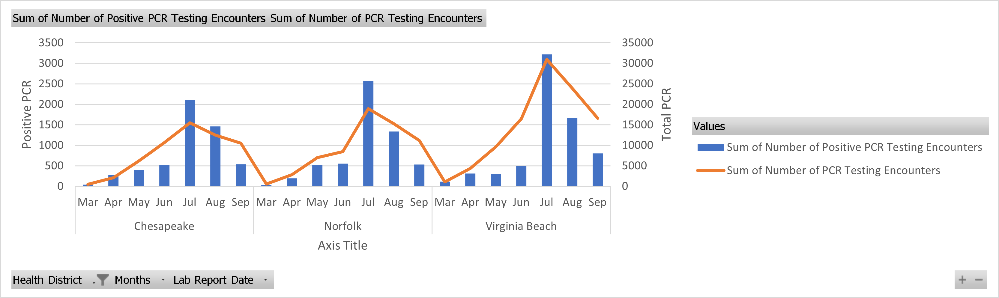

_**Question2**_:


#### For each health district, what percentage of the total tests given were PCR tests?

I recreate *Bar-graph* using Spreadsheet, Tableau, and Vega-lite.

#### Marks and channels:

*x-axis*: Percentage of positive PCR tests encountered

*y-axis*: All the "Health districts".

*Colors*: The color (Blue) is auto chosen, and I felt it is distinguishable. I tried to separate the bars using different colors, but it was not very impressive but in contrast there are a lot of colors and it was very distracting. 


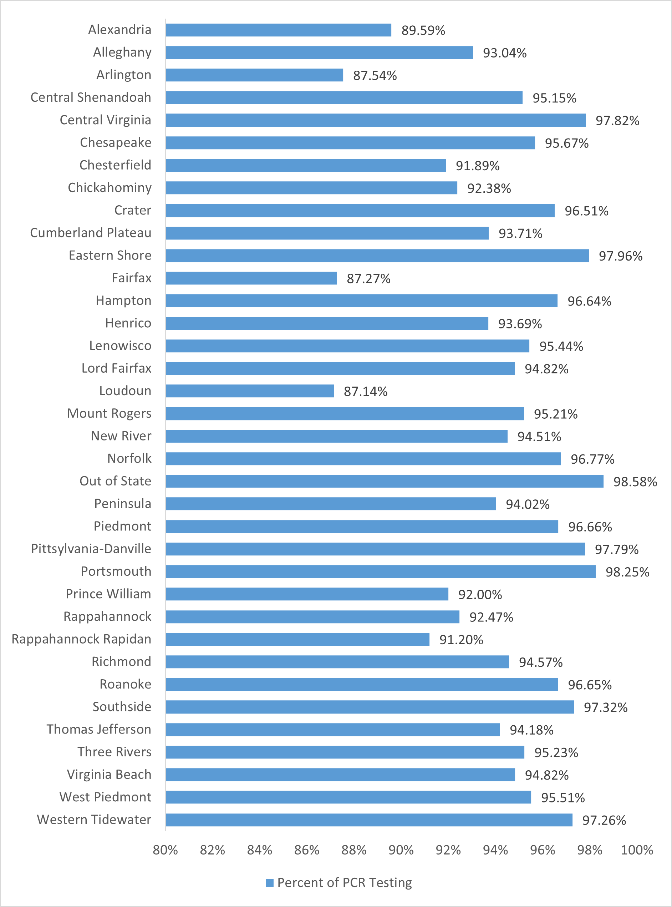


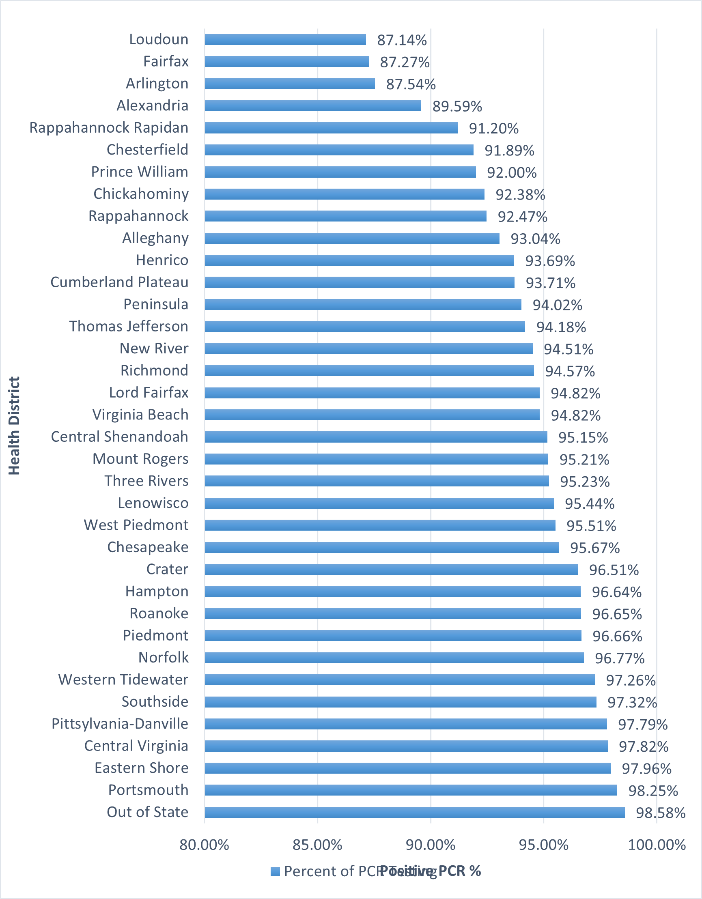


## Tableau:

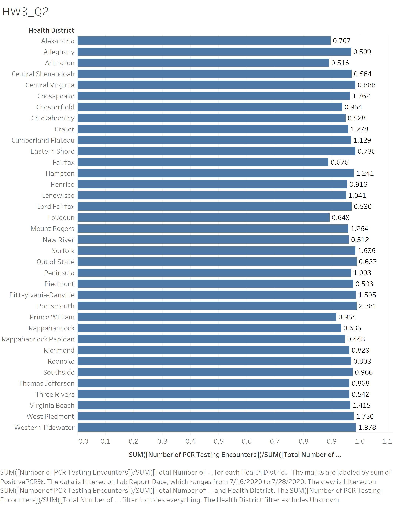


## Tableau:


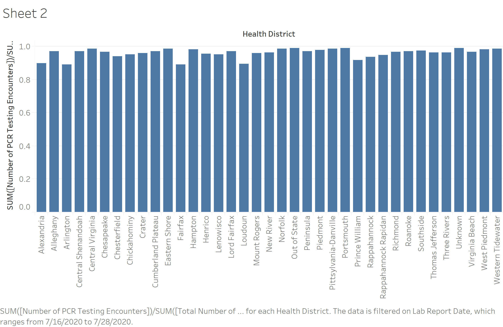

## Vega-lite:

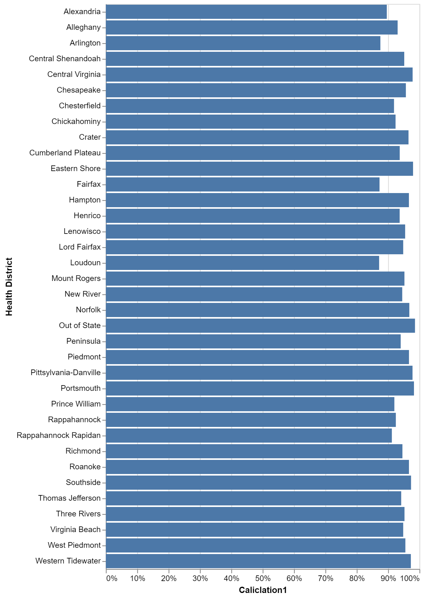

#### Observations:

 **Spreadsheet:** I found the spreadsheet is very impressive and I could make out the differences and compare the highest and lowest percentage.
 I could arrange the health districts in numerical order of percentages to observe the lowest and the highest percentage of positive PCR tests.
 
 
 **Tableau:** On the Tableau the graph is very much similar to that of spreadsheet. I could observe the percentage values while moving through the graph. However, I could not identify the percentage values at one view as I could view on the spreadsheet.
 
 
 
 **Vega-Lite:** I could upload the file following the instructions, and I could generate the output that is simulate to the output of spreadsheet and Tableau. However I could not identify the percentage values vary appropriately as in the spreadsheet.
 
 * _**Loudoun**_ has the least percentage (87.14%) of positive PCR tests.
 * _**Portsmouth**_ has the most percentage (98.25%) of positive PCR tests.
 * In the graph it shows "Out of State". I am not sure if we can count the Out of State as Virginia, so I have not considered it as the highest.

https://prod-useast-a.online.tableau.com/#/site/oducs625/views/part1_solution/sheet?:iid=3

_**Question3:**_


Was there a correlation between the percentage positive PCR tests averaged over July 16-28 (two weeks after the mask survey) and the estimated share of residents that answered "Frequently" or "Always" to the question of mask usage?

###### Show this for the following 15 health districts only: Norfolk, Virginia Beach, Chesapeake, Portsmouth, Hampton, Western Tidewater, Peninsula, Fairfax, Arlington, Prince William, Richmond, Henrico, Chesterfield, Roanoke, Central Shenandoah.

###### For health districts that span multiple counties, pick the county with the highest population for the mask survey and name the county that you're considering.

### Marks and channels:

*x-axis*: Percent of people responded "Frequently" or "Always" to the usage of masks.

*y-axis*: Percentage of positive PCR tests encountered.

*Colors*: The color (blue) was auto chosen, and I felt that was adequate.


### Observations:

Since the question is to find the correlation between the "Average Positive PCR encounters percentage" and "The percentage of people responded frequently or always to the mask usage" during the period July 16th to July 28th. I must make a new *.csv file and manipulate the data.

#### Steps:

  * I sorted the data to filter the 15 counties that were mentioned in the list.
  * I filtered the undefined data and blank lists.
  
  * I goggled to identify the county numbers to match the health districts.
  
  * Of the 15 health districts, I could find 13 of them very easily and I initially thought "**Peninsula**" and "**Western Tidewater**" belong to different states, however, I identified that they were  also a part of Virginia.
  
  * I identified "**James City County**" is the county with highest population in the health district "**Peninsula** and "**Suffolk**" with highest population in "**Western Tidewater.**"
  
#### Major Observations


One major observation is I could create a scatter plot to establish a correlation between the percentage positive PCR tests averaged over July 16-28 (two weeks after the mask survey) and the estimated share of residents that answered "Frequently" or "Always" to the question of mask usage.


  * I could not find a trend or a pattern regarding the correlation between mask usage and rate of increase/decrease in the positive PCR tests.
  
  * I could not identify the corresponding health district for each data point on the scatter plot. 
  
  * In all three tools sufficient correlation trend was not observed.
  
  * The output on the "**Tableau**" has the county as well, but each county is having the x-axis label.

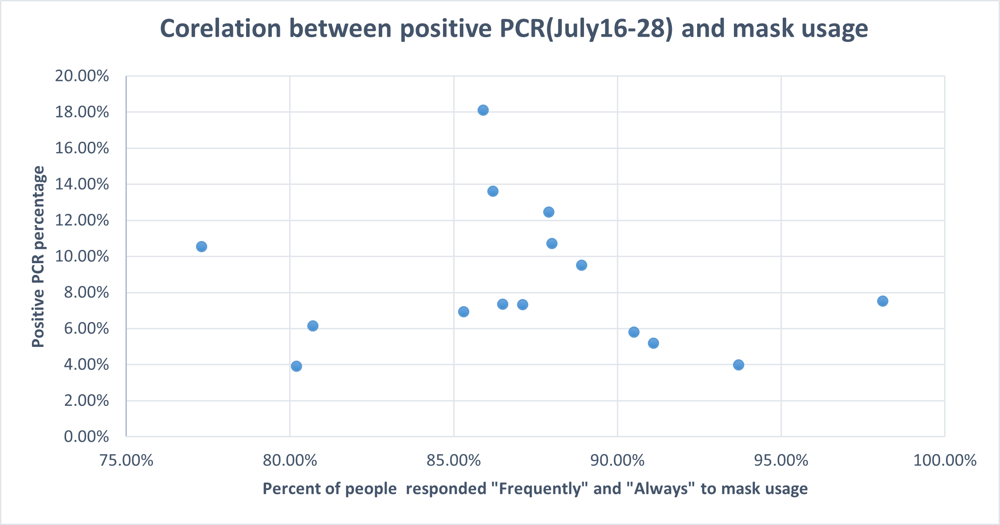

Since the above scatter plot does not show the clear trend line of the correlation, I have created the bar graph.

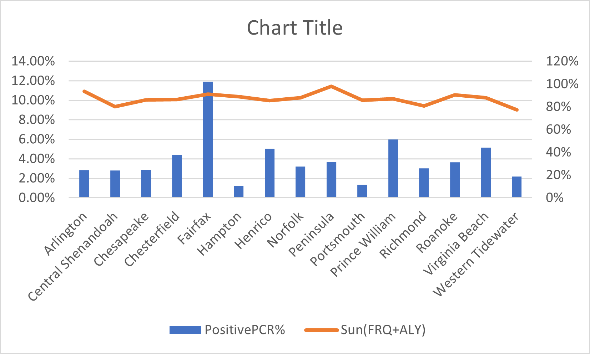

In the above mixed bar graph, the blue bars are the percentage positive PCR testing encounters (that shows percentages on right side of the graph). Orange line shows percentage of people who responded "Frequently" and "Always". It does show the better details than the above scatter plot. The orange line remained almost same for all the 15 health districts.


## Tableau:

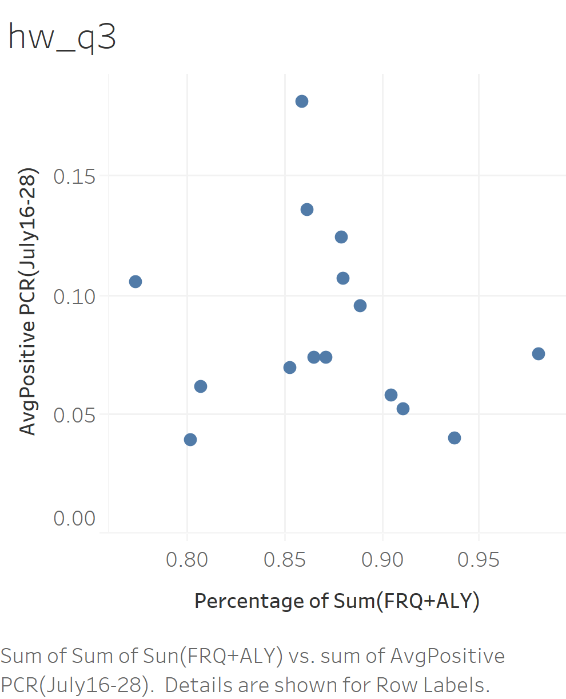


The scatter plot in the Tableau is same as in the spreadsheet, but a little contracted.


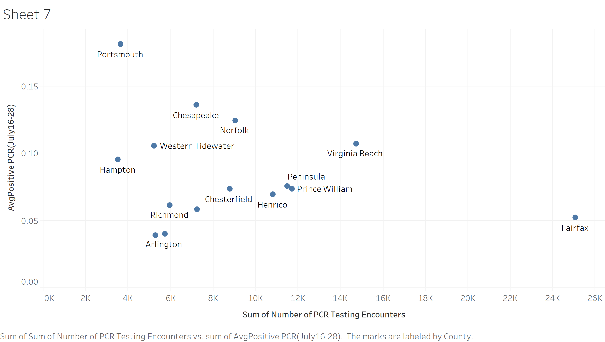
On the Tableau, I could mark the county on the point.


## Vega-lite:


The same graph in the vega-lite turned about pretty clear with the data plots marked with the corresponding counties. The only downside is the x-axis is showing the same label for 15 times.

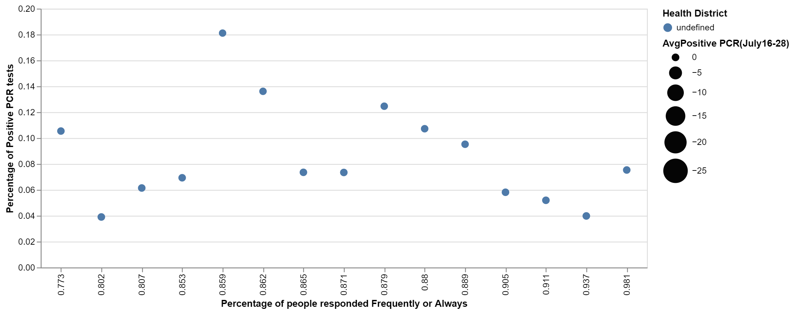

If I remove the city labels then the x-axis and y-axis labels are perfect, but it's hard to understand which data point related to what health district.


https://prod-useast-a.online.tableau.com/#/site/oducs625/views/part1_solution/Sheet4?:iid=4

https://prod-useast-a.online.tableau.com/#/site/oducs625/views/part1_solution_dashboard/Dashboard1?:iid=1


https://prod-useast-a.online.tableau.com/#/site/oducs625/workbooks/246174/views

On Vega-lite I was able to do coding. Apparently, I would need to practice a lot.


https://observablehq.com/d/ddeae7e1916d7437


# Learning Checks

## Spreadsheet:

I found working on the excel to be convenient for data visualization and was able to identify the marks and channels clearly. The color concentrations are easy to manipulate.


## Tableau:

I found Tableau to be user-friendly as well.  On the Tableau, I could choose the required axis and labels, but I could not generate the output as expected for all the questions. The following are the problems I faced while working on Tableau.
I could not generate all the variety of graphs on the Tableau as I could do on the spreadsheet. I was not able to slice the required rows on the tableau. I found the color channels options are limited or they were selected by default.


_I must work more and get familiarize with the tableau._


## Vega-lite:

I could upload the file in the Vega-lite, I could generate an output to see the header of the table.
I could make a line graph, bar graph, and scatter plot. I am still not familiar in generating mixed graphs which I could do on the excel spreadsheet.

_I am still learning._


## References

*Insert the list of sites you used as references as an unordered list with named links here.  This is required.*

YouTube:
https://www.youtube.com/watch?v=FyggutiBKvU&t=810s


https://help.tableau.com/current/pro/desktop/en-gb/buildexamples_scatter.htm


https://r4ds.had.co.nz/model-intro.html

https://observablehq.com/@observablehq/a-taste-of-observable

https://r4ds.had.co.nz/data-visualisation.html#exercises

https://observablehq.com/@observablehq/vega-lite


https://help.tableau.com/current/guides/get-started-tutorial/en-us/get-started-tutorial-home.htm

https://www.earthdatascience.org/courses/earth-analytics/document-your-science/add-images-to-rmarkdown-report/

https://r4ds.had.co.nz/introduction.html#the-tidyverse

https://r4ds.had.co.nz/r-markdown.html

https://r4ds.had.co.nz/introduction.html#running-r-code


