Homework 3
================
Nagesh Bheesetty

CS 625, Fall 2020

### Part-1:

# Reports:

The file “VDH-COVID-19-PublicUseDataset-Tests\_by-LabReportDate” was
downloaded from the provided source and uploaded the same in the excel,
Tableau, and Vega-lite. I was not able to replicate the same in the R.

***Question1***:

*How does the percentage of positive PCR tests over time compare for
Norfolk, Chesapeake, and Virginia Beach?*

Before heading to generate graphs for question 1, I filtered data
according to the requirements. I choose Norfolk, Virginia Beach, and
Chesapeake within the given period. According to the data, the COVID
cases were reported from Jan-2020, however, for Norfolk, Virginia Beach,
and Chesapeake the cases were reported from March-2020. I could choose
the appropriate marks and channels to generate an idiom as line graph.

I found working on the excel to be convenient for data visualization and
was able to identify the marks and channels clearly. The color
concentrations are easy to manipulate.

## Tableau:

I found Tableau to be user-friendly as well. On the Tableau, I could
choose the required axis and labels, but I could not generate the output
as expected for all the questions. The following are the problems I
faced while working on Tableau. I could not generate all the variety of
graphs on the Tableau as I could do on the spreadsheet. I was not able
to slice the required rows on the tableau. I found the color channels
options are limited or they were selected by default.

*I must work more and get familiarize with the tableau.*

*Though the total data shows that the number of PCR tests are
encountered from January 2020, however for the selected health districts
“Norfolk, Virginia Beach and Chesapeake” the tests were encountered from
March-2020.*

I could upload the file in the Vega-lite, I could generate an output to
see the header of the table. I could make a line graph and bar graph. I
am still not familiar in generating mixed graphs which I could do on the
excel spreadsheet.

### Step-1:

I used spreadsheet (PIVOT tables) to generate graphs. First, the *idiom*
I used to compare the three chosen cities (Norfolk, Virginia beach, and
Chesapeake) is a **“Mixed-graph”**.

### Mixed Graph:

A stacked bar-graph and a line graph.

I chose a stacked bar-graph to compare the number of PCR tests
encountered and the number of positive PCR tests encountered. A line
graph to compare the percentage of positive PCR tests encountered in the
selected three health districts.

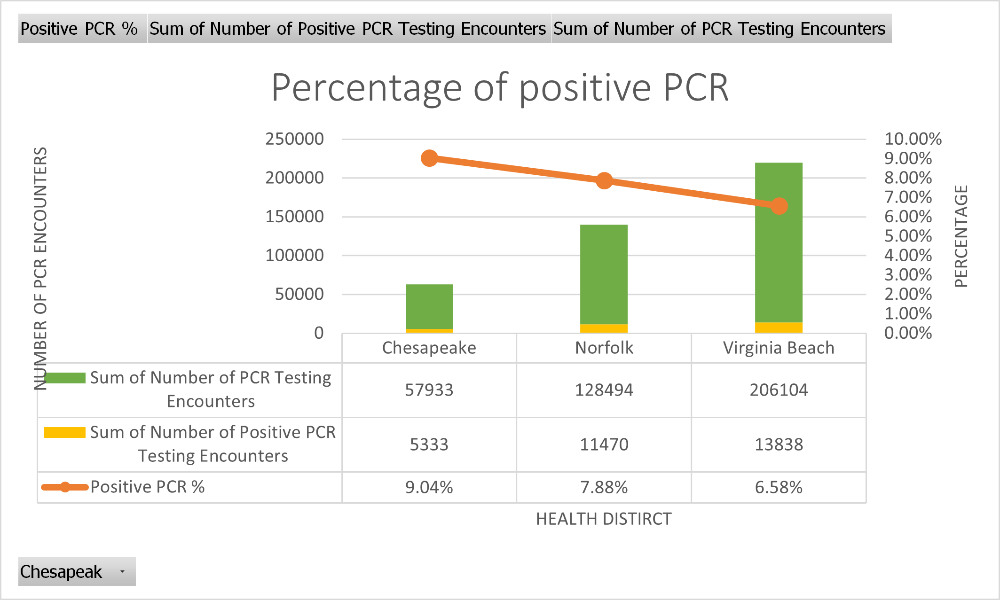

The above graph shows the sum of number of positive PCR testing
encounters (shown in blue color) against sum of number of PCR testing
counters (shown in orange color). In the graph, it appears as if
Virginia Beach has highest number of positive cases, but if we observe
analytically, Chesapeake has highest number of positive PCR test versus
PCR tests. Nevertheless, Virginia Beach has highest number of PCR tests
and positive PCR tests, followed by Norfolk, and then Chesapeake.
However, the percentage of positive PCR tests encountered in Chesapeake
is much greater followed by Norfolk and Virginia Beach.

*In either of the cases Norfolk stands in the center of Chesapeake and
Virginia Beach.*

#### Observations:

In the above mixed graph, I could compare the number of PCR tests
encountered, the number of positive PCR tests encountered and the
percentage of positive PCR tests that are mentioned in the three health
districts “**Norfolk, Virginia Beach, and Chesapeake**”.

#### Marks and channels:

*x-axis*: The three health districts “Norfolk, Virginia Beach and
Chesapeake”

*y-axis (left)*: Number of PCR tests encountered.

*y-axis (Right)*: Percentage of positive PCR tests encountered in the
three health districts.

*Colors*: I chose yellow and green colors *channel* for stacked graph
since they are contrast colors to distinguish, the line color is auto
chosen.

#### Remarks:

  - The trend in each month is missing.
  - The percentage of positive PCR tests cannot be assessed for each
    month in the given period.

### Step-2:

For the next graph, I have taken the percentages of sum of positive PCR
tests for Chesapeake, Norfolk, and Virginia Beach on monthly duration
basis, starting from March 20th. I calculated the percentages by
dividing the positive PCR testing encounters over the number of PCR
testing encounters. The color code specifically shows the comparison of
three cities for each month.

Before heading to generate graphs for question 1, I filtered data
according to the requirements. I choose Norfolk, Virginia Beach, and
Chesapeake within the given period. According to the data, the COVID
cases were reported from Jan-2020, however, for Norfolk, Virginia Beach,
and Chesapeake the cases were reported from march-2020. I could choose
the appropriate marks and channels to generate an idiom as line graph.

I used spreadsheet (PIVOT tables) to generate graphs. First, the idiom I
used to compare the three chosen cities (Norfolk, Virginia beach, and
Chesapeake) is a “Bar-graph”.

The above graph shows the sum of number of positive PCR testing
encounters (shown in blue color) against sum of number of PCR testing
counters (shown in orange color). In the graph, it appears as if
Virginia Beach has highest number of positive cases, but if we observe
analytically, Chesapeake has highest number of positive PCR test versus
PCR tests. Nevertheless, Virginia Beach has highest number of PCR tests
and Positive PCR tests, followed by Norfolk, and then Chesapeake.

For the next graph, I have taken the percentages of sum of positive PCR
tests for Chesapeake, Norfolk, and Virginia Beach on monthly duration
basis, starting from March 20th. I calculated the percentages by
dividing the positive PCR testing encounters over the number of PCR
testing encounters. The color code specifically shows the comparison of
three cities for each month.

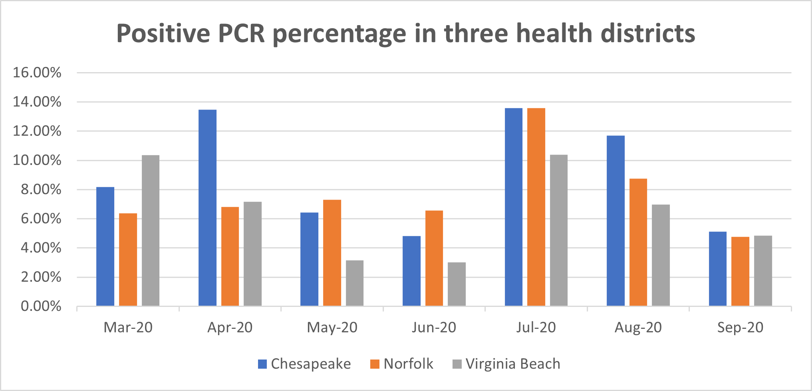

Above graph indicates that during March, Virginia Beach has highest
percentage of positive PCR test cases but was the lowest of the three
health districts in the later months. After March, during some months
Chesapeake has highest percentage and for some months Norfolk has the
highest. Interestingly, in the month of July all the three health
districts have surge in the positive percentage. We might assume that
phase-2 lock-down release might have contributed to this surge. In the
month of September-2020 almost all the three health districts remained
the same.

#### Marks and channels:

*x-axis*: Months from March through September"

*y-axis*: Percentage of number of PCR tests encountered.

*Colors*: The colors were auto chosen, and I felt they are
distinguishable.

#### Observations:

In this bar graph, I could observe the percentage of PCR tests
encountered for each month, but it is not so easy to distinguish the
percentage change in consecutive months and the other months.

#### Remarks:

  - The trend in comparing the positive PCR throughout the months is
    unclear.
  - The percentage of positive PCR tests cannot be easily compared for
    different months in the given period.

### Step-3:

I realized that a line graph would be more appropriate to make a perfect
trend and I created three different line charts. In the first one I
created is comparing the trend, however I could not identify the numbers
very clearly. In the second graph I eliminated the blank spaces and the
**outliers**, so that the trend is clearer. Finally, I filtered the data
averaging the month wise data in which the trend is more appropriate.

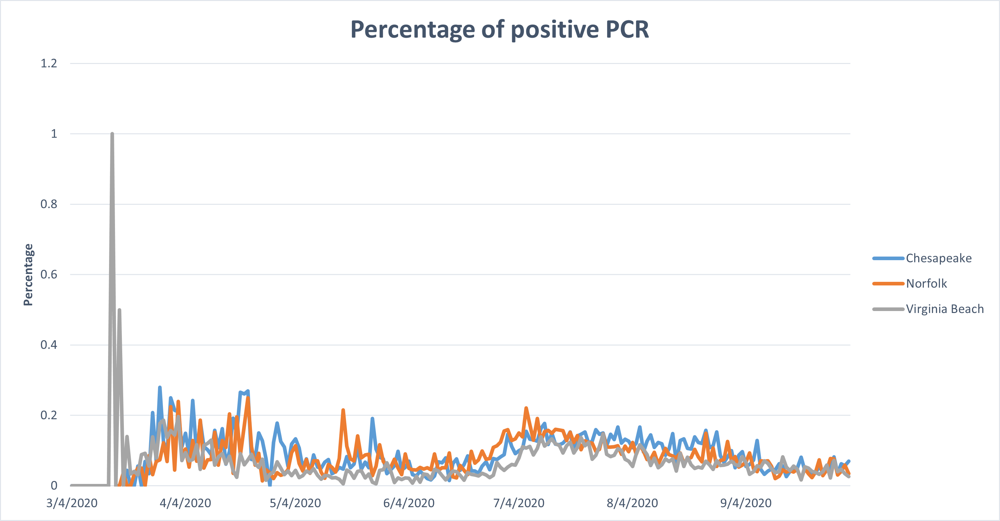

Above graph indicates that during March Virginia beach has highest
percentage of positive PCR test cases, but was the lowest of the three
health districts in the later months. After March, during some months
Chesapeake has highest percentage and for some months Norfolk has the
highest. Interestingly, in the month July all of the three health
districts has surge in the positive percentage. We might make an
assumption that phase 2 lockdown release might have contributed to this
surge.

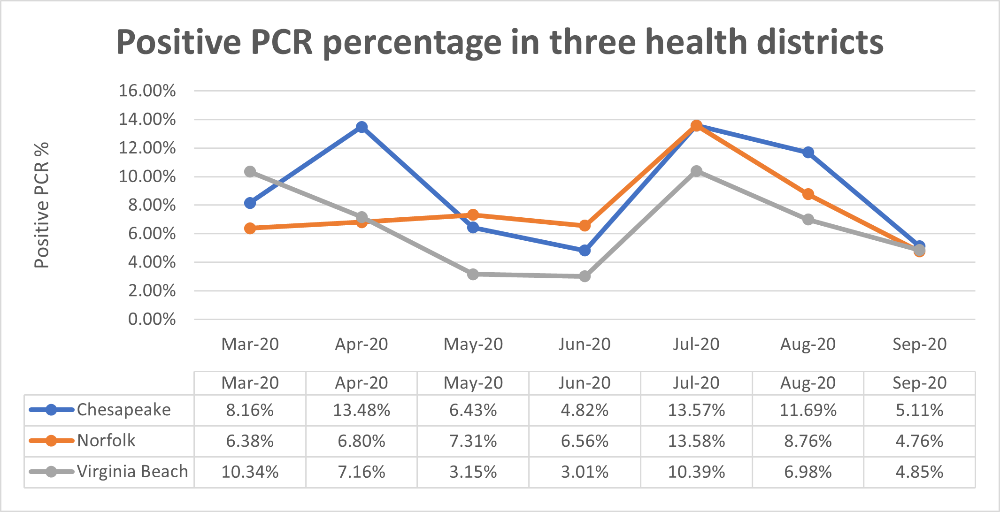

In the above three graphs the trend in the percentage of positive PCR
tests encountered form March to September is very significant.

#### Marks and channels:

*x-axis*: Months from March through September.

*y-axis*: Percentage of number of PCR tests encountered.

*Colors*: The colors were auto chosen, and I felt they are
distinguishable.

#### Observations:

  - In this line graphs, I could observe the percentage of positive PCR
    tests encountered for each month and it is easy to distinguish the
    percentage change in consecutive months and the other months.
  - All the three health districts started with different percentage of
    positive PCR tests.
  - In the month of April, the positive PCR tests for Chesapeake spiked
    up.
  - In the month of July, the percentage of positive PCR tests spiked up
    for all the three health districts.
  - July through September the trend went down for all the health
    districts.
  - In the month of September all the three health districts were almost
    the same, approximately 5%.

## Tableau:

I recreated the same **line graph** using *Tableau* and the trend is
almost the same and the colors were auto selected, and they were almost
the same colors as in the spreadsheet.

## Tableau:

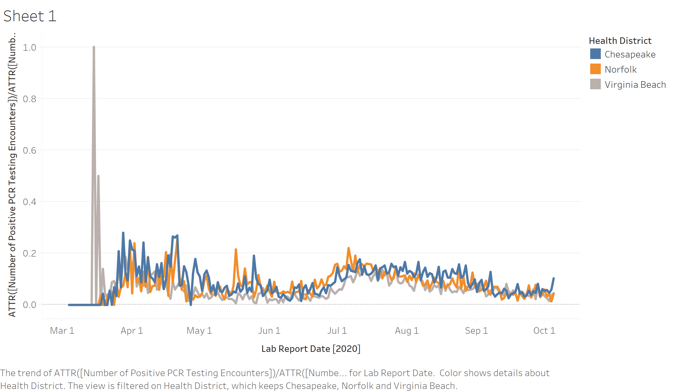
<https://prod-useast-a.online.tableau.com/#/site/oducs625/views/part1_solution/Sheet1>?:iid=1

## Vega-lite:

## Vega-lite:

I further recreated the same **line graph** using *Vega-Lite* and the
trend is almost the same and the colors were auto selected, and they
were almost the same colors as in the spreadsheet. However, the graph is
stretched, and it does not look appealing.

**Observations:**

  - In this view the x-axis is very illegible and I could not identify
    the values.
  - The colors were auto chosen, and I could recreate the colors that
    are visible in *“Spreadsheet”* and *“Tableau”*

I further went forward to recreate the graphs in different idioms to
visualize the data and understood the line graphs were most appropriate.

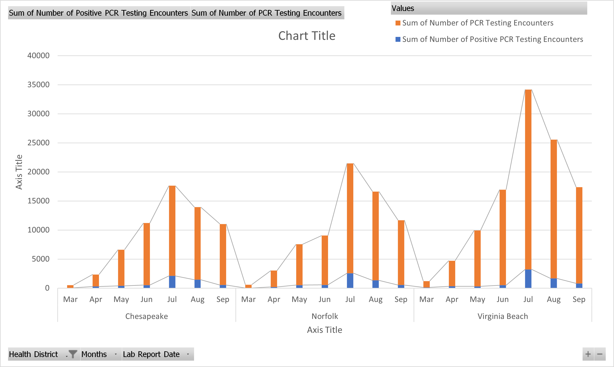

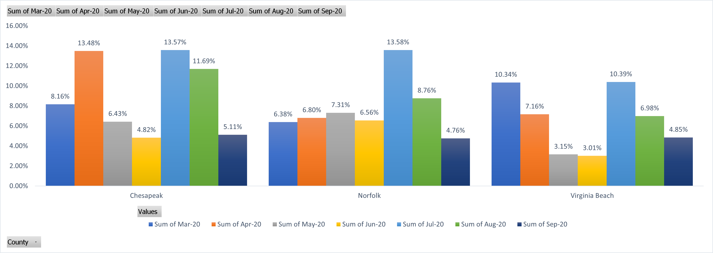

***Question2***:

#### For each health district, what percentage of the total tests given were PCR tests?

I recreate *Bar-graph* using Spreadsheet, Tableau, and Vega-lite.

#### Marks and channels:

*x-axis*: Percentage of positive PCR tests encountered

*y-axis*: All the “Health districts”.

*Colors*: The color (Blue) is auto chosen, and I felt it is
distinguishable. I tried to separate the bars using different colors,
but it was not very impressive but in contrast there are a lot of colors
and it was very distracting.

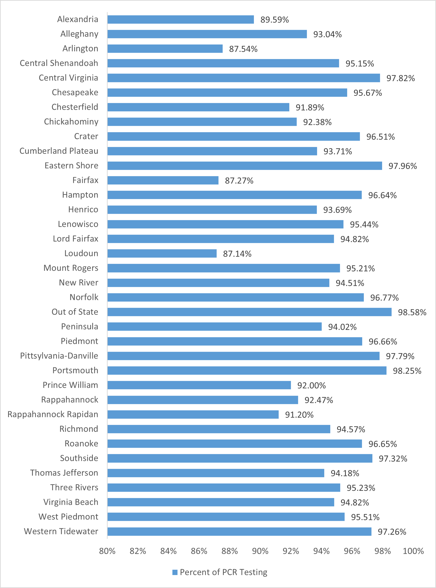

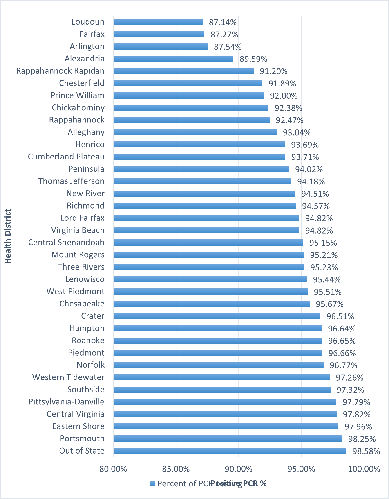

## Tableau:

## Tableau:

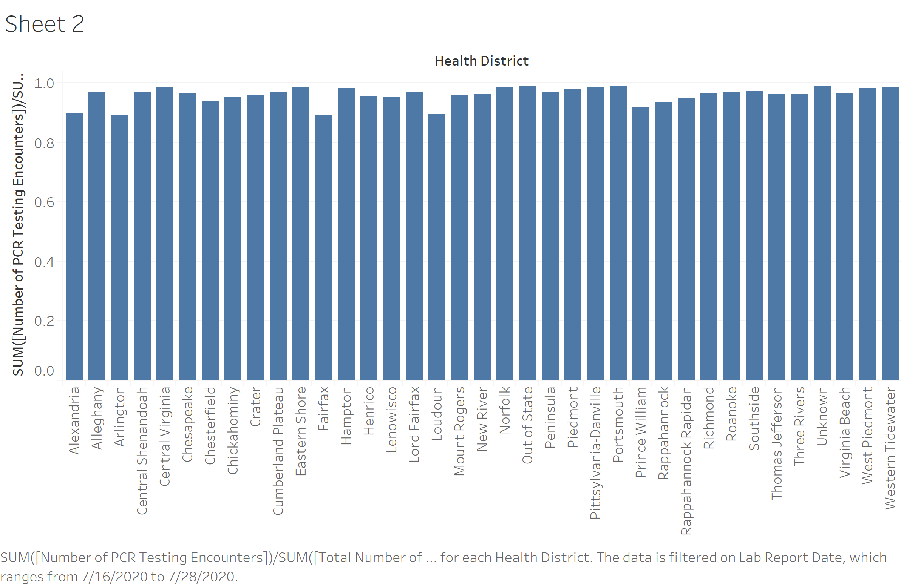

## Vega-lite:

#### Observations:

**Spreadsheet:** I found the spreadsheet is very impressive and I could
make out the differences and compare the highest and lowest percentage.
I could arrange the health districts in numerical order of percentages
to observe the lowest and the highest percentage of positive PCR tests.

**Tableau:** On the Tableau the graph is very much similar to that of
spreadsheet. I could observe the percentage values while moving through
the graph. However, I could not identify the percentage values at one
view as I could view on the spreadsheet.

**Vega-Lite:** I could upload the file following the instructions, and I
could generate the output that is simulate to the output of spreadsheet
and Tableau. However I could not identify the percentage values vary
appropriately as in the spreadsheet.

  - ***Loudoun*** has the least percentage (87.14%) of positive PCR
    tests.
  - ***Portsmouth*** has the most percentage (98.25%) of positive PCR
    tests.
  - In the graph it shows “Out of State”. I am not sure if we can count
    the Out of State as Virginia, so I have not considered it as the
    highest.

<https://prod-useast-a.online.tableau.com/#/site/oducs625/views/part1_solution/sheet>?:iid=3

***Question3:***

Was there a correlation between the percentage positive PCR tests
averaged over July 16-28 (two weeks after the mask survey) and the
estimated share of residents that answered “Frequently” or “Always” to
the question of mask usage?

###### Show this for the following 15 health districts only: Norfolk, Virginia Beach, Chesapeake, Portsmouth, Hampton, Western Tidewater, Peninsula, Fairfax, Arlington, Prince William, Richmond, Henrico, Chesterfield, Roanoke, Central Shenandoah.

###### For health districts that span multiple counties, pick the county with the highest population for the mask survey and name the county that you’re considering.

### Marks and channels:

*x-axis*: Percent of people responded “Frequently” or “Always” to the
usage of masks.

*y-axis*: Percentage of positive PCR tests encountered.

*Colors*: The color (blue) was auto chosen, and I felt that was
adequate.

### Observations:

Since the question is to find the correlation between the “Average
Positive PCR encounters percentage” and “The percentage of people
responded frequently or always to the mask usage” during the period July
16th to July 28th. I must make a new \*.csv file and manipulate the
data.

#### Steps:

  - I sorted the data to filter the 15 counties that were mentioned in
    the list.

  - I filtered the undefined data and blank lists.

  - I goggled to identify the county numbers to match the health
    districts.

  - Of the 15 health districts, I could find 13 of them very easily and
    I initially thought “**Peninsula**” and “**Western Tidewater**”
    belong to different states, however, I identified that they were
    also a part of Virginia.

  - I identified “**James City County**” is the county with highest
    population in the health district “**Peninsula** and”**Suffolk**"
    with highest population in “**Western Tidewater.**”

#### Major Observations

One major observation is I could create a scatter plot to establish a
correlation between the percentage positive PCR tests averaged over July
16-28 (two weeks after the mask survey) and the estimated share of
residents that answered “Frequently” or “Always” to the question of mask
usage.

  - I could not find a trend or a pattern regarding the correlation
    between mask usage and rate of increase/decrease in the positive PCR
    tests.

  - I could not identify the corresponding health district for each data
    point on the scatter plot.

  - In all three tools sufficient correlation trend was not observed.

  - The output on the “**Tableau**” has the county as well, but each
    county is having the x-axis label.

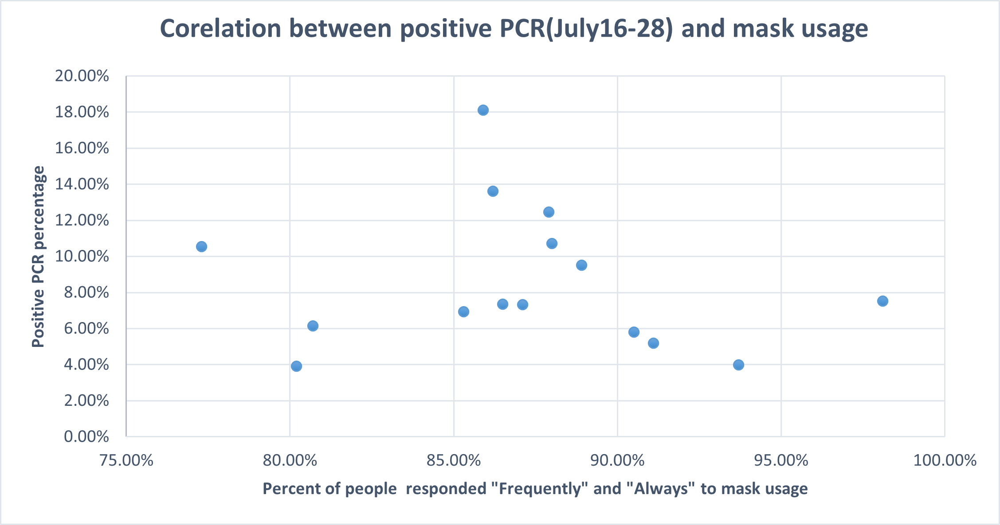

Since the above scatter plot does not show the clear trend line of the
correlation, I have created the bar graph.

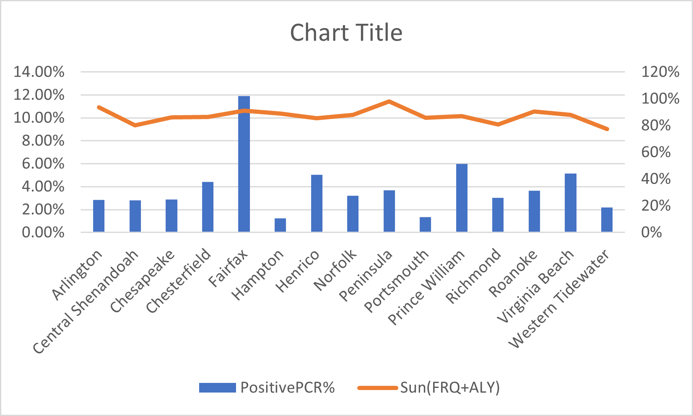

In the above mixed bar graph, the blue bars are the percentage positive
PCR testing encounters (that shows percentages on right side of the
graph). Orange line shows percentage of people who responded
“Frequently” and “Always”. It does show the better details than the
above scatter plot. The orange line remained almost same for all the 15
health districts.

## Tableau:

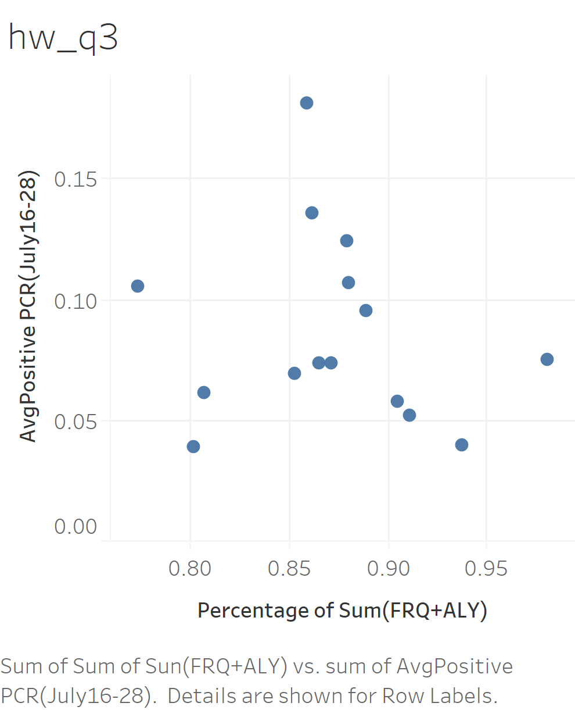

The scatter plot in the Tableau is same as in the spreadsheet, but a
little contracted.

 On the Tableau, I could mark the
county on the point.

## Vega-lite:

The same graph in the vega-lite turned about pretty clear with the data
plots marked with the corresponding counties. The only downside is the
x-axis is showing the same label for 15 times.

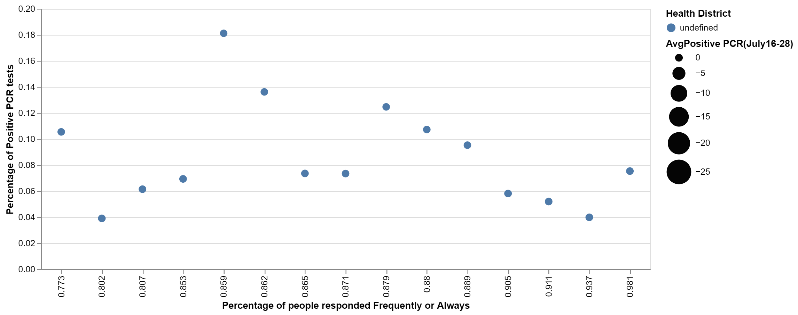

If I remove the city labels then the x-axis and y-axis labels are
perfect, but it’s hard to understand which data point related to what
health district.

<https://prod-useast-a.online.tableau.com/#/site/oducs625/views/part1_solution/Sheet4>?:iid=4

<https://prod-useast-a.online.tableau.com/#/site/oducs625/views/part1_solution_dashboard/Dashboard1>?:iid=1

<https://prod-useast-a.online.tableau.com/#/site/oducs625/workbooks/246174/views>

On Vega-lite I was able to do coding. Apparently, I would need to
practice a lot.

<https://observablehq.com/d/ddeae7e1916d7437>

# Learning Checks

## Spreadsheet:

I found working on the excel to be convenient for data visualization and
was able to identify the marks and channels clearly. The color
concentrations are easy to manipulate.

## Tableau:

I found Tableau to be user-friendly as well. On the Tableau, I could
choose the required axis and labels, but I could not generate the output
as expected for all the questions. The following are the problems I
faced while working on Tableau. I could not generate all the variety of
graphs on the Tableau as I could do on the spreadsheet. I was not able
to slice the required rows on the tableau. I found the color channels
options are limited or they were selected by default.

*I must work more and get familiarize with the tableau.*

## Vega-lite:

I could upload the file in the Vega-lite, I could generate an output to
see the header of the table. I could make a line graph, bar graph, and
scatter plot. I am still not familiar in generating mixed graphs which I
could do on the excel spreadsheet.

*I am still learning.*

## References

*Insert the list of sites you used as references as an unordered list
with named links here. This is required.*

YouTube: <https://www.youtube.com/watch?v=FyggutiBKvU&t=810s>

<https://help.tableau.com/current/pro/desktop/en-gb/buildexamples_scatter.htm>

<https://r4ds.had.co.nz/model-intro.html>

<https://observablehq.com/@observablehq/a-taste-of-observable>

<https://r4ds.had.co.nz/data-visualisation.html#exercises>

<https://observablehq.com/@observablehq/vega-lite>

<https://help.tableau.com/current/guides/get-started-tutorial/en-us/get-started-tutorial-home.htm>

<https://www.earthdatascience.org/courses/earth-analytics/document-your-science/add-images-to-rmarkdown-report/>

<https://r4ds.had.co.nz/introduction.html#the-tidyverse>

<https://r4ds.had.co.nz/r-markdown.html>

<https://r4ds.had.co.nz/introduction.html#running-r-code>
