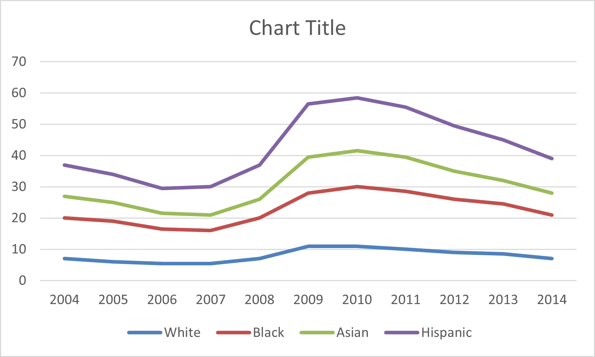
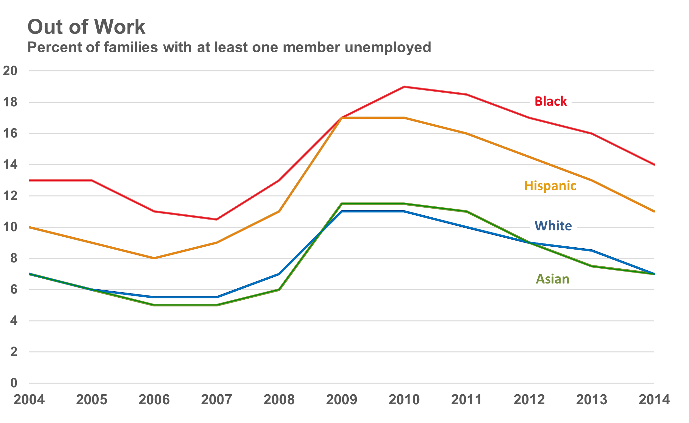
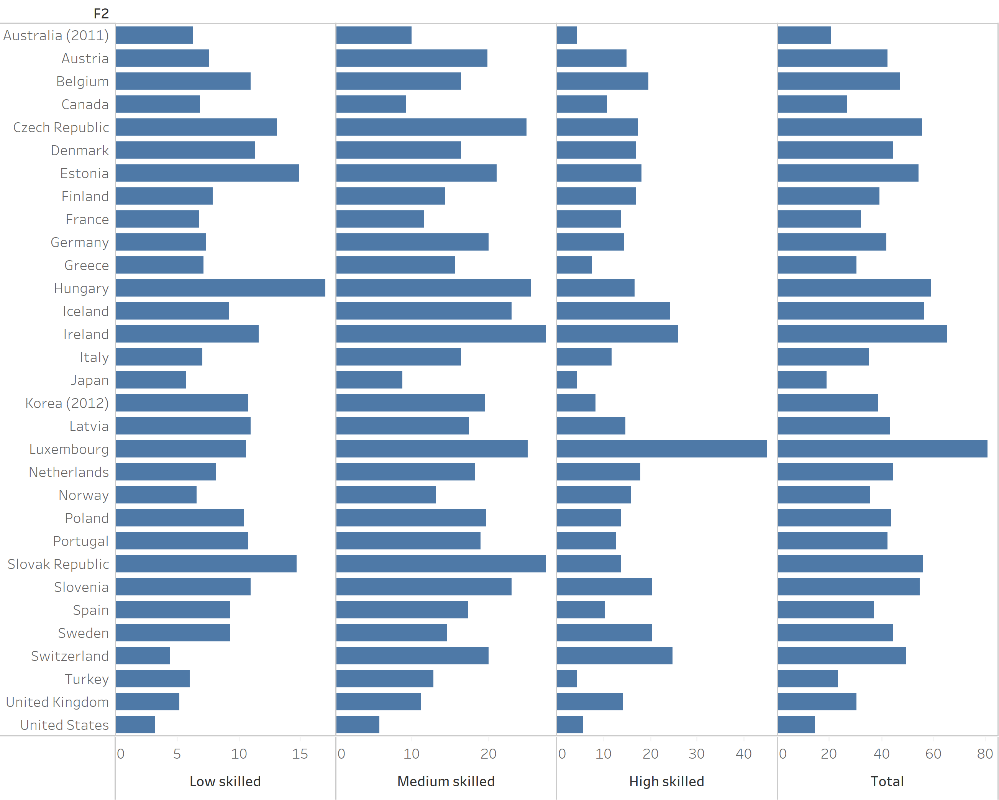
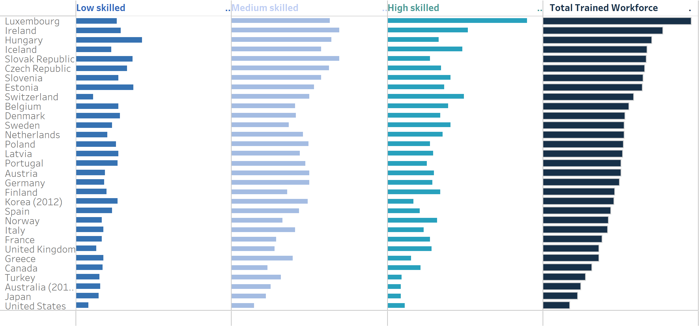

Homework 4
================
Nagesh Bheesetty

CS 625, Fall 2020

Date: 10/20/2020

## Assignment

The goal of this assignment is to re-create two existing charts as
closely as possible. This includes colors, fonts, and any text elements.
The data files and a link to the image of the original chart are
provided.

Choose one chart from Part 1 and one chart from Part 2. The two charts
you re-create must use different idioms *and* must be created using
different tools. *Extra credit will be given for excellent recreations
that use R or Vega-Lite.*

### Part 1 - Recreating line charts using Excel:

**Description of the source data**:

The data given was to compare unemployment rates within and between four
different racial/ethnic groups between 2004 and 2014.

We were given four ethnic groups (Black, Hispanic, White, and Asian) and
duration of years (2004 to 2014) The information provided is percentage
of families with at least one member unemployed in the family. Here, you
can easily see the four different trends.

#### Source of the Data:

Article: [Remake: Paired Column Chart from
WSJ](https://policyviz.com/2018/03/01/remake-paired-column-chart-from-wsj/)

  - Excel data file:
    <http://policyviz.com/wp-content/uploads/2018/02/PolicyViz_WSJ_Remake.xlsx>

  - image: [line chart with multiple
    lines](https://policyviz.com/wp-content/uploads/2018/02/PolicyViz_WSJ_Remake_LineChart-1024x613.png)
    or [small multiples
    chart](https://policyviz.com/wp-content/uploads/2018/02/PolicyViz_WSJ_Remake_SmallMultiples-1024x615.png)

| Idiom:      | Line Chart                                                         |
| ----------- | ------------------------------------------------------------------ |
| What: Data  | Table: One quantitative value attribute, one ordered key attribute |
| How: Encode | Dot chart with connecting marks between dots                       |
| Why         | Shows trend                                                        |

The spreadsheet is provided with 11 rows other the header “year” and 5
columns.

| Column-1            | Column-2     | Column-3     | Column-4     | Column-5     |
| ------------------- | ------------ | ------------ | ------------ | ------------ |
| Years (2004 – 2014) | White        | Black        | Asian        | Hispanic     |
| Ordinal (Ordered)   | Quantitative | Quantitative | Quantitative | Quantitative |

The idiom is a line chart (Multiple Lines) augments dot chart with line
connecting marks running between the points. The chart establishes a
trend in percentage of families with at least one member unemployed
during the period 2004 through 2014. So, each value on the chart must be
marked as a point or dot, which was not promptly marked. However, the
idea is to find the trend in the given period were the trend in lines
were clearly identified. Here, we can easily see the four different
trends. Before finding the observations in the graph it is important to
understand the “Marks and Channels”, and the attribute types in the
graph.

| Marks: | Lines (Dots) |
| ------ | ------------ |

| Channels                     | Attribute  | Attribute Type      |
| ---------------------------- | ---------- | ------------------- |
| Horizontal Position (X-axis) | Year       | Ordinal (Ordered)   |
| Vertical Position (Y-axis)   | Percentage | Quantitative        |
| Color                        | Ethnicity  | Categorical/Nominal |

### Observations in the Source Chart:

I could identify the marks, channels, attributes, and the data type. The
idea is to recreate the already existing Line chart. I chose spreadsheet
to recreate the chart. I found it is an appropriate idiom for the data
provided, because the goal of the data is to provide a trend in several
years within different ethnic groups.

  - From the graph it is evident that starting from 2004 through 2014
    the unemployment rate in Black ethnicity is more compared to other
    ethnicities.

  - Between 2006 and 2007 the percentage of unemployment for all the
    four ethnicities is reduced, which means the percentage of
    employment rate increased.

  - In 2009 the percentage of unemployment for all the four ethnicities
    is increased and reduced further except for “Black”.

  - In 2010 the Black has the highest unemployment rate and the
    unemployment rate for the other three ethnicities remained the same.

  - In the year 2014 all the four ethnicities unemployment rate dropped
    down compared to the previous 4 years and remained almost as same as
    in 2004.

  - The White and Asian race has almost the same trend in the given
    period.

# Report:

Initially, I chose Excel spreadsheet to recreate the give line chart.
The first chart is as shown below.

## Recreated Chart:

##### Initial Chart:

##### Final Chart:

#### Observations in recreated Chart:

The chart in the first stage is not as same as the one I wanted to
recreate. There are significant differences in the aesthetic look of the
graph. Very significant observations are:

1.  The colors were not the same.

2.  The font size on the x-axis and the y-axis is the same.

3.  The legend was on the right side of the graph, which were on the
    lines as in the original graph.

4.  The title was not available.

### Steps involved in recreating the chart:

To recreate the graph, I must make a few changes so the I can simulate
the graph.

| Color:  | I selected each line independently and adjusted the color that is close to the original view. | RBG and HSL were adjusted. |
| ------- | --------------------------------------------------------------------------------------------- | -------------------------- |
| Font:   | By right clicking on the labels I could choose the nearest font that matches the view.        | Ariel-10-Bold              |
| Legend: | Right click on a data point at the location and replaced the data value.                      | Replace-match Color        |
| Title:  | Right click and change title, adjust the font, and make it bold                               | Drag and left align        |

#### Challenges:

The challenge I experienced is to edgiest the ethnicity on the line. I
identified the process of adjusting the legend (Ethnicity) on the line.
I attached the reference below. Right Click on one Data point –\> It
displays the data value –\> Remove the number and hold the ethnicity –\>
Change the ‘Font’ and ‘Color’ –\> Choose the same color of the line –\>
Edit the connections that are displayed.

    Learning Checks: | I learnt to adjust the color and legends.

### Part 2 - Recreating bar charts using Tableau

### Article:

The chart is “small multiples bar chart” comparing the percentage of
business sector jobs sustained by foreign demand across different skill
levels for about 30 different countries. The presenters’ approach is to
break down the chart into four charts. Each individual skills series are
placed in the individual vertical axis, and then fourth series was added
that shows the total. He also switched the order of the series, going
from Low Skilled to High Skilled.

#### Source of the Data:

Article: [Remaking an OECD Stacked Bar Chart (and some more general
comments)](https://policyviz.com/2017/11/30/remaking-oecd-stacked-bar-chart-general-comments/)

  - Excel data file:
    <http://policyviz.com/wp-content/uploads/2017/11/PolicyViz_OECD_Skills_Data.xlsx>

  - image: [small
    multiples](https://policyviz.com/wp-content/uploads/2017/11/PolicyViz_OECDStackedColumnChartRemake.png)

*Note*: The date provide in the spread is placed twice to create graphs
and the labels in of the two data sets the columns has been misplaced.
The data values with Low skilled and High skilled were misplaced. I
could fix this by observing the real graph provide in [small
multiples](https://policyviz.com/wp-content/uploads/2017/11/PolicyViz_OECDStackedColumnChartRemake.png).

The spreadsheet is provided with 30 rows and 7 columns. The rows
represent 30 countries where the study was conducted in the year 2014.
The first two columns have countries and their corresponding acronyms,
the next 3 columns represent skill intensity of workforce ranging from
low to high, followed by total percentage of skill intensity. The last
column consists of total business sector employment percentage in 2004.

| Column-1          | Column-2     | Column-3     | Column-4       | Column-5     | Column-6     | Column-7    |
| ----------------- | ------------ | ------------ | -------------- | ------------ | ------------ | ----------- |
| Country acronym   | Country      | High Skilled | Medium Skilled | Low Skilled  | Total (2014) | Total(2004) |
| Ordinal (Ordered) | Quantitative | Quantitative | Quantitative   | Quantitative |              |             |

The columns considered from the given data are from Column-2 through
Column-6 and renamed as Column-1 to Column-5.

| Column-1    | Column-2     | Column-3       | Column-4     | Column-5     |
| ----------- | ------------ | -------------- | ------------ | ------------ |
| Country     | Low Skilled  | Medium Skilled | High Skilled | Total        |
| Categorical | Quantitative | Quantitative   | Quantitative | Quantitative |

The idiom is a bar chart (Multiple bars) augments line marks to encode
quantitative attributes with length channel. The chart establishes
percentage of 3 levels (low, medium, high) of skilled workers from
business sector in 30 different countries in the year 2014. It also
provides the total percentage of skilled workforce in each of the
country. The length of each bar represents the percentage of skilled
workforce in their respective columns. So, each value on the chart must
be marked as a point or dot, which was not promptly marked. The idea is
to identify the percentage of different skills contributed toward total
skill intensity for each country.

Before finding the observations in the graph it is important to
understand the “Marks and Channels”, and the attribute types in the
graph.

### Observations from the chart in the article:

I could identify the marks, channels, attributes, and the data type from
the chart in the article. The idea is to recreate the already existing
bar chart in the Tableau. I found this idiom provided has good aesthetic
visualization. The chart is provided with sorted total skilled
workforce. So, we could clearly identify the highest to lowest
percentage of contribution of skilled workforce for 30 countries.

  - From the graph it is evident that Luxembourg has highest percentage
    of total trained work force contribution out of 30 countries.
  - The United States has the lowest percentage of total trained
    workforce.
  - The individual skill levels can be observed in the similar way; for
    instance, low skilled workforce Hungary has the highest and United
    States is the lowest.
  - In this graphical representation, one obvious caveat is the reader
    cannot know the exact percentage in numbers, thus defeating the
    purpose of this graph in the report.

# Report:

The first recreated chart is as shown below.

##### Initial Chart:

##### Final Chart:

| Idiom:      | Bar Chart \[ Small Multiples\]                                                                                                           |
| ----------- | ---------------------------------------------------------------------------------------------------------------------------------------- |
| What: Data  | Multidimensional table: One categorical key attribute, Four quantitative value attributes                                                |
| How: Encode | Length encoding of line marks, express value attributes with aligned horizontal position, separate key attribute with vertical position. |
| Why         | Lookup and compare values (part - whole relationship)                                                                                    |

| Marks: | Lines |
| ------ | ----- |

| Channels                   | Attribute                           | Attribute Type      |
| -------------------------- | ----------------------------------- | ------------------- |
| Horizontal Length (X-axis) | Skill Levels (Individual and total) | Quantitative        |
| Vertical Position (Y-axis) | Percentage                          | Quantitative        |
| Color                      | Ethnicity                           | Categorical/Nominal |

#### Observations in the recreated chart:

The chart in the first stage does not exactly satisfy the requirements
to recreate the chart. There are significant differences in the
aesthetic visualization of the graph. Very significant observations are:

1.  The bars in all the columns were of the same color.

2.  The column labels were marked on the bottom instead of on the top of
    chart.

3.  The bin/bar widths are wider than in the original chart. The look
    was not appealing.

4.  The alignment of bins was based on the alphabetical order of the
    countries (categorical data) instead of the sorted order of the
    Total Trained Workforce column.

5.  The view is not fit to screen.

### Steps involved to recreate:

To recreate the graph, following steps were executed.

**Step 1**: In the Tableau, the data file was uploaded.

**Step 2**: In the table, countries column was represented as F2. F2 was
chosen in the rows option. And in the columns, Low skilled, Medium
skilled, High skilled, and Total Trained Workforce were chosen.

**Step 3**: Once the initial graph was created, some adjustments were
made to simulate the original graph.

**Step 4**: The visualization in the **standard view** was set to the
**entire view**.

**Step 5**: The column **Total** was sorted from highest to the lowest
order.

**Step 6**: I found the steps to modify the position of the labels.
(from bottom to top. *I included the reference.*

**Step 7**: To shift the labels from bottom to the top, a dual axis is
required. But the dual axis option is not available in the **Drop down**
list of columns.

**Step 8**: Each column was replicated and combined with the existing
one. For example, another Low skilled column was copied adjacent to the
existing Low skilled column.

**Step 9**: Now the dual axis option can be chosen on the second Low
skilled column. By doing this, the entire graph is converted into dot
chart.

**Step 10**: Next, for the first Low skilled, under the marks drop down
Bars option was chosen. For the second Low skilled Color option was
chosen opacity was reduced to zero percent, so that the dots disappear.

**Step 11**: For the bars, colors were chosen from More colors option
and the color HSL and RGB values were adjusted to match with the
original chart.

**Step 12**: The same process was repeated for the other three columns
and observed that the scales and labels on the x-axis appeared on both
the bottom and top of the columns in the chart.

**Step 13**: To eliminate the labels on the bottom, Right click on the
label \>\> chose Edit Axis option \>\> Delete Low skilled in the Axis
Titles tab \>\> Click on Tick Marks \>\> Enable None. Labels on the top
were deleted by following the same steps. The same process was repeated
for the other three columns.

**Step 14**: The title heading **Total** was replaced with **Total
Trained Workforce**.

**Step 15**: The bin size of each bar was adjusted, Marks Dropdown \>\>
More Fields \>\> Select each column with bar icon \>\> Choose Size under
Marks \>\> Adjust Bin Width to match the original.

**Step 16**: To change colors of the titles, Right click on the label
\>\> Click on Format option \>\> Under the Title tab \>\> Font Dropbox
\>\> Chose appropriate colors and font to match with the corresponding
bar colors.

#### Challenges:

1.  In the original chart, the titles of the columns were left-aligned,
    the recreated one has center alignment. To achieve the required
    alignment, Right click on the label \>\> chose Edit Axis option \>\>
    Axis Tile \>\> “Low skilled .” I gave multiple spaces followed by a
    dot. This made the title left aligned, but the dot was visible as
    well.

2.  I could not adjust the **Total Trained Workforce** column width to
    match with the original one. In the original one Total Trained
    Workforce has almost double width compared to the other columns.

| *Color*: | I could adjust the colors as required.                                                 | RBG and HSL were adjusted.   |
| -------- | -------------------------------------------------------------------------------------- | ---------------------------- |
| *Font*:  | By right clicking on the labels I could choose the nearest font that matches the view. | Tableau Medium-9-Bold        |
| *Title*: | Right click and change title, adjust the font, Change the color, and make it bold      | Left alignment (Manipulated) |

    Learning Checks: | I learnt to recreate multiple bar graphs, adjust formatting, change colors.
    Implication: In Analysis  Show Mark Labels option can be selected to view the data point of each bar. That would give clear and complete comparison analysis.

## References:

<https://help.tableau.com/current/pro/desktop/en-us/formatting_resizetable.htm>

*Moving Horizontal Bar Chart Headers from Bottom to Top*

<https://kb.tableau.com/articles/howto/moving-horizontal-bar-chart-headers-from-bottom-to-top>

*How to Place Labels Directly Through Your Line Graph in Microsoft
Excel*

<https://depictdatastudio.com/how-to-place-labels-directly-through-your-line-graph-in-microsoft-excel/>

*Small Multiples or Panel charts in Excel*

<https://mbounthavong.com/blog/2018/5/27/communicating-data-effectively-with-data-visualizations-part-7-using-small-multiples-or-panel-charts-in-excel>

*How to Make a Small Multiples Bar Chart in Excel:*

<https://depictdatastudio.com/small-multiples-solution/>

*Color Codes*:

<https://www.w3schools.com/colors/colors_picker.asp>

*Markdown*:

<https://www.markdownguide.org/basic-syntax>

<https://vega.github.io/vega-lite/docs/scale.html#scheme>

<https://observablehq.com/d/06499f6a4926793f>
