Homework 5
================
Nagesh Bheesetty

CS 625, Fall 2020

Date: 10/29/2020

### Goal:

The goal of this assignment is to practice creating distribution charts
(histogram, eCDF, boxplot) in either R or Vega-Lite.

# Assignment:

Create a **boxplot**, **eCDF**, and **two histograms** (with different
bin sizes) for the distributions below using either ***R or
Vega-Lite***. You may use either the standard R functions or ggplot2
functions (used with the tidyverse package from our tutorials).

The following datasets contain varying types of distributions:

### Boxplots (box-and-whisker diagrams):

| Idiom:        | Boxplots                                                                                                                            |
| ------------- | ----------------------------------------------------------------------------------------------------------------------------------- |
| What: Data    | Table: many quantitative value attribute                                                                                            |
| What: Derived | Five quantitative attributes for each original attribute, representing its distribution.                                            |
| How: Encode   | One glyph/one attribute and multiple glyphs for each attribute expressing derived attribute values using vertical spatial position. |
| Why           | Find outliers, extremes, averages; identify skew.                                                                                   |

**The boxplot has 5 main points to observe:**

The **boxplots** uses five derived variables carefully chosen to provide
information about the attribute’s distribution: the median **(50%
point)**, the lower and upper quartiles **(25% and 75% points)**, and
the **upper** and **lower fences** (chosen values near the extremes,
beyond which points should be counted as *outliers*).

The boxplots show five numbers through the use of a glyph rather than
the single number encoded by the linear mark in a bar chart.

### Histogram:

| Idiom:      | Histogram                                                                                      |
| ----------- | ---------------------------------------------------------------------------------------------- |
| What: Data  | Table: One quantitative value attribute(item count for bin), one derived ordered key attribute |
| How: Encode | Rectilinear layout                                                                             |
| Why         | Shows frequency                                                                                |

The number of bins in the histogram can be chosen independently of the
number of items in the dataset. A histogram divides the x-axis into
equally spaced bins and then uses the height of a bar to display the
number of observations that fall in each bin. Different binwidths can
reveal different patterns.

### eCDF (Empirical Cumulative Distribution Function):

| Idiom:      | eCDF (step graph)                                 |
| ----------- | ------------------------------------------------- |
| What: Data  | Two quantitative value attributes                 |
| How: Encode | line chart with connecting marks                  |
| Why         | Shows continuous and break values                 |
| X-axis:     | Data ‘x’ in the chosen attribute (Column)         |
| Y-axis:     | Percentage (cumulative density corresponding ‘x’) |

An ECDF is an estimator of the Cumulative Distribution Function. The
ECDF essentially allows to plot a feature of the data in order from
least to greatest and see the whole feature as if is distributed across
the data set.

    I used R to extract the relevant columns from the state dataset and manipulated/formatted as needed.

# Part-1:

### Report of Part-1:

#### Source of the Data:

[“NYT Mask Usage Survey
dataset.”](https://github.com/nytimes/covid-19-data/tree/master/mask-use)

For the **boxplot**, show the distributions for all of the answers
(Never, Rarely, Sometimes, Frequently, Always) on the same chart (each
answer will have a separate boxplot glyph).

For eCDF and histograms, show the distribution of the levels of
Frequently/Always mask usage (combine these columns).

**Importing the library “tidyverse”**.

``` r
library(tidyverse)
```

    ## Warning: package 'tidyverse' was built under R version 4.0.3

    ## -- Attaching packages ------------------------------------ tidyverse 1.3.0 --

    ## v ggplot2 3.3.2     v purrr   0.3.4
    ## v tibble  3.0.3     v dplyr   1.0.2
    ## v tidyr   1.1.2     v stringr 1.4.0
    ## v readr   1.3.1     v forcats 0.5.0

    ## Warning: package 'ggplot2' was built under R version 4.0.3

    ## -- Conflicts --------------------------------------- tidyverse_conflicts() --
    ## x dplyr::filter() masks stats::filter()
    ## x dplyr::lag()    masks stats::lag()

This library allows statisticians and data scientists to create
work-flow that facilitate communication and result in reproducible work
product. It consists a collection of R packages that share an underlying
design philosophy, grammar, and data structures. this “tidyverse” makes
data processing faster and easier. The most important packages are:

  - ggplot
  - dplyr
  - tidyr
  - readr

## Boxplot:

**Import and read the mask-use-by-county.csv file:**

I imported “mask-use-by-county.csv” file and saved the file as data1.
Since the motive is to represent the data as a boxplot, I need to
synchronize all the data from the required attributes and put them in
two attributes(columns). To perform this, I choose a library
“**reshape2**” and use commands such as “**melt**” and “**long**”.

``` r
data1 <- read.csv(file = "C:/Users/alla/Desktop/Nagesh/CS625/cs625-fall-2020/HomeWorks/hw5-distributions-Nageshbvrch/mask-use-by-county.csv", row.names = 1)
mat1 <- as.matrix(data1)


#library(ggplot2)
library(reshape2)
```

    ## Warning: package 'reshape2' was built under R version 4.0.3

    ## 
    ## Attaching package: 'reshape2'

    ## The following object is masked from 'package:tidyr':
    ## 
    ##     smiths

``` r
long <- melt(mat1)
head(long)
```

    ##   Var1  Var2 value
    ## 1 1001 NEVER 0.053
    ## 2 1003 NEVER 0.083
    ## 3 1005 NEVER 0.067
    ## 4 1007 NEVER 0.020
    ## 5 1009 NEVER 0.053
    ## 6 1011 NEVER 0.031

I could observe that by performing this operation, all the required
columns are arranged in two columns “**Var2**” and “**value**”.

**Expectations:**

Since the data has five different attributes "NEVER, RARELY, SOMTIMES,
FREQUENTLY AND ALWAYS, and the responses are given in percentages, I am
expecting to visualize the output as a boxplot with five different
**glyphs** and check the percentages. The five major points of
observation min, 25%, median, 75%, max, and outliers.

  - I should be able to tell the median value, IQR, and the range of the
    data points in the column.

  - I should be able to find the outliers.

**Code to generate a boxplot:**

``` r
ggplot(long, aes(x=Var2, y=value)) + geom_boxplot() + geom_point()+
  labs(title = "Boxplot: Mask Usage Response", y ="Percentage", x= "Response to usage of mask")
```

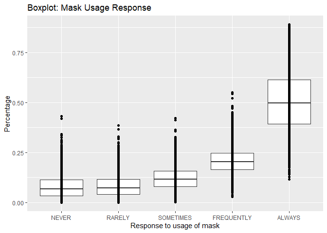<!-- -->

By choosing appropriate commands in the Code of **ggplot**, I could make
a box plot.

In the Code I could assign the Title, x-axis, and y-axis.

### Observations:

| X-axis | Response to usage of mask                                  |
| ------ | ---------------------------------------------------------- |
| X-axis | Responses (NEVER, RARELY, SOMTIMES, FREQUENTLY AND ALWAYS) |
| Y-axis | Percentage                                                 |

The output is almost as expected, I could see five **glyphs** for five
responses across the x-axis and percentages across the y-axis and the
five points. However,

  - the values about the five points are not significant.

  - the percentage of people responded “ALWAYS” is more than that of the
    other responses.

  - the median response to mask usage is more for the response Always
    and least for never.

  - according to the graph the median response to usage of mask looks
    almost the same for the response “Never” and “Rarely”.

  - there are significant **outliers** on the upper side for four of the
    glyphs except for “Always”.

  - the IQR for all them appears to be same except for “Always”.

**Advantages:**

  - In the output five **glyphs** are easily visible.

  - Median values can be identified and compared.

  - Outliers can be clearly identified

**Disadvantages:**

  - I could not identify all the statistical values using the boxplot.

  - The range and IQR could not be distinguished.

To identify the five major value points on each of the boxplot glyph, I
took the summary report and printed the values.

##### Summary Report:

``` r
print(summary(data1[-1:-5,]))
```

    ##      NEVER             RARELY          SOMETIMES        FREQUENTLY    
    ##  Min.   :0.00000   Min.   :0.00000   Min.   :0.0010   Min.   :0.0290  
    ##  1st Qu.:0.03400   1st Qu.:0.04000   1st Qu.:0.0790   1st Qu.:0.1640  
    ##  Median :0.06800   Median :0.07300   Median :0.1150   Median :0.2040  
    ##  Mean   :0.07998   Mean   :0.08292   Mean   :0.1213   Mean   :0.2076  
    ##  3rd Qu.:0.11300   3rd Qu.:0.11500   3rd Qu.:0.1560   3rd Qu.:0.2470  
    ##  Max.   :0.43200   Max.   :0.38400   Max.   :0.4220   Max.   :0.5490  
    ##      ALWAYS      
    ##  Min.   :0.1150  
    ##  1st Qu.:0.3930  
    ##  Median :0.4980  
    ##  Mean   :0.5081  
    ##  3rd Qu.:0.6140  
    ##  Max.   :0.8890

According to the boxplot the median for the response “Never” and
“Always” appeared the same, and from the report I could say they are
close but not the same. I could also see all the five required points
and the average values as well.

Mostly, the mean and median values for each of the individual responses
are almost close to each other.

## Histogram:

The task is generate a **histogram** to the percentage of people those
who responded Frequently/Always to the use of mask in all the given
counties in Virginia.

Primarily, I need to add a new column which contains the sum of the
percentage value of the people who responded “Frequently and Always” to
usage of mask.

**Expectations:**

  - The output of the histogram should have an x-axis with label "
    Frequently/Always".
  - y-axis must have the count, or the number of people responded.
  - The bins must be clear and distinguishable.
  - Make two histograms with different bin sizes.
  - Identify the number of people within the given percentage of
    response.

**Checking the header of the original data.**

``` r
head(data1)
```

    ##      NEVER RARELY SOMETIMES FREQUENTLY ALWAYS
    ## 1001 0.053  0.074     0.134      0.295  0.444
    ## 1003 0.083  0.059     0.098      0.323  0.436
    ## 1005 0.067  0.121     0.120      0.201  0.491
    ## 1007 0.020  0.034     0.096      0.278  0.572
    ## 1009 0.053  0.114     0.180      0.194  0.459
    ## 1011 0.031  0.040     0.144      0.286  0.500

### Adding a New column to existing data frame:

In this stage I could find a code to sum the values in both columns
FREQUENTLY and ALWAYS and copy the values to one more new column to the
end of the data frame as a new column.

**Checking the header of the data1 with new column.**

``` r
data1$NewCol <- as.numeric(apply(data1[,4:5], 1, sum))
head(data1)
```

    ##      NEVER RARELY SOMETIMES FREQUENTLY ALWAYS NewCol
    ## 1001 0.053  0.074     0.134      0.295  0.444  0.739
    ## 1003 0.083  0.059     0.098      0.323  0.436  0.759
    ## 1005 0.067  0.121     0.120      0.201  0.491  0.692
    ## 1007 0.020  0.034     0.096      0.278  0.572  0.850
    ## 1009 0.053  0.114     0.180      0.194  0.459  0.653
    ## 1011 0.031  0.040     0.144      0.286  0.500  0.786

The new column is added as expected and named it as “**NewCol**”. Very
clearly the ‘NewCol’ has values which is the sum of the values in the
columns “Frequently and Always”.

## Histogram(binwidth=0.1):

I intend to generate a histogram with binwidth = 0.1 and I choose the
bin border color to identify the separations.

``` r
ggplot(data = data1)+
  
  geom_histogram(mapping = aes(x=NewCol ), binwidth = 0.1, color = "red" )+
  labs(title = "Histogram of Response FREQUENTLY/ALWAYS", y ="Number of People", x= "FREQUENTLY/ALWAYS")
```

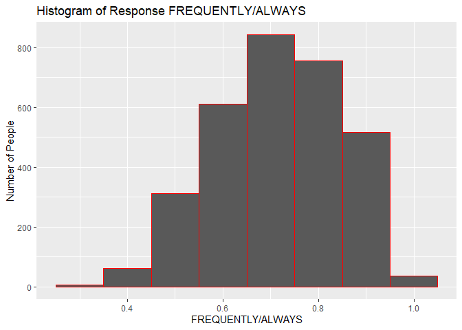<!-- -->

### Observations:

  - The bins, x-axis, and y-axis are as expected.
  - The bins are separated with red color as chosen.
  - I could tell the approximate number by looking at the bin and the
    y-axis, but I could not tell the exact number.
  - The y-axis has a number count from 0-900.
  - The x-axis is scaled 0-1 (0% to 100%)
  - Most number of people responded 70% positive to mask usage.

**Advantages:**

  - Can easily compare data.

  - Can differentiate range of data in each bin.

  - Can easily find the approximate number of people with corresponding
    response.

  - Can easily identify the highest and lowest values.

**Disadvantages:**

  - It is hard to tell the exact value corresponding to each bin.

  - Too few bins can leave out important information.

## Histogram(binwidth=0.05):

I intend to generate a histogram with binwidth = 0.05 and I chose the
bin border color to identify the separations.

``` r
ggplot(data = data1)+
  
  geom_histogram(mapping = aes(x=NewCol), binwidth = 0.05, color = "red")+
  labs(title = "Histogram of Response FREQUENTLY/ALWAYS", y ="Number of People", x= "FREQUENTLY/ALWAYS") 
```

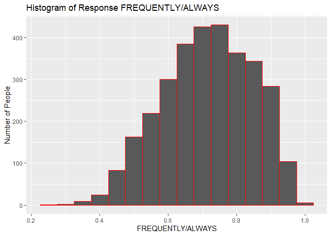<!-- -->

### Observations:

I initially chose a binwidth of 0.01 and I found the histogram is more
clumsy, so I changed the binwidth to 0.05 and I could observe that the
number of people responded at different percentages are much better and
clear. I found it easy to point the numbers since the count on the
y-axis is ranged 0-450, instead of 0-900.

In my point of view, a binwidth of 0.05 is more prominent than that of
0.1.

**Advantages:**

  - Can easily compare data.

  - Can differentiate range of data in each bin.

  - Can easily find the approximate number of people with corresponding
    response.

  - Can easily identify the highest and lowest values.

  - More bins appear like the data is normally distributed.

  - The smaller scale on the y-axis gives more approximation to the
    corresponding bins.

**Disadvantages:**

  - It is hard to tell the exact value corresponding to each bin.

### Alternate View:

I went forward and tried to set the corresponding number on each bin,
and I came up with the following code. My intention is to create the
same number of bins I created in the and set the frequency on the top of
the bin.

``` r
#set.seed(20)

ggplot(data = data1, aes(x = NewCol, color = ""))+
  
  geom_histogram()+stat_bin(aes(y= ..count.., label = ..count..),geom = "text", bins = 30, vjust= -.2)+
    labs(title = "Histogram of response: FREQUENTLY/ALWAYS ", y ="Number of People", x= "FREQUENTLY/ALWAYS")
```

    ## `stat_bin()` using `bins = 30`. Pick better value with `binwidth`.

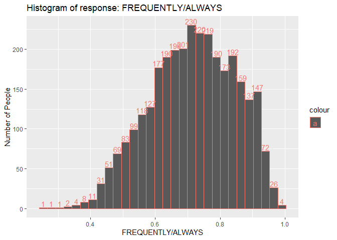<!-- -->

### Observations:

| X-axis | Quantitative attribute (percentages)                 |
| ------ | ---------------------------------------------------- |
| X-axis | percentage of people response to “Frequently/Always” |
| Y-axis | Quantitative (Number of people)                      |

  - The output is almost as expected, I could see the frequency on each
    bin, however, they are over lapping and not very clear.

  - I could not change the number of bins by giving bins=10 or so.

  - By making any changes the aesthetic view is disturbed and I could
    not make any further better.

**Advantages:**

  - Can easily compare data.

  - Can differentiate range of data in each bin.

  - The approximations are better with smaller scale on y-axis

  - Can easily identify the median, highest, and lowest values.

  - The count of each bin clearly tells the number of people responded.

**Disadvantages:**

  - Too many bins make the numbers overlapping.

<!-- end list -->

    The histogram with smaller binsize give better visibility of the data distribution. 

## eCDF (estimator of the Cumulative Distribution Function):

**Expectations:**

I am expecting to plot the data in order from least to greatest and see
the whole feature as if the data is distributed across the data set.
Since it is distributive function the y-axis must range from 0 through
1, or 0% to 100%. The graph must be step function.

**Code to execute a eCDF graph as a step function:**

``` r
ggplot(data = data1, aes(NewCol))+ 
  stat_ecdf(geom = "step")+
  labs(title = "eCDF of mask_FRQ/ALWAYS", y ="Percentage", x= "FREQUENTLY/ALWAYS")
```

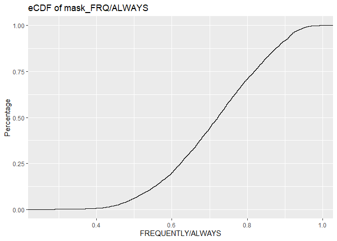<!-- -->

### Observations:

| X-axis | Response to usage of mask     |
| ------ | ----------------------------- |
| X-axis | Responses( FREQUENTLY/ALWAYS) |
| Y-axis | Percentage                    |

The output is almost as expected, I could see a continuous step graph
for the responses across the x-axis and percentages across the y-axis.
Probability, since the data is huge the graph looks like a line but in a
close look, I could make it as a step graph. The density function is
very convincing.

**Advantages:**

  - Was able to fit entire data in the definite axis

**Disadvantages:**

  - Could not find out the outliers

  - Corresponding value of each distribution cannot be identified.

  - The continuity between the range of each interval could not be
    identified.

### Conclusion for Part-1:

Of the four different idioms, the histogram with a greater number of
bins gave clear visualization of the data distribution. However, for all
the five different **glyphs** the box plot is much better.

# Part-2:

### Report of Part-2:

#### Source of the Data:

[US Census Bureau County Population
dataset](https://www.census.gov/data/datasets/time-series/demo/popest/2010s-counties-total.html#par_textimage_70769902)

Create a boxplot, eCDF, and two histograms (with different bin sizes)

  - for all charts, show the distribution of the population of all
    counties in the US as of the 2010 Census (CENSUS2010POP column).

  - the boxplot chart will just have a single boxplot glyph.

### Importing the data file and checking the header:

``` r
data2 <- read.csv(file = "C:/Users/alla/Desktop/Nagesh/CS625/cs625-fall-2020/HomeWorks/hw5-distributions-Nageshbvrch/co-est2019-alldata.csv",header = T, sep = ";",skip = 24, row.names = 1)
head(data2)
```

    ## data frame with 0 columns and 6 rows

#### Filtering the required attributes(columns):

The task is to view a boxplot to the attribute **CENSUS2010POP** in the
given file. So, I chose to filter and create a new data frame with only
one column CENSUS2010POP.

**Code to filter and view the column CENSUS2010POP:**

Sine the required heading is in column 8, I chose column 8 and saved the
date to **newdatalist**.

``` r
#library(dplyr)

data2 <- read.csv(file = "C:/Users/alla/Desktop/Nagesh/CS625/cs625-fall-2020/HomeWorks/hw5-distributions-Nageshbvrch/co-est2019-alldata.csv")

newdatalist <- data2[c(8)]
head(newdatalist)
```

    ##   CENSUS2010POP
    ## 1       4779736
    ## 2         54571
    ## 3        182265
    ## 4         27457
    ## 5         22915
    ## 6         57322

## Boxplot:

**Expectations:**

Since the data has only one attribute with CENSUS2010POP and the column
values are population count which is a quantitative attribute type, \* I
am expecting to visualize the output as a boxplot with one **glyphs**
and check the number of people that are distributed about the five major
points of observation **min, 25%, median, 75%, max**, and the outliers
as well.

  - I should be able to tell the median value, IQR, and the range of the
    data points in the column.

  - I should be able to find the outliers.

<!-- end list -->

``` r
ggplot(newdatalist, aes(y = CENSUS2010POP )) + geom_boxplot() +
  labs(title = "US Census Bureau County Population: CENSUS2010POP", y ="Population Count", x= "CENSUS2010POP")
```

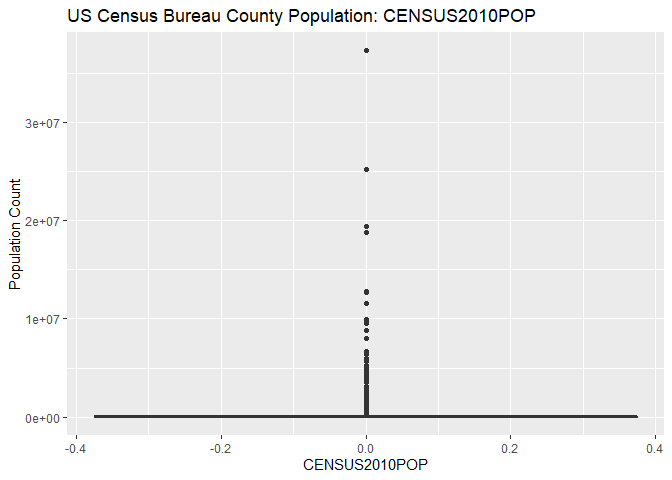<!-- -->

By choosing appropriate commands in the Code of **ggplot**, I could make
a box plot.

In the Code I could assign the Title, x-axis, and y-axis.

### Observations:

| X-axis        | Quantitative attribute          |
| ------------- | ------------------------------- |
| X-axis: Label | CENSUS2010POP                   |
| Y-axis        | Quantitative( Population Count) |

The output is not at all as expected, I could see one **glyph** across
the x-axis and population count across the y-axis for the column I
choose **CENSUS2010POP**. However,

  - the values about the five points are not significantly visible.

  - the population count is not properly identified.

  - the x-axis range is very much unexpected.

  - the median population for the county and the other values were
    unpredictable.

  - according to the graph all the five points (min, 25%, median, 75%,
    and max) are marked on one single line.

  - there are significant **outliers** on the upper side of the glyph.

  - the IQR, range, and the exact outliers are not very clear.

Finally, I could not make out all the values from the graph.

**Advantages:**

  - Could not find advantage, since the visualization of the glyph is
    poor.

**Disadvantages:**

  - I could not identify all the statistical values using the boxplot.

  - The range and IQR could not be distinguished.

  - The source data need lot of manipulation for better visualization.

To identify the five major value points on each of the boxplot glyph, I
took the summary report and printed the values.

``` r
print(summary(newdatalist[-1:-5,]))
```

    ##     Min.  1st Qu.   Median     Mean  3rd Qu.     Max. 
    ##       82    11285    26394   192101    71380 37253956

With the summary report I could see the spread of the data and I could
tell the five basic points of boxplot.

Looking at the data I intended to crop a chunk of data a see how the
graph looks like and then I want to see the changes that could happen.

To do so I checked the total values available in the column and I
arranged the values in a numerical order to check the outliers.

``` r
count(newdatalist)
```

    ##      n
    ## 1 3193

``` r
newdata <- newdatalist[order(-newdatalist),]
#newdata
```

By running the code above, I could check the top 1000 values. So, I
tried to see the bottom values and ran the code below.

Once after identifying the required information, I intentionally hide
the output because that is running tons of lines.

``` r
count(newdatalist)
```

    ##      n
    ## 1 3193

``` r
newdata <- newdatalist[order(newdatalist),]


#newdata
```

  - I found that there are 3193 data values and the middle 50% of the
    data (IQR) lies between 11285 and 71380.

  - I could find that there are many 4-digit numbers in the bottom and a
    few values in millions on the top order.

  - Which means, 25% of the data is less than 11285 and 25% of the data
    is more than 71380.

  - I have decided to crop some data values form bottom and from top. By
    trial-and-error I started cropping the bottom and top few values and
    checked the view of the graph.

<!-- end list -->

``` r
newdata1 <- newdata[c(300:3100 )]
#newdata1
```

``` r
library(dplyr)
df <-data.frame(newdata1)
head(df)
```

    ##   newdata1
    ## 1     4936
    ## 2     4959
    ## 3     4979
    ## 4     4980
    ## 5     5010
    ## 6     5042

**Expectations:**

Since the data has only one attribute with CENSUS2010POP and the column
values are population count which is a quantitative attribute type, \* I
am expecting to visualize the output as a boxplot with one **glyphs**
and check the number of people that are distributed about the five major
points of observation **min, 25%, median, 75%, max**, and the outliers
as well.

  - I should be able to tell the median value, IQR, and the range of the
    data points in the column.

  - I should be able to find the outliers.

<!-- end list -->

``` r
ggplot(df, aes(y = newdata1 )) + geom_boxplot() +
  labs(title = "Boxplot: CENSUS2010POP", y ="Population count", x= "CENSUS2010POP")
```

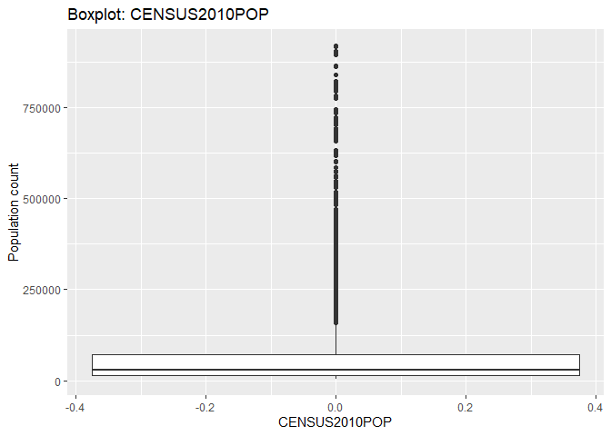<!-- -->

### Observations:

The output is almost as expected, I could see the **glyph** across the
x-axis very clearly and population count across the y-axis. However,

  - the values about the five points are significant, but they are
    different from the original values.

  - the population count is very clear, and I could tell the approximate
    value at each of the five required points.

  - the outliers were still there though I cropped the data.

  - the IQR can be predicted from the data which is close to 20000.

Finally, I could make out all the values. Now I want to check how
different are the values from the original.

To identify the five major value points on each of the boxplot glyph, I
took the summary report and printed the values before and after cropping
the data.

**Advantages:**

  - By eliminating the outliers, five statistical points were
    identified.

  - Median values can be identified.

  - The IQR is clearly identified

**Disadvantages:**

  - The outliers had to be eliminated manually.

  - The five statistical points were not same as the original data.

**Initial Data Summary:**

``` r
print(summary(newdatalist[-1:-5,]))
```

    ##     Min.  1st Qu.   Median     Mean  3rd Qu.     Max. 
    ##       82    11285    26394   192101    71380 37253956

**Date Summary after cropping the data:**

``` r
print(summary(df[-1:-5,]))
```

    ##    Min. 1st Qu.  Median    Mean 3rd Qu.    Max. 
    ##    5042   14617   29450   79401   72539  919040

I could conclude that the entire statistics changed, the view might be
good but the data is lost.

I was expecting maintain the IQR, median Q1, and Q3, but they were
completely different from the original.

## Histograms with two different binwidths:

**Expectations:**

  - The output of the histogram should have an x-axis with label
    “CENSUS2010POP”.
  - y-axis must have the population count.
  - The bins must be clear and distinguishable.
  - Make two histograms with different bin sizes.
  - Identify the number of counties within the given population range.
  - I chose two histograms: one with 10 bins and another with 5 bins.

## Histogram(Bins = 10):

**Code to generate histogram with 10 bins:**

``` r
ggplot(data = newdatalist)+
  
  geom_histogram(mapping = aes(CENSUS2010POP), bins = 10, color = "red")+
  labs(title = "Histogram of CENSUS2010POP", y ="Population count", x= "CENSUS2010POP") 
```

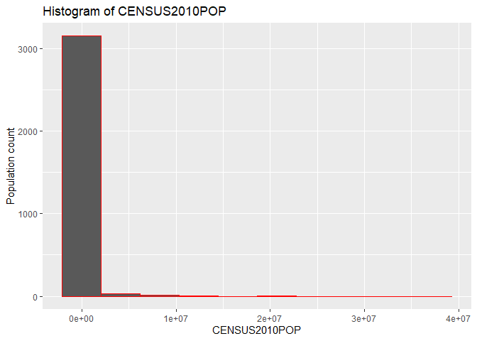<!-- -->

### Observations:

  - The bins, x-axis, and y-axis are not as expected.

  - The bins are separated with red color as chosen.

  - The above histogram looks right skewed and most of the values seem
    concentrated in only one bin.

  - Remaining data points could not be clearly identified on the
    histogram.

  - I could tell the approximate number by looking at the first bin and
    the y-axis, but I could not tell for the rest of the bins.

  - The y-axis has a number count from 0-3500.

  - The x-axis is scaled 0- millions.

  - I knew there are 3193 counties, and the counties are with different
    population size, however, in this graph they output is not clear
    because of the outliers.

## Histogram(Bins = 5):

Since the Histogram with 10 bins is right skewed, I chose 5 bins.

I am expecting more visible clarity and clear numbers.

**Code to generate histogram with 5 bins:**

``` r
ggplot(data = newdatalist)+
  
  geom_histogram(mapping = aes(x = CENSUS2010POP), bins = 5, color = "red")+
  labs(title = "Histogram- CENSUS2010POP", y ="Number", x= "CENSUS2010POP") 
```

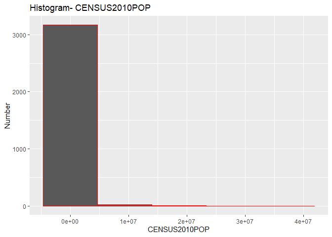<!-- -->

### Observations:

  - The histogram is still right skewed and most of the values seem
    concentrated in only one bin.

  - Remaining data points could not be clearly identified on the
    histogram.

  - The y-axis has a number count from 0-3500.

  - The x-axis is scaled 0- millions.

  - All the 3193 counties are still concentrated in one bin.

## Alternate View by filtering few values:

To generate a box plot I cropped few outliers with different
observations, and I am using the same data to see how the histogram
looks like.

**Code to make a new histogram:**

``` r
ggplot(data = df)+
  
  geom_histogram(mapping = aes(x = newdata1), bins = 10, color = "red")+
  labs(title = "Histogram- CENSUS2010POP", y ="Number", x= "CENSUS2010POP") 
```

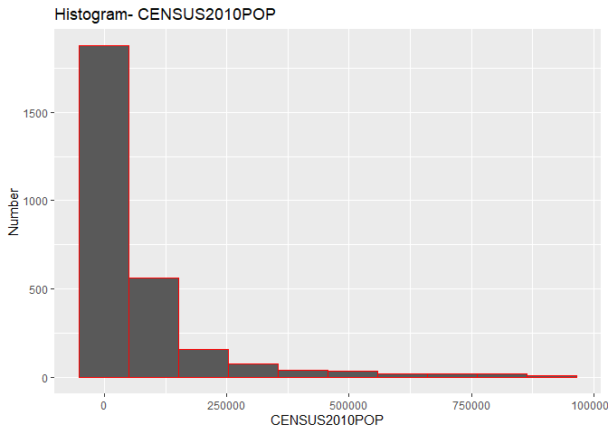<!-- -->

### Observations:

By cropping some data points on either side of the data, the new
histogram has a much better visualization.

  - The bins, x-axis, and y-axis are close to the expectation.

  - The bins are separated with red color as chosen.

  - The above histogram looks right skewed, but the values can be
    predicted for each bin.

  - I could tell the approximate number by looking at the bins and the
    y-axis for most of the bins.

  - The y-axis has a number count from 0-1200.

  - The x-axis is scaled 0- 1million.

  - I knew there are 3193 counties, and the counties are with different
    population size and I could sum up and find the closet count.

**Advantages:**

  - Can easily compare data.

  - Can differentiate range of data in each bin.

  - Can easily find the approximate number of counties with
    corresponding population census in 2010.

  - Can easily identify the highest and lowest values.

  - Can easily identify the skewness of data.

**Disadvantages:**

  - It is hard to tell the exact value corresponding to each bin.

## eCDF:

**Expectations:**

I am expecting to plot the data in order from least to greatest and see
the whole feature as if the data is distributed across the data set.
Since it is distributive function the y-axis must range from 0 through
1, or 0% to 100%. The graph must be step function.

**Code to execute a eCDF graph as a step function:**

``` r
ggplot(data = newdatalist, aes(CENSUS2010POP))+ 
  stat_ecdf(geom = "step")+
  labs(title = "eCDF of CENSUS2010POP", y ="Percentage", x= "CENSUS2010POP")
```

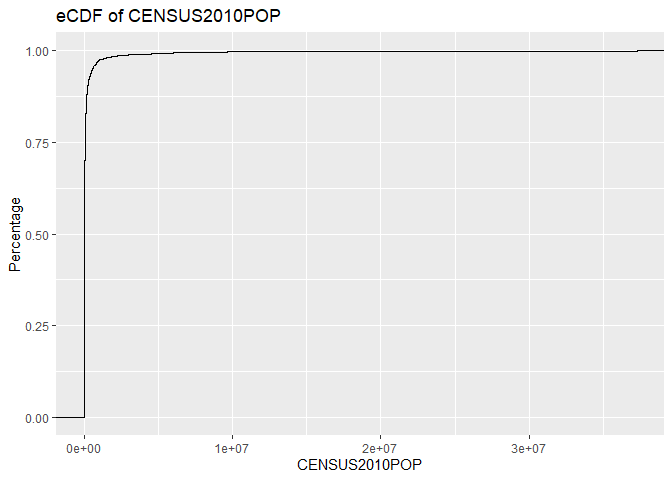<!-- -->

### Observations:

| X-axis | Quantitative | CENSUS2010POP |
| ------ | ------------ | ------------- |
| Y-axis | Quantitative | Percentage    |

The output is almost as expected, but I understood I could see a
continuous step graph for the responses across the x-axis and
percentages across the y-axis. Since most of the data points are
concentrated within a small range and the data is scattered from
two-digit number to millions, it appears to have less steps.

## Alternate View of eCDF by filtering few values:

To generate a box plot I cropped few outliers with different
observations, and I am using the same data to see how the eCDF looks
like.

**Code to make a new eCDF:**

``` r
ggplot(data = df, aes(newdata1))+ 
  stat_ecdf(geom = "step")+
  labs(title = "eCDF of CENSUS2010POP", y ="Percentage", x= "CENSUS2010POP")
```

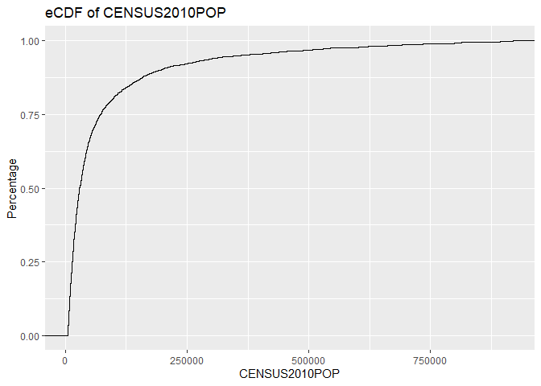<!-- -->

### Observations:

The output is almost as expected, I could see a continuous step graph
for the responses across the x-axis and percentages across the y-axis.
By cropping a few data points, I could visualize a better view on the
eCDF.

ECDF

**Advantages:**

  - Was able to fit entire data in the definite axis

  - By modifying the data size and by eliminating the outliers the
    distribution is better.

**Disadvantages:**

  - Could not find out the outliers

  - Corresponding value of each distribution cannot be identified.

  - The continuity between the range of each interval could not be
    identified.

### Conclusion for Part-2:

There are 3 idioms for which I have generated 7 graphs by manipulating
the data for better visualization. Of the three different idioms, the
histogram with modified data and a greater number of bins gave clear
visualization of the data distribution.

# Part-3:

### Report of Part-3:

#### Source of the Data:

[US Census Bureau State Population
dataset](https://www.census.gov/data/tables/time-series/demo/popest/2010s-state-total.html#par_textimage)

Create a boxplot, eCDF, and two histograms (with different bin sizes)

  - for the boxplot, show the distributions for the 2019 birth rates
    (RBIRTH2019 column), death rates (RDEATH2019 column), and migration
    rates (RNETMIG2019 column) for all the states in the US (will result
    in 3 separate boxplot glyphs)

  - for the eCDF and histograms, pick one of the above (birth rates,
    death rates, or migration rates

### Importing the data file:

``` r
data3 <- read.csv(file = "C:/Users/alla/Desktop/Nagesh/CS625/cs625-fall-2020/HomeWorks/hw5-distributions-Nageshbvrch/nst-est2019-alldata-q3.csv",header = F, sep = ";",skip = 5, row.names = 1)
head(data3)
```

    ## data frame with 0 columns and 6 rows

### Filtering the required columns:

The task is to make three separate **glyps** to three different
attributes “RBIRTH2019, RDEATH2019, and RNETMIG2019”.

| RBIRTH2019  | Birth rate in period 7/1/2018 to 6/30/2019         |
| ----------- | -------------------------------------------------- |
| RDEATH2019  | Death rate in period 7/1/2018 to 6/30/2019         |
| RNETMIG2019 | Net migration rate in period 7/1/2018 to 6/30/2019 |

``` r
library(dplyr)

data3 <- read.csv(file = "C:/Users/alla/Desktop/Nagesh/CS625/cs625-fall-2020/HomeWorks/hw5-distributions-Nageshbvrch/nst-est2019-alldata-q3.csv")

newdatalist1 <- data3[c(106,115,151)]
head(newdatalist1)
```

    ##   RBIRTH2019 RDEATH2019 RNETMIG2019
    ## 1   11.57904   8.657569    1.818059
    ## 2   10.76039   9.025986   -2.859713
    ## 3   11.60384   9.121680   -1.111173
    ## 4   11.84285   8.971661    5.203720
    ## 5   11.72202   7.484418    2.312083
    ## 6   11.70744  11.005972    2.483744

## Boxplot:

**Expectations:**

Since the task is to make three separate **glyps** to three different
attributes “RBIRTH2019, RDEATH2019, and RNETMIG2019” and the column
values are percentage values which is a quantitative attribute type,

  - I am expecting to visualize the output as a boxplots with three
    separated **glyphs** and check the percentage of people that are
    distributed about the five major points of observation **min, 25%,
    median, 75%, max**, and the outliers as well.

  - I should be able to tell the median value, IQR, and the range of the
    data points in the column.

  - I should be able to find the outliers.

To make a boxplot all the required columns must be aligned in two
columns.

``` r
mat2 <- as.matrix(newdatalist1)

library(ggplot2)
library(reshape2)
long1 <- melt(mat2)
head(long1)
```

    ##   Var1       Var2    value
    ## 1    1 RBIRTH2019 11.57904
    ## 2    2 RBIRTH2019 10.76039
    ## 3    3 RBIRTH2019 11.60384
    ## 4    4 RBIRTH2019 11.84285
    ## 5    5 RBIRTH2019 11.72202
    ## 6    6 RBIRTH2019 11.70744

The rearranged data frame has a categorical attribute and a quantitative
attribute.

**Code to generate Boxplot:**

``` r
ggplot(long1, aes(x=Var2, y=value)) + geom_boxplot() + geom_point()+
  labs(title = "Boxplot:  Rates of the Components of Resident Population Change for the United States for 2019", y ="Percentage", x= "Rate of Distributions")
```

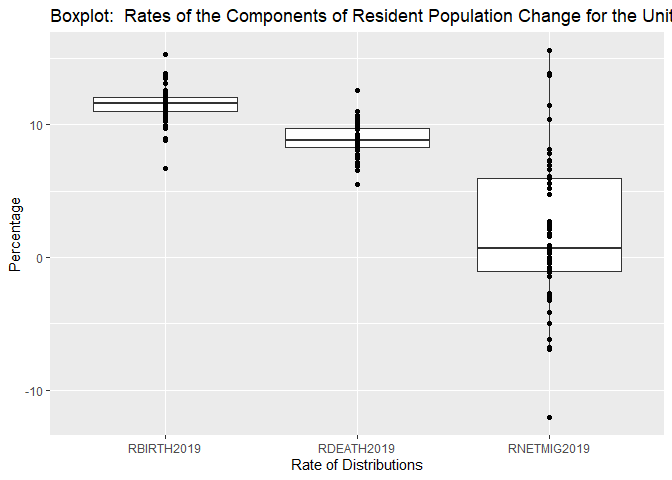<!-- -->

By choosing appropriate commands in the Code of **ggplot**, I could make
a box plot.

In the Code, I could assign the Title, x-axis, and y-axis labels.

### Observations:

| X-axis | Rate of Distributions |                                     |
| ------ | --------------------- | ----------------------------------- |
| X-axis | Rate of Distributions | RBIRTH2019, RDEATH2019, RNETMIG2019 |
| Y-axis | Percentage            |                                     |

The output is almost as expected, I could see three separate **glyphs**
for three rate of distributions across the x-axis and percentages across
the y-axis and the five points (Minimum, Q1, Median, Q3, Maximum).
However,

  - the values about the five points are not clear.

  - the “rate of birth” is more than that of the other rates.

  - the median for RBIRTH2019 is more than 10, while the other two rates
    were less than 10.

  - the IQR for “RNETMIG2019” is more than RBIRTH and RDEATH.

  - there are significant **outliers** on the RNETMIG2019 compared to
    other two.

  - the data values for the RBIRTH and RDEATH are all positive; but for
    RNETMIG there exists negative rates for some states.

**Advantages:**

  - In the output three **glyphs** are easily visible.

  - Median values can be identified and compared.

  - Outliers can be clearly identified

**Disadvantages:**

  - I could not identify all the statistical values using the boxplot.

  - The range and IQR could not be distinguished.

The next step I did was to observe how the statistics of the negative
values impacted the **RNETMIG** glyph. To identify the five major value
points on each of the boxplot glyph, I took the summary report and
printed the values.

``` r
print(summary(newdatalist1[-1:-5,]))
```

    ##    RBIRTH2019      RDEATH2019      RNETMIG2019      
    ##  Min.   : 6.71   Min.   : 5.486   Min.   :-12.0312  
    ##  1st Qu.:10.96   1st Qu.: 8.297   1st Qu.: -0.8783  
    ##  Median :11.58   Median : 8.754   Median :  0.6214  
    ##  Mean   :11.48   Mean   : 8.919   Mean   :  1.9014  
    ##  3rd Qu.:12.09   3rd Qu.: 9.836   3rd Qu.:  6.2504  
    ##  Max.   :15.30   Max.   :12.550   Max.   : 15.5625

Finally, I could not observe statistical values for each glyph on the
boxplot chart.

\#\#\#Histogram for “RBIRTH2019” with two different binwidths:

Out of the three value attributes, I picked **RBIRTH2019**, because it
has a significant range.

**Expectations:**

  - The output of the histogram should have an x-axis with label "
    RBIRTH2019".

  - X-axis is showing the rate of birth in the year 2019.

  - y-axis must have the count or the number of states with
    corresponding rate of birth on the x-axis.

  - The bins must be clear and distinguishable.

  - Make two histograms with different bin sizes.

  - Identify the number of states in a particular range of rate of birth
    in the year 2019.

  - Two histograms were generated with binwidths 0.1 and 0.5.

## Histogram(Binwidth =0.1):

**Code to generate Histogram with binwidth 0.1:**

``` r
ggplot(data = newdatalist1)+
  
  geom_histogram(mapping = aes(x=RBIRTH2019), binwidth = 0.1, color = "green")+
  labs(title = "Histogram of US Census Bureau State Population - RBIRTH2019", y ="Number of States", x= "Rate of Birth 2019") 
```

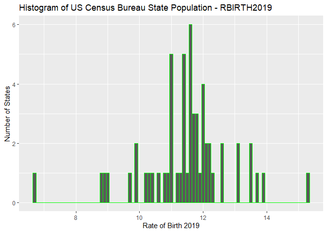<!-- -->

### Observations:

  - The bins, x-axis, and y-axis are as expected.

  - The bins are separated with green color as chosen.

  - The above histogram looks normally distributed.

  - The number of states with corresponding rate of births can be
    identified, but not very clear.

  - The y-axis has a number count from 0-7.

  - The x-axis is scaled 0- 16.

I knew there are 58 values in the column from the output and from the
observation, however, in this graph the output is not clear because of
the binwidth.

**Advantages:**

  - Can differentiate range of data in each bin.

  - Can easily find the approximate number of people with corresponding
    response.

  - Can easily identify the highest and lowest values.

**Disadvantages:**

  - Cannot easily compare data.

  - It is hard to tell the exact value corresponding to each bin.

  - Too many bins look clumsy.

## Histogram (Binwidth =0.5):

Since the binwidth of 0.1 is not an appropriate view I chose a binwidth
of 0.5 and expecting the relative values must be much better than the
existing.

``` r
ggplot(data = newdatalist1)+
  
  geom_histogram(mapping = aes(x=RBIRTH2019), binwidth = 0.5, color = "red")+
  labs(title = "Histogram of US Census Bureau State Population - RBIRTH2019", y ="Number of States", x= "Rate of Birth 2019") 
```

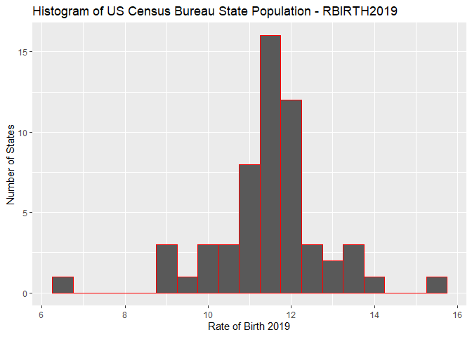<!-- -->

### Observations:

  - The bins, x-axis, and y-axis are as expected.

  - The bins are separated with red color as chosen.

  - The above histogram looks normally distributed.

  - The number of states with corresponding rate of births can be
    identified, but much better than the histogram with binwidth =0.1.

  - The y-axis has a number count from 0-15.

  - The x-axis is scaled 0- 16.

I knew there are 58 values in the column from the output and from the
observation, however, in this graph the output is not clear because of
the binwidth.

**Advantages:**

  - Can easily compare data.

  - Can differentiate range of data in each bin.

  - Can easily find the approximate number of states with corresponding
    range of rate of births.

  - Can easily identify the median, highest, and lowest values.

  - By reducing the bin size, the idiom visualization is much better.

**Disadvantages:**

  - Too few bins can leave out important information regarding the
    spread.

## eCDF (RBIRTH2019):

**Expectations:**

I am expecting to plot the data in order from least to greatest and see
the whole feature as if the data is distributed across the data set.
Since it is distributive function the y-axis must range from 0 through 1
or 0% to 100%. The graph must be step function.

**Code to execute an eCDF graph as a step function:**

``` r
ggplot(data = newdatalist1, aes(RBIRTH2019, color = "red"))+ 
  stat_ecdf(geom = "step")+
  labs(title = "eCDF of US Census Bureau State Population", y ="Percentage", x= "RBIRTH2019")
```

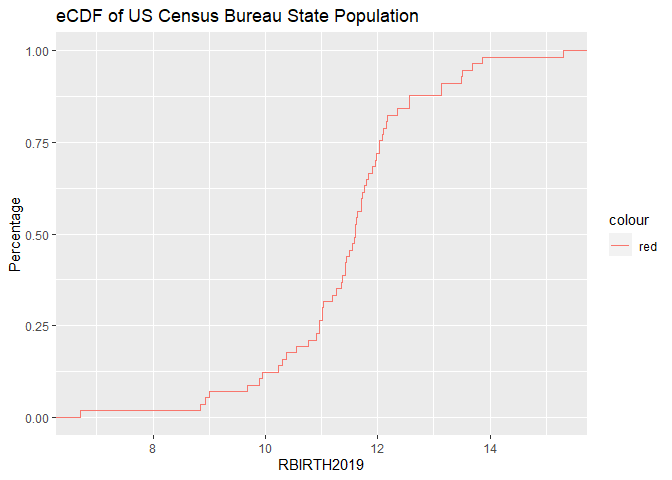<!-- -->

### Observations:

| X-axis | Quantitative | RBIRTH2019 |
| ------ | ------------ | ---------- |
| Y-axis | Quantitative | Percentage |

The output is almost as expected, I could see a continuous step graph
for the responses across the x-axis and percentages across the y-axis. I
could easily identify that the visualization is step graph.

**Advantages:**

  - Was able to fit entire data in the definite axis

  - The step function provides better clarity in understanding the data
    distribution.

**Disadvantages:**

  - Could not find out the outliers

  - Corresponding value of each distribution cannot be identified.

  - The continuity between the range of each interval could not be
    identified.

### Conclusion for Part-3:

Three idioms for which four graphs are generated. Of the three different
idioms, the histogram with a smaller number of bins gave clear
visualization of the data distribution.

## Final Conclusion:

Overall, out of the three different idioms (Boxplot, Histogram, and
eCDF), histogram has better visualization for the given datasets, but
with different bin sizes.

## References:

##### Resources for plotting distributions in R:

  - Boxplot -
    <https://www.rdocumentation.org/packages/graphics/versions/3.6.1/topics/boxplot>,
    <https://www.datamentor.io/r-programming/box-plot/>

  - Histogram -
    <https://www.rdocumentation.org/packages/graphics/versions/3.6.1/topics/hist>,
    <https://www.datamentor.io/r-programming/histogram/>

  - eCDF -
    <https://www.rdocumentation.org/packages/stats/versions/3.6.1/topics/ecdf>,
    <https://r-dir.com/blog/2014/03/cdfs-in-r.html>

##### Resources for plotting distributions in R with ggplot2:

  - Boxplot -
    <https://ggplot2.tidyverse.org/reference/geom_boxplot.html>

  - Histogram -
    <https://ggplot2.tidyverse.org/reference/geom_histogram.html>

  - eCDF - <https://ggplot2.tidyverse.org/reference/stat_ecdf.html>

##### Resources for plotting distributions in Vega-Lite:

  - Boxplot - <https://vega.github.io/vega-lite/docs/boxplot.html>

  - Histogram - <https://vega.github.io/vega-lite/docs/bin.html>,

  - <https://vega.github.io/vega-lite/docs/bin.html#histogram>

  - eCDF - <https://vega.github.io/vega-lite/docs/window.html>,
    <https://vega.github.io/vega-lite/docs/window.html#cumulative-frequency-distribution>

*library(tidyverse):*

<https://ggplot2.tidyverse.org/reference/index.html>

<https://help.tableau.com/current/pro/desktop/en-us/formatting_resizetable.htm>

*Moving Horizontal Bar Chart Headers from Bottom to Top*

<https://kb.tableau.com/articles/howto/moving-horizontal-bar-chart-headers-from-bottom-to-top>

*How to Place Labels Directly Through Your Line Graph in Microsoft
Excel*

<https://depictdatastudio.com/how-to-place-labels-directly-through-your-line-graph-in-microsoft-excel/>

*Small Multiples or Panel charts in Excel*

<https://mbounthavong.com/blog/2018/5/27/communicating-data-effectively-with-data-visualizations-part-7-using-small-multiples-or-panel-charts-in-excel>

*How to Make a Small Multiples Bar Chart in Excel:*

<https://depictdatastudio.com/small-multiples-solution/>

*Color Codes*:

<https://www.w3schools.com/colors/colors_picker.asp>

*Markdown*:

<https://www.markdownguide.org/basic-syntax>

<https://vega.github.io/vega-lite/docs/scale.html#scheme>

<https://observablehq.com/d/06499f6a4926793f>

**ggplot**:

<https://datacarpentry.org/R-ecology-lesson/04-visualization-ggplot2.html>

**Summing multiple columns in an R data-frame:**:

<https://stackoverflow.com/questions/52075580/summing-multiple-columns-in-an-r-data-frame-quickly/52075773>

**Adding Labels and Title:**

<https://cengel.github.io/R-data-wrangling/data-visualization-with-ggplot2.html#plotting-with-ggplot2>

**Select a subset of a data:**

<https://stackoverflow.com/questions/47443365/how-to-extract-certain-columns-from-a-list-of-data-frames>

**Coloring boxplot:**

<http://www.sthda.com/english/wiki/ggplot2-box-plot-quick-start-guide-r-software-and-data-visualization>

**eCDF:**

<https://ggplot2.tidyverse.org/reference/stat_ecdf.html>

**Re-arrange/re-order:**

<https://rpubs.com/Felix/7644>

<https://www.r-graph-gallery.com/264-control-ggplot2-boxplot-colors.html>

<https://jcoliver.github.io/learn-r/004-intro-ggplot.html>

**Boxplot-long:**

<http://monashbioinformaticsplatform.github.io/2015-11-30-intro-r/ggplot.html>
<https://ggplot2.tidyverse.org/reference/geom_boxplot.html>

<https://r4ds.had.co.nz/data-visualisation.html>

**ggplot2-cheatsheet-2.1**:

<https://rstudio.com/wp-content/uploads/2016/11/ggplot2-cheatsheet-2.1.pdf>

<https://r4ds.had.co.nz/data-visualisation.html#introduction-1>
