Homework 6
================
Nagesh Bheesetty

CS 625, Fall 2020

Date: 11/10/2020

### Goal:

The goal of this assignment is to practice exploratory data analysis
using R.

# Assignment:

The questions and exercises this week come from [Chapter 5 (Data
Transformations)](https://r4ds.had.co.nz/transform.html) and [Chapter 7
(Exploratory Data
Analysis)](https://r4ds.had.co.nz/exploratory-data-analysis.html) in R
for Data Science. You should read and practice the examples in each
section before attempting the associated exercises.

Answer each of the questions using RMarkdown. Any R code needed to
answer the questions should be runnable and embedded in your report.
Make sure to ‘Knit’ your report to produce Markdown suitable for Github
and commit both the .Rmd and .md files (and all images generated by the
Knitting process) to your repo. *It is not sufficient just to answer
each question, but you must also explain your answer and describe what
you did to arrive at the answer, including necessary code and charts*.

Make sure that you click the links provided to view the questions in the
book as some include additional information or figures than what is
given below.

# Report:

**Importing the libraries “tidyverse” and “nycflights13”**.

``` r
library(nycflights13)
library(tidyverse)
```

    ## Warning: package 'tidyverse' was built under R version 4.0.3

    ## -- Attaching packages ---------------------------------------------- tidyverse 1.3.0 --

    ## v ggplot2 3.3.2     v purrr   0.3.4
    ## v tibble  3.0.3     v dplyr   1.0.2
    ## v tidyr   1.1.2     v stringr 1.4.0
    ## v readr   1.3.1     v forcats 0.5.0

    ## Warning: package 'ggplot2' was built under R version 4.0.3

    ## -- Conflicts ------------------------------------------------- tidyverse_conflicts() --
    ## x dplyr::filter() masks stats::filter()
    ## x dplyr::lag()    masks stats::lag()

The library “**tidyverse**” allows statisticians and data scientists to
create work-flow that facilitate communication and result in
reproducible work product. It consists a collection of R packages that
share an underlying design philosophy, grammar, and data structures.
this “tidyverse” makes data processing faster and easier. The most
important packages are:

  - ggplot
  - dplyr
  - tidyr
  - readr

Whereas the “**nycflights13**” is a package of `dataset` on flights
departing New York City in 2013. This data frame contains all 336,776
flights that departed from New York City in 2013. The data came from the
[US Bureau of Transportation
Statistics](https://www.transtats.bts.gov/DatabaseInfo.asp?DB_ID=120&Link=0),
and is documented in `?flights`.

## Understanding and Analysing the dataset:

``` r
flights
```

    ## # A tibble: 336,776 x 19
    ##     year month   day dep_time sched_dep_time dep_delay arr_time sched_arr_time
    ##    <int> <int> <int>    <int>          <int>     <dbl>    <int>          <int>
    ##  1  2013     1     1      517            515         2      830            819
    ##  2  2013     1     1      533            529         4      850            830
    ##  3  2013     1     1      542            540         2      923            850
    ##  4  2013     1     1      544            545        -1     1004           1022
    ##  5  2013     1     1      554            600        -6      812            837
    ##  6  2013     1     1      554            558        -4      740            728
    ##  7  2013     1     1      555            600        -5      913            854
    ##  8  2013     1     1      557            600        -3      709            723
    ##  9  2013     1     1      557            600        -3      838            846
    ## 10  2013     1     1      558            600        -2      753            745
    ## # ... with 336,766 more rows, and 11 more variables: arr_delay <dbl>,
    ## #   carrier <chr>, flight <int>, tailnum <chr>, origin <chr>, dest <chr>,
    ## #   air_time <dbl>, distance <dbl>, hour <dbl>, minute <dbl>, time_hour <dttm>

#### Procedure and Observations:

The dataset consists of 336,776 rows and 19 columns.

|                          |             |              |              |          |
| ------------------------ | ----------- | ------------ | ------------ | -------- |
| Number of Attributes:    | 4           | 8            | 6            | 1        |
| Attribute abbreviations: | *chr*       | *int*        | *dbl*        | *dttm*   |
| Attribute type:          | Categorical | Quantitative | Quantitative | temporal |

The output of the `flights` data allow us to identify each type of
attribute, and we can choose the type of attribute depending the
analysis we would like to draw.

  - The first three columns are year,month,day, and the last
    19<sup>th</sup> column is **time\_hour**, which includes the
    year-month-day-time (temporal attribute).

  - The 4<sup>th</sup>, 5<sup>th</sup>, and 6<sup>th</sup> columns gives
    us an idea about the flights **departure** (time, schedule, and
    delay).

  - The 7<sup>th</sup>, 8<sup>th</sup>, and 9<sup>th</sup> columns gives
    us an idea about the flights **arrival** (time, schedule, and
    delay).

  - The 10<sup>th</sup>, 12<sup>th</sup>, 13<sup>th</sup>, and
    14<sup>th</sup> columns are 4 categorical data values which gives us
    an idea about the flights (carrier, tail-number, origin, and
    destination).

  - The other columns tells us about the flight number, air time,
    distance travelled, the time taken in hours and minutes to travel.

[Section 5.6.7](https://r4ds.had.co.nz/transform.html#exercises-12)

Q1. 4. Look at the number of cancelled flights per day. `Is there a
pattern?` Is the proportion of cancelled flights related to the average
delay?

#### Expectation:

The task is find a correlation between “average delay in flights per
day” and “cancellation of flights”.

To derive a correlation there are a few challenges:

1.  To find the average delay in flights per day.
2.  To find the number of cancelled flights and proportion of cancelled
    flights.
3.  Finally, to find a correlation between the proportion of cancelled
    flights related to the average delay.

**Code to find the average delay in flights per day:**

``` r
by_day <- group_by(flights, year, month, day)
summarise(by_day, Avgdelay = mean(dep_delay, na.rm = TRUE))
```

    ## `summarise()` regrouping output by 'year', 'month' (override with `.groups` argument)

    ## # A tibble: 365 x 4
    ## # Groups:   year, month [12]
    ##     year month   day Avgdelay
    ##    <int> <int> <int>    <dbl>
    ##  1  2013     1     1    11.5 
    ##  2  2013     1     2    13.9 
    ##  3  2013     1     3    11.0 
    ##  4  2013     1     4     8.95
    ##  5  2013     1     5     5.73
    ##  6  2013     1     6     7.15
    ##  7  2013     1     7     5.42
    ##  8  2013     1     8     2.55
    ##  9  2013     1     9     2.28
    ## 10  2013     1    10     2.84
    ## # ... with 355 more rows

``` r
#filter(flights,  is.na(dep_delay))
```

#### Procedure and Observations:

The task is to find the average delay in flights per day.

This code allowed me to find the average delay in flights per day.

  - I considered “**group\_by**” option to group the data of flights in
    a day of a month of the corresponding year to a and stored it in
    “**by\_day**”.

  - The average(mean) `dep_delay` of each day is stored in
    “**Avgdelay**”.

  - The attribute type **Avgdelay** in the data frame refers to the
    mean/average of the departure delay (`dep_delay`) in fights on each
    day.

  - The output of the data frame finally consists of the year, month,
    day, and the Average departure delay of flights.

**Code to find the cancelled flights and proportion of cancelled flights
per day:**

``` r
cancel<-mutate(flights, cancelled = is.na(dep_delay) )

by_day<-group_by(cancel,  day)
df<-summarise(by_day, Avgdelay= mean(dep_delay, na.rm = TRUE),
              n = n(), NoOfCancelled = sum(cancelled), 
              PropOfCancelled = mean(cancelled) )
```

    ## `summarise()` ungrouping output (override with `.groups` argument)

``` r
head(df)
```

    ## # A tibble: 6 x 5
    ##     day Avgdelay     n NoOfCancelled PropOfCancelled
    ##   <int>    <dbl> <int>         <int>           <dbl>
    ## 1     1    14.2  11036           246         0.0223 
    ## 2     2    14.1  10808           250         0.0231 
    ## 3     3    10.8  11211           109         0.00972
    ## 4     4     5.79 11059            82         0.00741
    ## 5     5     7.82 10858           226         0.0208 
    ## 6     6     6.99 11059           296         0.0268

#### Procedure and Observations:

The task is find the number of cancelled flight s and the proportion of
flights cancelled per day.

This code allowed me to find the average delay in flights per day, the
number of flights cancelled per day, and the proportion of flights
cancelled per day. In addition to this I could also find the number of
flights travelled in a day.

The initial data does not have columns that shows " average delay,
number of cancelled flights, and the proportion of cancelled flights"
per each day.

  - **Cancelled flights:** I considered if a flight has a schedule
    departure and the fights `dep_time` is “**NA**”, than the flight has
    been cancelled.

  - I mutated all the fights with `dep_delay` with **NA** to **cancel.**

  - I considered “**group\_by**” option to group the data of flights in
    a day and **cancel**.

  - The average(mean) `dep_delay` of each day is stored in
    “**Avgdelay**”.

  - The number of flights travelled in a day is considered as “**n**”.

  - The number of flights cancelled on each day day is stored in
    “**NoOfCancelled**”.

  - The proportion of cancelled flight son each day is stored in
    “**PropOfCancelled**”.

  - Finally, the output of the data frame consists of the day, the
    Average delay of flights, the number of flights travelled on each
    day, the number of cancelled flights, and the proportion of
    cancelled flights on each day.

**Code to find the proportion using ggplots:**

``` r
ggplot(data = df, mapping = aes(x = Avgdelay, y = PropOfCancelled)) +
  geom_point() +
  geom_smooth(se = FALSE)
```

    ## `geom_smooth()` using method = 'loess' and formula 'y ~ x'

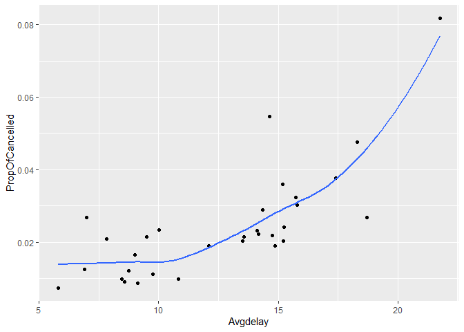<!-- -->

#### Procedure and Observations:

The task is to generate a correlation between average delay in flights
per day and the the number of cancelled flights on that day.

| Idiom:        | Scatterplot                                                                   |
| ------------- | ----------------------------------------------------------------------------- |
| What: Data    | Table: Two quantitative value attributes                                      |
| What: Derived | Correlation between key attributes in X-axis and Y-axis                       |
| How: Encode   | Express values with horizontal and vertical spatial position and point marks. |
| Why           | Find trends, outliers, distribution, correlation, locate clusters             |
| X-axis        | Average delay time of flights on each day                                     |
| Y-axis        | Proportion of cancelled flights on each day                                   |

  - The `ggplot` is used to generate a `Scatterplot` which establishes a
    correlation between the `Avgdalay` and `PropOfCancelled`.
    
      - Within the `ggplot` **geom\_point()** is used to generate a
        `Scatterplot`, which establishes a correlation between the
        required attributes.
      - `geom_smooth()` automatically fits to each group (defined by
        categorical aesthetics or the group aesthetic) and for each
        facet.
          - se = FALSE, means the standard error is omitted.

  - The `Avgdelay` and `PropOfCancelled` are defined in the data frame.

  - The graph established a correlation between the average delay in
    flights per day and the proportion of flights cancelled on each day.

##### Conclusion:

  - As expected I could observe a correlation between the average delay
    in flights per day and the proportion of cancelled fights on a day.

  - As the delay in time increased the proportion of cancelled flights
    also increased.

  - There is a positive correlation between the average delay in flights
    per day and the proportion of cancelled fights on a day.

-----

[Section 5.7.1](https://r4ds.had.co.nz/transform.html#exercises-13)

`Q2. 2. Which plane` (`tailnum`) `has the worst on-time record?`

#### Expectation:

The task is find the tail number of a flight “`tailnum`” that has a
worst `on-time` record.

I am expecting to view the top 10 fights with worst on-time record.

**Code to find the “tailnum” and “onTime”:**

``` r
  group_by(flights, tailnum) %>%
  summarise(onTime=mean(arr_delay)) %>%
  
  filter(rank(desc(onTime)) <= 10)
```

    ## `summarise()` ungrouping output (override with `.groups` argument)

    ## # A tibble: 10 x 2
    ##    tailnum onTime
    ##    <chr>    <dbl>
    ##  1 N427SW    157 
    ##  2 N587NW    264 
    ##  3 N654UA    185 
    ##  4 N665MQ    175.
    ##  5 N7715E    188 
    ##  6 N844MH    320 
    ##  7 N851NW    219 
    ##  8 N911DA    294 
    ##  9 N922EV    276 
    ## 10 N928DN    201

#### Procedure and Observations:

**I considered the worst `on-time` record of flight as the flight with
highest average arrival delay, which is represented as an attribute with
attribute type `arr_delay`.**

  - This code allowed me to group the data consisting the tail
    number(`tailnum`) of the flights with highest arrival delay.

  - The initial data has a columns that shows arrival delay as
    `arr_delay`, however the average of the arrival delay is stored in
    the new attribute `onTime`.

  - The data frame shows two attributes; the `tailnum` and the `onTime`.

  - The data frame is filtered to view the 10 flight tail numbers with
    average worst `on-time` record.

##### Conclusion:

  - As expected I could view the 10 fights `tailnum` with the worst
    `on-time` record.

  - The flight with `tailnum` = **N844MH** has the worst on-time record
    with an average arrival delay 320 (minutes).

-----

`Q3. 4. For each destination, compute the total minutes of delay.`

#### Expectation:

The task is to find the total minutes of delay in flights with respect
to the destination of the flight.

  - I would like find the top 5 destinations of flights with highest
    delay in minutes and the number of flights.

  - I would like find the bottom 5 destinations of flights with least
    delay in minutes and the number of flights.

**Code to find the “destination” and “Total delay”:**

``` r
  group_by(flights, dest) %>%
  summarise( count = n(),
             Totaldelay=sum(arr_delay, na.rm = TRUE ))%>%
  filter(rank(desc(Totaldelay)) <= 5)
```

    ## `summarise()` ungrouping output (override with `.groups` argument)

    ## # A tibble: 5 x 3
    ##   dest  count Totaldelay
    ##   <chr> <int>      <dbl>
    ## 1 ATL   17215     190260
    ## 2 CLT   14064     100645
    ## 3 DCA    9705      82609
    ## 4 FLL   12055      96153
    ## 5 ORD   17283      97352

``` r
by_dest <- group_by(flights, dest)
Totaldelay <- summarise(by_dest,
  count = n(),
    Totaldelay = sum(arr_delay, na.rm = TRUE)
)
```

    ## `summarise()` ungrouping output (override with `.groups` argument)

``` r
Totaldelay %>% slice_min(Totaldelay, n= 5)
```

    ## # A tibble: 5 x 3
    ##   dest  count Totaldelay
    ##   <chr> <int>      <dbl>
    ## 1 SNA     825      -6389
    ## 2 SEA    3923      -4270
    ## 3 STT     522      -1987
    ## 4 HNL     707       -957
    ## 5 PSP      19       -229

#### Procedure and Observations:

I tried the code in two different ways to find the top 5 and the bottom
5 destinations with the total delay of flights in minutes.

The initial data does not have columns that shows " number of flights"
and “the total arrival delay time”.

| dest        | count        | Totaldelay   |
| ----------- | ------------ | ------------ |
| Categorical | Quantitative | Quantitative |

  - I considered `group_by` option to group the data of flights with its
    corresponding reaching destination.

  - The total arrival delay of flights to each destination is stored in
    “`Totaldelay`”.

  - The number of flights travelled to the destination is stored to
    `count`.

  - In both of the codes the data frame consists of " destination,
    count, and the total arrival delay".

  - The bottom destination places has a arrival delay time in negative
    values, which means the flights to these destinations would arrive
    early than scheduled.

##### Conclusion:

  - I could compute the total minutes of arrival delay for each
    destination.

  - In addition to total time, I could also find the number of flights
    that contributed to the total delay in time.

  - I could find the top 5 and bottom 5 destinations corresponding to
    the delay in total arrival time.

  - The destination with highest delay is `ATL = Atlanta`, which is
    190260 minutes.

  - The destination with least delay is `SNA = John Wayne Airport in
    "Santa Ana"`. Since the total delay time is negative, I was assuming
    that the flights to this destination arrive early than scheduled.

-----

[Section 7.3.4](https://r4ds.had.co.nz/exploratory-data-analysis.html#exercises-15)

`Q4. 2. Explore the distribution of` `price`. `Do you discover anything
unusual or surprising?` (Hint: Carefully think about the `binwidth` and
make sure you try a wide range of values.)

#### Expectation:

The task is to explore the distribution of `price` of diamonds. The data
`diamonds` is available in the `library(tidyverse)`

Before approaching the question, I was trying to explore the data and
the data types.

**Code to find the data in `diamonds`:**

``` r
diamonds
```

    ## # A tibble: 53,940 x 10
    ##    carat cut       color clarity depth table price     x     y     z
    ##    <dbl> <ord>     <ord> <ord>   <dbl> <dbl> <int> <dbl> <dbl> <dbl>
    ##  1 0.23  Ideal     E     SI2      61.5    55   326  3.95  3.98  2.43
    ##  2 0.21  Premium   E     SI1      59.8    61   326  3.89  3.84  2.31
    ##  3 0.23  Good      E     VS1      56.9    65   327  4.05  4.07  2.31
    ##  4 0.290 Premium   I     VS2      62.4    58   334  4.2   4.23  2.63
    ##  5 0.31  Good      J     SI2      63.3    58   335  4.34  4.35  2.75
    ##  6 0.24  Very Good J     VVS2     62.8    57   336  3.94  3.96  2.48
    ##  7 0.24  Very Good I     VVS1     62.3    57   336  3.95  3.98  2.47
    ##  8 0.26  Very Good H     SI1      61.9    55   337  4.07  4.11  2.53
    ##  9 0.22  Fair      E     VS2      65.1    61   337  3.87  3.78  2.49
    ## 10 0.23  Very Good H     VS1      59.4    61   338  4     4.05  2.39
    ## # ... with 53,930 more rows

The data set consists of 53940 rows and 10 columns. The price column is
a quantitative attribute with integer values.

**Code to find the distribution of price in the data set `diamonds`:**

I am expecting to see the price range and I would like to see if there
are any unusual or surprising values.

``` r
ggplot(diamonds) + 
  geom_histogram(mapping = aes(x = price), binwidth = 10)
```

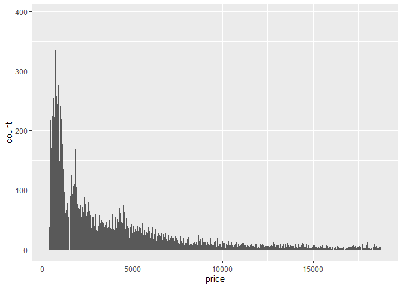<!-- -->

**Histogram of distribution of price in the data set `diamonds`
(binwidth = 5000):**

``` r
ggplot(diamonds) + 
  geom_histogram(mapping = aes(x = price), binwidth = 5000)
```

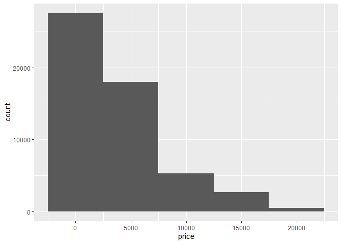<!-- -->

``` r
ggplot(diamonds) + 
  geom_freqpoly(aes(x = price), binwidth = 10) +
  xlim(c(1000, 2000))
```

    ## Warning: Removed 44232 rows containing non-finite values (stat_bin).

    ## Warning: Removed 2 row(s) containing missing values (geom_path).

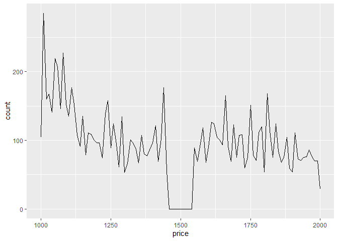<!-- -->

#### Procedure and Observations:

I considered different values of `binwidth` starting from 10 to 5000 and
I noticed a very few unusual values.

  - When I considered a `binwidth` of a very low value as 10, I could
    observe that the price range is not continuous. At one point
    approximately a value less than 2000 there is a break. Which means
    there no values at one interval of price, possibly some ware between
    1000 and 2000.
    
      - To have more clarity, I took the `xlim` between 1000 and 2000 on
        the x-axis to see if there is any surprising.
      - To my surprise, in a price range of 326-18823, there are no
        diamonds priced 1500 and slightly within the neighborhood of
        1500.

  - Maximum number of diamonds were priced less than 5000.

  - The number of diamonds with price greater than 10000 remained almost
    same.

  - When the `binwidth` is considered as large as 5000, the price range
    above 15000 is very less.

  - There is a significant difference in the price of the diamonds that
    ranged 10000-15000 and 15000 and above.

  - The data is right skewed or positively skewed, which means higher
    number of data points having minimal values.

  - My observation from the data is there are a few outliers on the
    highest price range of diamonds.

##### Unusual/Surprising:

  - According to the above two visualizations of histogram there are a
    few unusual price range below 500 and above 15000 thousand.

  - I was assuming the price of the diamonds would generally range from
    1000-15000, but to my surprise there are a few diamonds priced above
    18000.

#### Disadvantages:

  - I could not find the exact outliers.

  - I could not make an exact prediction of number of diamond in the
    outliers.

##### Further analysis:

To understand the data and outliers of the given data I took the summary
report of the price of the diamonds.

##### Summary Report:

``` r
#print(summary(diamonds[-1:-5,]))
pri<-select(diamonds, price)
summary(pri)
```

    ##      price      
    ##  Min.   :  326  
    ##  1st Qu.:  950  
    ##  Median : 2401  
    ##  Mean   : 3933  
    ##  3rd Qu.: 5324  
    ##  Max.   :18823

This summery report allowed me to explore the distribution of price of
diamonds more clearly.

  - I could also see all the five required points and the average values
    as well.

  - According to the summary the median price of the diamonds is 2401,
    the least price is 326 and the maximum price is 18823.

  - Considering the lower range \(`2401-326 = 2075`\) and the upper
    range \(`18826-2401= 16422`\), the upper range is much greater.

  - I was assuming there are outliers on the higher price values.

  - It is evident that there are 25% of the values below 950 and 25% of
    the values above 5324.

To identify the unusual values I filtered and checked the price values
below 500 and above 18500.

``` r
unusual <- diamonds %>% 
  filter( price > 18500) %>% 
  #filter( price < 1000) %>%
  select(price) %>%
  arrange(price)
unusual
```

    ## # A tibble: 102 x 1
    ##    price
    ##    <int>
    ##  1 18507
    ##  2 18507
    ##  3 18508
    ##  4 18508
    ##  5 18509
    ##  6 18515
    ##  7 18522
    ##  8 18524
    ##  9 18525
    ## 10 18526
    ## # ... with 92 more rows

``` r
unusual <- diamonds %>% 
  #filter( price > 18000) %>% 
  filter( price < 500) %>%
  select(price) %>%
  arrange(price)
unusual
```

    ## # A tibble: 1,729 x 1
    ##    price
    ##    <int>
    ##  1   326
    ##  2   326
    ##  3   327
    ##  4   334
    ##  5   335
    ##  6   336
    ##  7   336
    ##  8   337
    ##  9   337
    ## 10   338
    ## # ... with 1,719 more rows

##### Conclusion:

  - Surprisingly there are 1729 values below 500 and there are 102
    values above 18500.

  - The least price is 326 and the highest price is 18823.

  - Most of the diamonds are priced between 950 and 5324 (IQR:50% of the
    values).

  - There are no diamonds priced around 1500.

-----

`Q5. 3. How many diamonds are 0.99 carat? How many are 1 carat? What do
you think is the cause of the difference?`

#### Expectation:

The task is find the number of diamonds that are 0.99 carat and 1 carat.

To find if there is cause of the difference in the number.

**Code to find the number of diamonds with (0.99 carat and 1 carat):**

``` r
diamonds %>% 
  count(carat== 0.99, carat==1) 
```

    ## # A tibble: 3 x 3
    ##   `carat == 0.99` `carat == 1`     n
    ##   <lgl>           <lgl>        <int>
    ## 1 FALSE           FALSE        52359
    ## 2 FALSE           TRUE          1558
    ## 3 TRUE            FALSE           23

``` r
ggplot(diamonds) + 
  geom_histogram(aes(x = carat)) +
  xlim(c(0.97, 1.03))
```

    ## `stat_bin()` using `bins = 30`. Pick better value with `binwidth`.

    ## Warning: Removed 48621 rows containing non-finite values (stat_bin).

    ## Warning: Removed 2 rows containing missing values (geom_bar).

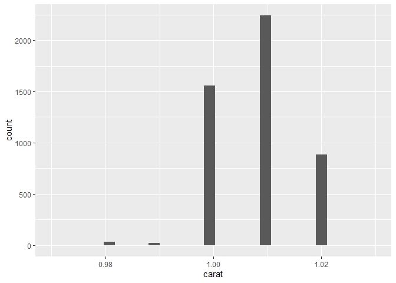<!-- -->

#### Procedure and Observations:

I considered the `count` option find the number of diamonds that weigh)
0.99 carat and 1 carat.

The code allowed me to identify the numbers.

##### Conclusion:

  - I could clearly observe that there are **1558** diamonds that weigh
    1 carat and **23** diamonds that weigh 0.99 carat. So, the 1 carat
    diamonds are more than 0.99 carat diamonds.

**Causes for the difference:**

  - Since there is a correlation between the carat and the price, as the
    carat value increase the price also increase. So, the diamond makers
    tend to produce 1 carat diamonds instead of 0.99 carat diamonds.

  - Possibly, the decimal number 0.99 is rounded to the integer value 1,
    so that the price of the diamonds increases.

-----

[Section 7.5.1.1](https://r4ds.had.co.nz/exploratory-data-analysis.html#cat-cont)

`Q6. 1. Use what you’ve learned to improve the visualisation of the`
[departure times of cancelled vs. non-cancelled
flights](https://d33wubrfki0l68.cloudfront.net/3b39886be0ed133839461341db7faeb7420c7942/2b3e3/eda_files/figure-html/unnamed-chunk-18-1.png)
from the end of
[Section 7.4](https://r4ds.had.co.nz/exploratory-data-analysis.html#missing-values-2).

#### Expectation:

The learning checks by the end of
[Section 7.4](https://r4ds.had.co.nz/exploratory-data-analysis.html#missing-values-2)
in terms of the departure times of cancelled vs non-cancelled flights.

**Code to find visualize the cancelled vs non-cancelled flights:**

The given data is visualized as a box plot to see if there are any
significant observations.

If there is a missing values in the attributes `dep_time` or `arr_time`
I am considering that the flight has been cancelled. So, to compare the
scheduled departure times for cancelled and non-cancelled times, I
created a new variable with `is.na()` and named it as `cancelled`.

I ran the following code to find if there are any missing values in
departure time and arrival time.

``` r
flights %>% 
  mutate(cancelled = is.na(dep_time) | is.na(arr_time)) %>% 
  filter(cancelled) %>% 
  select(dep_time, arr_time)
```

    ## # A tibble: 8,713 x 2
    ##    dep_time arr_time
    ##       <int>    <int>
    ##  1     2016       NA
    ##  2       NA       NA
    ##  3       NA       NA
    ##  4       NA       NA
    ##  5       NA       NA
    ##  6     2041       NA
    ##  7     2145       NA
    ##  8       NA       NA
    ##  9       NA       NA
    ## 10       NA       NA
    ## # ... with 8,703 more rows

I could observe that there are missing values in the departure time and
arrival time.

``` r
flights %>% 
  mutate(cancelled = is.na(dep_time) | is.na(arr_time)) %>% 
  ggplot(mapping = aes(colour = cancelled)) +
  geom_boxplot(aes(y = cancelled, x = dep_time/60))+  labs(title = 'Cancelled vs non-cancelled flights',
         x = 'Departure time in hours',
         y = 'Cancelled: TRUE/FALSE')
```

    ## Warning: Removed 8255 rows containing non-finite values (stat_boxplot).

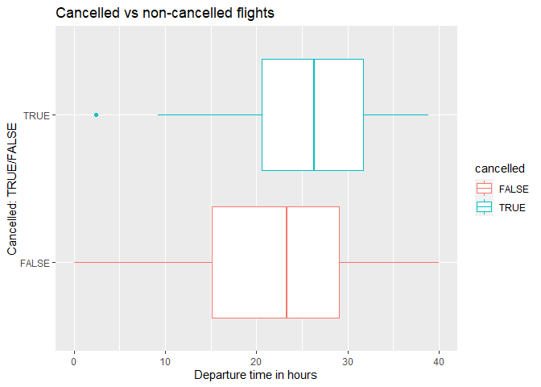<!-- -->

#### Procedure and Observations:

  - Since the frequency graph is not clear, I created a **boxpolt** to
    compare.

  - The departure time is converted from minutes to hours.

  - The visualization of the `boxplot` is as expected.

  - The 5 basic points on the \``boxplot` are very clear and it is easy
    to compare.

##### Conclusion:

  - The departure time of cancelled flights is grater than that of
    non-cancelled flights.

  - The median time of cancelled flights is approximately 26 hours and
    the median time of non-cancelled flights is approximately 24 hours.

  - By the end of the chapter I learned that that I can make a better
    visualization to represent the data to describe relations and
    comparisons.

-----

`Q7. 2. What variable in the diamonds dataset is most important for
predicting the price of a diamond? How is that variable correlated with
cut? Why does the combination of those two relationships lead to lower
quality diamonds being more expensive?`

#### Expectation:

  - To find the variable in the data set that is most important for
    predicting the price of a diamond.

  - To establish a correlation between the most important variable and
    the cut.

  - To conclude how the two relationships lead to lower quality diamonds
    being more expensive.

In the data set there are a few other variables other than price and I
am assuming that there must be some correlation between the price and
the other variables.

``` r
head(diamonds)
```

    ## # A tibble: 6 x 10
    ##   carat cut       color clarity depth table price     x     y     z
    ##   <dbl> <ord>     <ord> <ord>   <dbl> <dbl> <int> <dbl> <dbl> <dbl>
    ## 1 0.23  Ideal     E     SI2      61.5    55   326  3.95  3.98  2.43
    ## 2 0.21  Premium   E     SI1      59.8    61   326  3.89  3.84  2.31
    ## 3 0.23  Good      E     VS1      56.9    65   327  4.05  4.07  2.31
    ## 4 0.290 Premium   I     VS2      62.4    58   334  4.2   4.23  2.63
    ## 5 0.31  Good      J     SI2      63.3    58   335  4.34  4.35  2.75
    ## 6 0.24  Very Good J     VVS2     62.8    57   336  3.94  3.96  2.48

In the data set the other variables are carat, cut, color, clarity,
depth, table , x, y , and z. I am assuming (x, y, and z are length,
width and depth of the diamond cut).

Of the available attributes carat, depth, table, are quantitative
values, so we can establish a correlation between them and the price.  
I was assuming that each position x or y or z alone may not effect the
price but all three combined may effect. However, my prediction is the
cut of the diamond is related to these three positions.

To find the variable that is most important for predicting the price, I
am checking the correlation between each the quantitative attributes
that can be compared with the price.

*The possible relations are:*

  - carat-price
  - depth-price
  - table-price
  - x-price(I just want to see if this is also related to price.)

I would also like to see if cut could influence the price. \* cut-price
Since the cut is an ordered categorical attribute, and there are five
different levels, I would like to generate a boxplot.

**Code to find a relation between carat and price of diamonds:**

``` r
ggplot(data = diamonds, mapping = aes(x = carat, y = price) ) +
   geom_point(alpha=0.5) +
  geom_smooth(se = FALSE)
```

    ## `geom_smooth()` using method = 'gam' and formula 'y ~ s(x, bs = "cs")'

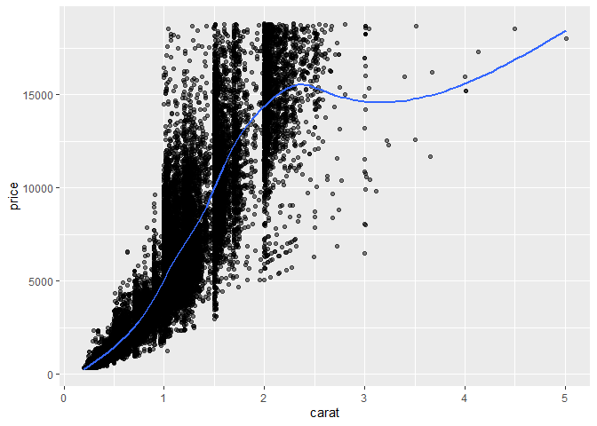<!-- -->

**Code to find a relation between depth and price of diamonds:**

``` r
ggplot(diamonds) +
  geom_point(aes(x = depth, y = price), color = 'red', alpha = 0.5)
```

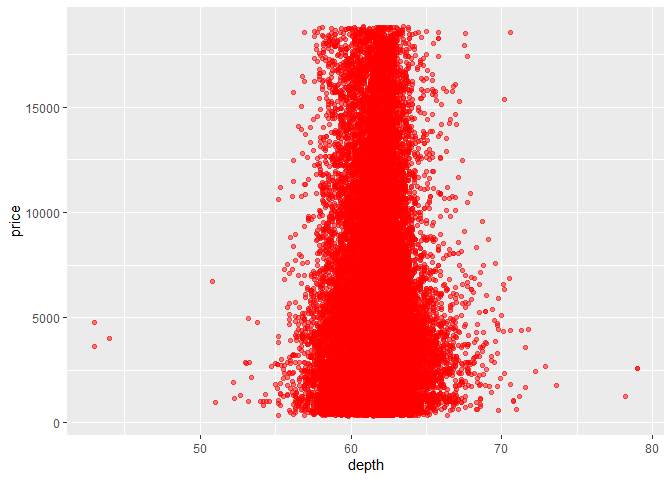<!-- -->

**Code to find a relation between table and price of diamonds:**

``` r
ggplot(diamonds) +
  geom_point(aes(x = table, y = price), color = "blue", alpha = 0.5)
```

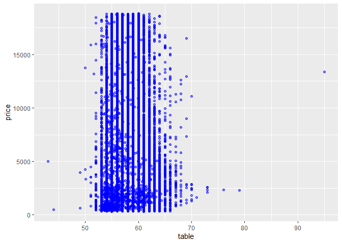<!-- -->

**Code to find a relation between depth and price of diamonds:**

``` r
ggplot(diamonds) +
  geom_point(aes(x = x , y = price), alpha = 0.5)
```

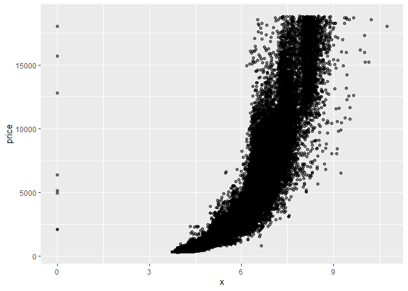<!-- -->

**Code to find a relation between cut and price of diamonds:**

``` r
ggplot(data = diamonds, mapping = aes(x = cut, y = price)) +
  geom_boxplot()
```

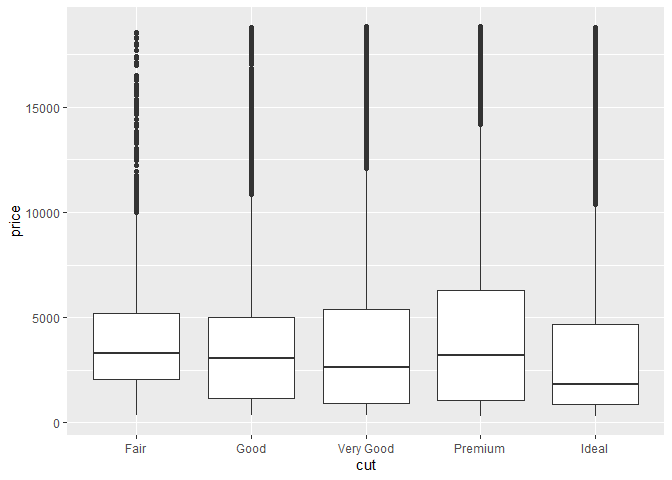<!-- -->

``` r
library(ggstance)
```

    ## Warning: package 'ggstance' was built under R version 4.0.3

    ## 
    ## Attaching package: 'ggstance'

    ## The following objects are masked from 'package:ggplot2':
    ## 
    ##     geom_errorbarh, GeomErrorbarh

``` r
ggplot(diamonds) +
  geom_violin(aes(x = cut, y = price,  fill = cut))
```

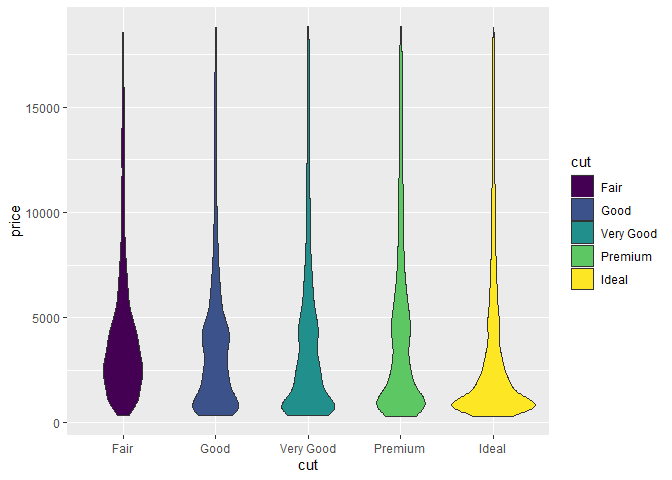<!-- -->

#### Procedure and Observations:

I established relation between price and other variables, and as
expected I could observe significant relations between the price of
diamonds and the a few other variables.

**carat-price:** There is a strong positive correlation between the
carat and price, as the carat value increase the price of the diamond
also increases.

  - The blue line shows that the diamonds with carat ranged between 2
    and 3 has the maximum value.

**depth-price:** This relation could not draw any conclusion because it
is evident from the graph that most and all of the diamonds have a depth
in within the range around 60.

**table-price:** This relation could not draw any conclusion because it
is evident from the graph that most and all of the diamonds have a table
value within the range around 60 as well.

**x-price:** (I just want to see if this is also related to price.) I am
assuming the x, y and z are related to cut. The graph shows that there
is a positive correlation between x and price and similarly with y and
z.

**cut-price:** I could say the premium cut has a better price range.

##### Conclution in this stage:

Of the three quantitative relations established, I found that carat of
diamonds is most influencing the price the diamond.

The carat is the weight of the diamond, which is one of the most
impotent factor to preduct the price of the diamonds.

**Code to find a relation between cut and price of diamonds:**

The task is find a correlation between the the variable that is most
important for predicting the price of the diamond and the cut of the
diamond.

According to previous previous observations it is evident that carat is
the variable that is most important factor that can predict the price, I
would like to establish a relation between the price and carat of a
diamond.

**Code to find a relation between carat and price of diamonds:**

``` r
ggplot(data = diamonds, mapping = aes(y = carat, x = cut)) +
  geom_boxplot()+ coord_flip()
```

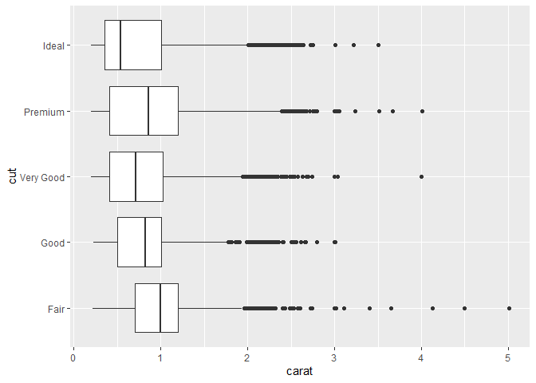<!-- -->

**Code to find a relation between carat and price of diamonds using
`ggstance`:**

``` r
library(ggstance)


ggplot(diamonds) +
  geom_violin(aes(x = carat, y = cut))
```

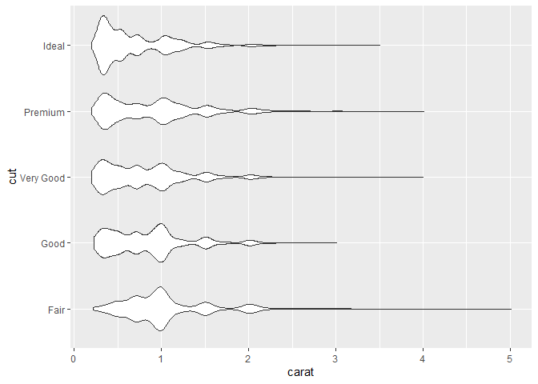<!-- -->

The `cord_flip()` is used to flip the x-axis and y-axis. In `ggplot` I
chose (y = carat, x = cut)+ cord\_flip(). So the vertical graph is
flipped horizontally.

When using `ggstance` I chose (x = carat, y = cut) to have a horizontal
graph.

#### Procedure and Observations:

Since `cut` is an ordered categorical data-type, I chose to establish
relation as a boxplot.

  - Observing each `gylph` in the graph we can easily compare and
    predict that most of the diamonds have a carat weight around 1
    carat.

  - The higher carat weights are as shown as outliers with respect to
    the cut.

  - The fair cut has the highest median carat weight.

  - The premium cut has a wider range of carat weight.

  - Surprisingly only fair cut has a carat above 4 carats.

  - the median carat of premium is also less than the fair cut.

  - Imported `libray(ggstance)` to visualize the box plot.

  - Very impressively the horizontal `boxplot` using `ggstance` is clear
    and predictive.

##### Conclusion:

  - Of the three quantitative relations established, I found that carat
    of diamond is most influencing to predict the price the diamond.

  - Since there is a strong relation between carat and price and cut and
    price, the carat and cut are also correlated. However, relative to
    their size better quality diamonds are more expensive.

  - Because better cut has lower carat which makes their price lower, so
    if we don’t look at carat, it would appear that better cut has lower
    price.

  - Since the diamonds with better cut has lower carat, their price is
    also lower. SO the lower quality diamond are better cut and the
    better cut diamonds are more expensive.

  - So, I could conclude that it is not the carat alone decides the
    price of the diamond, a better cut also matters.

-----

[Section 7.5.3.1](https://r4ds.had.co.nz/exploratory-data-analysis.html#two-continuous-variables)

`Q8. 2. Visualise the distribution of carat, partitioned by price.`

#### Expectation:

To visualize the graph distribution of carat partitioned by price.

According to knowledge gained from the previous questions, I was
assuming that the diamonds with more carat weight is more expensive.

To predict the price range and distribution, I chose to generate a
`boxplot`.

**Code to find a visualization between carat and price of diamonds:**

``` r
library(ggstance)


ggplot(diamonds, mapping = aes(group = cut_width(carat, 1))) +
  geom_violin(aes(x = carat, y = price))
```

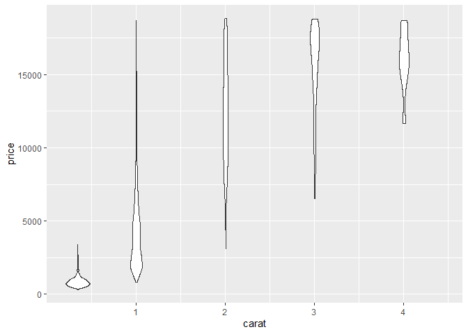<!-- -->

**Code to find a visualization between carat and price of diamonds:**

``` r
ggplot(data = diamonds, mapping = aes(x = carat, y = price)) + 
  geom_boxplot(mapping = aes(group = cut_width(carat, 0.5)))
```

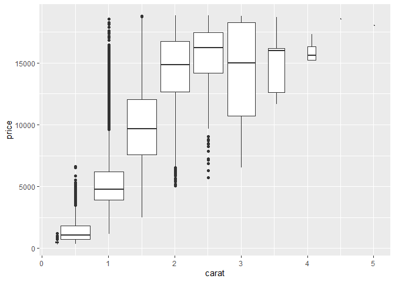<!-- -->

#### Procedure and Observations:

I visualized the distribution of carat partitioned by price using both
the libraries`ggstance` and `diamonds`.

  - The output pertaining to `ggstance` is very effective and easy to
    predict the price range, and also it is easy to compare the
    different `glyphs`.

  - I chose a `cut_width` of 1 in `ggstance` and `cut_width` of 0.5
    otherwise.

  - In both of the graphs we can predict the relation between the price
    and the carat.

##### Conclusion:

The price range can be visualized and easily predicted in both the
graphs.

-----

`Q9. 3. How does the price distribution of very large diamonds compare
to small diamonds? Is it as you expect, or does it surprise you?`

In the previous question it is evident from the `boxplot` that the
larger diamonds have a very large price range. However, the price range
of diamonds with carat more than 4 has a less range that of diamonds
within the range of 3.

The distribution for larger diamonds is more spread out, which is not
surprising since the other factors like color, cut, and clarity may also
be an important parameters to the pricing than they are for smaller
diamonds.

-----

`Q10. 4. Combine two of the techniques you’ve learned to visualise the
combined distribution of cut, carat, and price.`

#### Expectation:

The task is combine at least two techniques to visualize the graphs to
combine cut, carat and price.

**Code to combine cut, carat, and price:**

``` r
diamonds %>% ggplot() +
  geom_boxplot(mapping = aes(x = cut, y = price,
                             color = cut_number(carat, 3)))
```

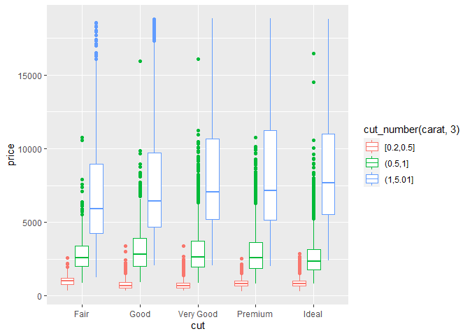<!-- -->

**Code to combine cut, carat, and price using `library(ggstance)`:**

``` r
library(ggstance)


ggplot(diamonds, mapping = aes(color = cut_number(carat, 3))) +
  geom_violin(aes(x = cut, y = price,  fill = cut))+guides(fill=FALSE)
```

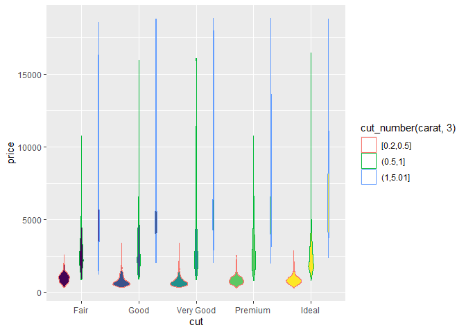<!-- -->

##### Conclusion:

The visualization is better than what I expected. So far I was combining
two parameters and establishing a correlation between the the two
attributes.

In the above two graphs I could combine three variable and visualize the
output.

## Refferences:

**library(tidyverse):**

<https://ggplot2.tidyverse.org/reference/index.html>

**R for Data Science:**

<https://r4ds.had.co.nz/>

**R for Data Science Chapter-7 Exploratory Data Analysis:**

<https://r4ds.had.co.nz/exploratory-data-analysis.html>

**R for Data Science Chapter-5 Data transformation:**

<https://r4ds.had.co.nz/transform.html#grouped-mutates-and-filters>

**Library(ggstance):**

<https://cran.r-project.org/web/packages/ggstance/readme/README.html>

**R-Keyboard Shortcuts**

<https://support.rstudio.com/hc/en-us/articles/200711853-Keyboard-Shortcuts>

**RStudio IDE Cheat Sheet:**

<https://rstudio.com/wp-content/uploads/2016/01/rstudio-IDE-cheatsheet.pdf>

**Markdown**:

<https://www.markdownguide.org/basic-syntax>

**Super script**

<https://r4ds.had.co.nz/r-markdown.html>

**geom\_smooth() usage:**

<https://www.rdocumentation.org/packages/ggplot2/versions/3.3.2/topics/geom_smooth>

**ggplot**:

<https://datacarpentry.org/R-ecology-lesson/04-visualization-ggplot2.html>

**Adding Labels and Title:**

<https://cengel.github.io/R-data-wrangling/data-visualization-with-ggplot2.html#plotting-with-ggplot2>

**Select a subset of a data:**

<https://stackoverflow.com/questions/47443365/how-to-extract-certain-columns-from-a-list-of-data-frames>

**Coloring boxplot:**

<http://www.sthda.com/english/wiki/ggplot2-box-plot-quick-start-guide-r-software-and-data-visualization>

**Re-arrange/re-order:**

<https://rpubs.com/Felix/7644>

<https://www.r-graph-gallery.com/264-control-ggplot2-boxplot-colors.html>

<https://jcoliver.github.io/learn-r/004-intro-ggplot.html>
