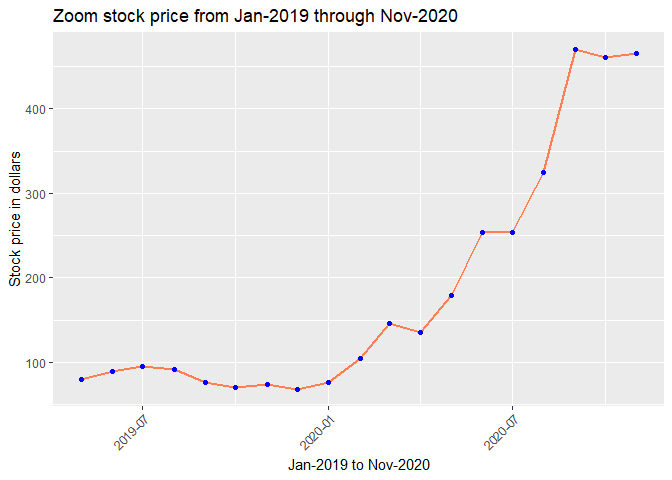

Homework 7
================
Nagesh Bheesetty

CS 625, Fall 2020

Date: 12/01/2020

### Goal:

HW7 and HW8 are the last two assignments of the semester. In HW7 (this
assignment), you will use EDA techniques to generate questions from a
dataset(s) and propose charts to address those questions. In HW8, you
will take one of the proposed charts from HW7 and refine it based on
storytelling/data journalism techniques so that it is suitable for
presentation.

## Assignment:

Use the EDA process to explore a dataset or datasets of your choice.
Through this process, you should generate at least 2 detailed questions
that can be most effectively answered through visualization.

# Report:

**Importing the libraries “tidyverse”, and “lubridate”**.

``` r
library(tidyverse)
```

    ## Warning: package 'tidyverse' was built under R version 4.0.3

    ## Warning: package 'ggplot2' was built under R version 4.0.3

    ## Warning: package 'readr' was built under R version 4.0.3

``` r
library(dplyr)
library(lubridate)
```

    ## Warning: package 'lubridate' was built under R version 4.0.3

The library “**tidyverse**” allows statisticians and data scientists to
create work-flow that facilitate communication and result in
reproducible work product. It consists a collection of R packages that
share an underlying design philosophy, grammar, and data structures.
this “tidyverse” makes data processing faster and easier. The most
important packages are:

  - ggplot
  - dplyr
  - tidyr
  - readr The library “**lubridate**” allowed me to edit the date format
    in the datasets.

# Abstract:

Since the World Health Organization (WHO) declared COVID-19 as a
pandemic in February 2020, millions of people were infected globally and
almost every country was hit by massive economy melt-downs. As a result
of unavoidable lockdowns, most of the small businesses were closed and
many people found themselves unemployed or worse homeless. As COVID-19
became rampant again since past couple months that’s considered to be
second wave, it would be an interesting phenomenon to observe its impact
on economy. In my research, a surprising fact was revealed that U.S.
economy was thriving compared to other countries, irrespective of the
COVID consequences. This project demonstrates an evidence-based data
visualization of U.S. economy and its journey in times of COVID. The
conclusion provides the annual comparison of the rise in Corona Virus
cases versus ups and downs of various industries. The goal is to find
out how did the Covid cases influenced/impacted various industries and
its overall impact on the U.S. economy.

#### Motivation:

My project goal was motivated by an article that’s published online. The
details of that article are as displayed below. \`America Failed at
COVID-19, but the Economy’s Okay. Why? Published date: November 27, 2020
[Why?](https://www.theatlantic.com/ideas/archive/2020/11/america-failed-covid-economys-ok-why/617223/?utm_source=pocket-newtab)


Based on the above article and few others, I selected my datasets that
are related to COVID case numbers starting from January 2020 to till
date (i.e., November 27, 2020), and various industry statistics stating
from Jan, 2019 to Nov, 2020.

My goal is to understand if the COVID-19 has affected the USA economy. I
have imported multiple data sets as `csv files` to understand the
relations. The list of data sets imported from different
[sources.]()References were given. For my analysis, I have selected
stock markets, commodities like Gold and GAs prices, and companies that
are related to online entertainment, grocery, airlines and online
communication industries.

  - [COVID-19](https://github.com/nytimes/covid-19-data/blob/master/us.csv)
  - [GAS Prices](https://datahub.io/core/natural-gas#resource-monthly)
  - [Gold](https://finance.yahoo.com/quote/GC%3DF/history?period1=1547078400&period2=1606780800&interval=1mo&filter=history&frequency=1mo&includeAdjustedClose=true)
  - [Crude
    Oil](https://finance.yahoo.com/quote/CL%3DF/history?period1=1547078400&period2=1606780800&interval=1mo&filter=history&frequency=1mo&includeAdjustedClose=true)
    <!-- * NASDAQ --> <!-- * DOW Jones -->
  - [S\&P500](https://finance.yahoo.com/quote/ES%3DF/history?period1=1547078400&period2=1606780800&interval=1mo&filter=history&frequency=1mo&includeAdjustedClose=true)
  - [Netflix](https://finance.yahoo.com/quote/NFLX/history?period1=1547078400&period2=1606780800&interval=1mo&filter=history&frequency=1mo&includeAdjustedClose=true)
  - [Walmart](https://finance.yahoo.com/quote/WMT/history?period1=1547078400&period2=1606780800&interval=1mo&filter=history&frequency=1mo&includeAdjustedClose=true)
  - [Zoom](https://finance.yahoo.com/quote/ZM/history?period1=1547078400&period2=1606780800&interval=1mo&filter=history&frequency=1mo&includeAdjustedClose=true)Listed
    in April-2019(Date shouldn’t be prior to ‘2019-04-18’)
  - [Delta
    Airlines](https://finance.yahoo.com/quote/DAL/history?period1=1548720000&period2=1606780800&interval=1mo&filter=history&frequency=1mo&includeAdjustedClose=true)
  - [Unemployment](https://www.bls.gov/covid19/employment-situation-covid19-faq-november-2020.htm)

I would like to understand how different sectors are affected by
COVID-19 and how the stock market and the USA economy were affected by
COVID-19.

I am considering the last one year data for COVID-19 (Jan-2020 to
Nov-2020). For the rest of the stocks I am considering the two years
data (Jan-2019 to Nov2020).

#### Note points:

One important note point regarding the stock values: The stock value
will keep changing through out the day from the market opening to close
and usually the closing price of the stock can be considered as the
price of the stock. However, I am considering the **opening price** of
the stock as the price value.

For a few stocks the price column is given, in that case I considered
the given price.

For a few stocks the price of the stock column is not given, in that
case I chose the opening price as the stock price.

Since for long period of time there is not much difference in the
prices, I am considering the opening price as the stock value.

## Understanding and Analysing the datasets:

**COVID dataset:**

``` r
COVID <- read.csv("./HW7_datasets/COVID-19.csv")
#head(COVID)
COVID$date<-mdy(COVID$date)
COVID19 <- select(COVID, date, cases)
COVID19 <- rename(COVID19, Date = date)
# #head(COVID19)
COVID19<- mutate(COVID19, Percentage = cases/sum(cases))
#head(COVID19)
ggplot(data = COVID19, mapping = aes(x = Date, y = Percentage)) +
  geom_line(size=1.5, color="red")+
  geom_point(size=0.5, color="blue")+labs(x="Jan-2020 to Nov-2020", y ="Number of cases" , title = "COVID-19 cases from Jan-2020 through Nov-2020")
```

<!-- -->

``` r
write.csv(COVID19,"C:\\Users\\alla\\Desktop\\Nagesh\\CS625\\cs625-fall-2020\\HomeWorks\\hw7-questions-Nageshbvrch\\HW7_Ndata\\COVID19.csv", row.names = FALSE)
```

``` r
COVID19 <- read.csv("./HW7_Ndata/COVID19.csv")

#head(COVID19)
COVID19$Date<-ymd(COVID19$Date)
COVID19<- mutate(COVID19, Percentage = cases/sum(cases))
#head(COVID19)
# ggplot(data = COVID19, mapping = aes(x = Date, y = Percentage)) +
#   geom_line(size=1.5, color="red")+
#   geom_point(size=0.5, color="blue")+labs(x="Jan-2020 to Nov-2020", y ="Number of cases" , title = "COVID-19 cases from Jan-2020 through Nov-2020")
```

**Observations:**

In the original dataset, the date attribute in the data frame is read as
character `**chr**` and I could not generate a line graph to find the
trend. So I have changed the format of the date and the library
**lubridate** was used to change the format of the date. The above data
frame shows that U.S. had its first Covid case on January 21st and the
rise in cases and deaths in the following days.

**Code to generate a graph:**

As the comparisons are made with respect to date (ordered attribute) and
number of cases (numerical attribute), a line graph would be appropriate
to establish the trend.

``` r
ggplot(data = COVID, mapping = aes(x = date, y = cases)) +
  geom_line(size=1.5, color="red")+
  geom_point(size=0.5, color="blue")+labs(x="Jan-2020 to Nov-2020", y ="Number of cases" , title = "COVID-19 cases from Jan-2020 through Nov-2020")
```

<!-- -->

``` r
COVID1 = select(COVID, date, cases)
#head(COVID1)
summary(COVID1)
```

    ##       date                cases         
    ##  Min.   :2020-01-21   Min.   :       1  
    ##  1st Qu.:2020-04-07   1st Qu.:  423259  
    ##  Median :2020-06-24   Median : 2417514  
    ##  Mean   :2020-06-24   Mean   : 3720964  
    ##  3rd Qu.:2020-09-10   3rd Qu.: 6430090  
    ##  Max.   :2020-11-27   Max.   :13159784

**Observations:**

Since we know the COVID cases were increasing day by day, the line graph
shows uptrend as the months passed by.

The first Covid case occurred on January21st, 2020 and first. According
to the descriptive statistics, the cases recorded by Nov, 27th (Max.
value) is almost doubled compared to the number of cases recorded by the
third quartile.

`Step-by-step process to arrive at the graph`:

UPLOAD –\> Check Data frame –\> Check Formats –\> Change Format –\>
Graph –\> Add Labels and Title –\> Check stats–\>Observations

**Read the data, format, and generate a graph for the commodity dataset
`Gold`:**

``` r
Gold<-read.csv("./HW7_datasets/gold_yahoo.csv")
#head(Gold)

Gold$Date<-as.Date(Gold$Date)
Gold <- select(Gold, Date, Open)
Gold <- rename(Gold, Price = Open)
#head(Gold)
Gold<- mutate(Gold, Percentage = Price*100/sum(Price))
#head(Gold)

ggplot(data = Gold, mapping = aes(x = Date, y = Price)) +

  geom_point(size=1.5, color="blue") + geom_line(size = 0.5, color = "green")+theme(axis.text.x = element_text(angle=45, hjust = 1))+labs(x="Jan-2019 to Nov-2020", y ="Stock price in dollars" , title = "Gold stock price from Jan-2019 through Nov-2020")
```

<!-- -->

``` r
Gold=select(Gold,Price)
summary(Gold)
```

    ##      Price     
    ##  Min.   :1279  
    ##  1st Qu.:1399  
    ##  Median :1535  
    ##  Mean   :1579  
    ##  3rd Qu.:1767  
    ##  Max.   :1997

**Observations:**

The format of the date has been changed from character “chr” to date.

I chose the opening price of the stock as the `price`.

The gold stock is most surprising stock, irrespective of the global
situations, the stock value of gold has a positive trend for most of the
time. This infers that inflation increased and U.S. dollar value
decreased.

However, stock value of gold started dropping down in last few months
when compared to the previous months.

In July-2020, the stock value of Gold is all time high in the past two
years which is approximately $2000.

When we observe the summary of the stock for the statistics, it can be
notice that the `median` price of **Gold** stock is $1535.00, and
75<sup>th</sup> percentile is $1767. at present the stock is trading
close to $1800.

So I can conclude that there is 25% dip in the stock price of gold.

This need further analysis and observations to predict the true causes
for the drop.

Step-by-step process to arrive at the graph\`:

UPLOAD –\> Check Data frame –\> Check Formats –\> Change Format –\>
Graph –\> Add Labels and Title –\> Check stats–\>Observations

**Read the data, format, and generate a graph for the dataset `Gas
Prices`:**

``` r
Gas<-read.csv("./HW7_datasets/gas_monthly_csv.csv")
#head(Gas)
Gas$Date = as.Date(paste(Gas$Month,"-01",sep=""))
Gas = filter(Gas, Date > as.Date("2018-12-01","%Y-%m-%d"))
#head(Gas)
Gas <- select(Gas, Date, Price)
#Gold <- rename(Gold, Price = Open)
#head(Gas)
Gas<- mutate(Gas, Percentage = Price*100/sum(Price))
#head(Gas)
ggplot(data = Gas, mapping = aes(x = Date, y = Price)) +

  geom_line(size=1, color="purple")+
  geom_point(size=1.5, color="blue")+theme(axis.text.x = element_text(angle=45, hjust = 1))+labs(x="Jan-2019 to Nov-2020", y ="Gas price in dollars" , title = "Gas price from Jan-2019 through Nov-2020")
```

<!-- -->

<!-- -->

    ##      Price      
    ##  Min.   :1.630  
    ##  1st Qu.:1.880  
    ##  Median :2.315  
    ##  Mean   :2.285  
    ##  3rd Qu.:2.643  
    ##  Max.   :3.110

**Observations:** The format of the date has been changed.

The dataset for this commodity ranged from January 1997 to November
2020. Since I want only last couple years data, I have cropped the data
and used the valued from January 2019 to November 2020 for my analysis.
The prices shown in the dataset are average gas prices for each month.
From the line graph, highest gas price was recorded during Jan 2019. For
the following months in 2019 the price fluctuated a little, but from Jan
2020 we can see an apparent downtrend. By May 2020, gas prices hit all
time low. This maybe the result of lockdowns, globally.

The descriptive statistics shows the all-time high price in the past
couple years as 3.11 and all-time low as 1.63. Even though, still most
people avoid commuting (Work-from-home) gas prices started to rise after
lockdown was released and currently it is reaching the median value of
2.31.

Histogram shows the frequency of price trends over these two years. This
implies rise in Covid cases negatively impacted the gas prices.

`Step-by-step process to arrive at the graph`:

UPLOAD –\> Check Data frame –\> Check Formats –\> Change Format –\>
Graph –\> Add Labels and Title –\> Check stats–\>Observations

**Read the data, format, and generate a graph for the dataset
`NASDAQ`:**

    NASDAQ<-read.csv("./HW7_datasets/NASDAQ_Yahoo.csv")
    #head(NASDAQ)
    NASDAQ$Date = as.Date(NASDAQ$Date)
    #head(NASDAQ)
    NASDAQ <- select(NASDAQ, Date, Open)
    NASDAQ <- rename(NASDAQ, Price = Open)
    #head(NASDAQ)
    NASDAQ<- mutate(NASDAQ, Percentage = Price*100/sum(Price))
    #head(NASDAQ)
    ggplot(data = NASDAQ, mapping = aes(x =Date , y = Price )) +
    <<<<<<< HEAD
      geom_line(size=1, color="orange")+
      geom_point(size=1.5, color="blue") +
    =======
      geom_line()+
      geom_point() +
    >>>>>>> e95a7734f3061759c60f086dd6b8948695081632
      theme(axis.text.x = element_text(angle=45, hjust = 1))+labs(x="Jan-2019 to Nov-2020", y ="Stock price in dollars" , title = "NASDAQ stock price from Jan-2019 through Nov-2020")

    NASDAQ1 = select(NASDAQ, Price)
    summary(NASDAQ1)

**Observations:** The format of the date has been changed.

I chose the opening level(value) of the stock market as the `price`.

The line graph shows the all time low of NASDAQ was in Jan 2019. By Jan,
2020 the value started rising and experienced a steep low within 3
months. The lockdown of the country may contribute to this dip. From
that low, it exponentially raised and was traded high during September
giving the K-effect. November witness the highest Value for NASDAQ.

Descriptive statistics back the graph showing the max. value as 50% more
than the median.

Step-by-step process to arrive at the graph\`:

UPLOAD –\> Check Data frame –\> Check Formats –\> Change Format –\>
Graph –\> Add Labels and Title –\> Check stats–\>Observations

**Read the data, format, and generate a graph for the dataset `SP500`:**

``` r
SP500<-read.csv("./HW7_datasets/S&P500_yahoo.csv")
#head(SP500)
SP500$Date = as.Date(SP500$Date)
#head(SP500)
SP500 <- select(SP500, Date, Open)
SP500 <- rename(SP500, Price = Open)
#head(SP500)
SP500<- mutate(SP500, Percentage = Price*100/sum(Price))
#head(SP500)
ggplot(data = SP500, mapping = aes(x = Date, y = Price)) +

  geom_line(size=1, color="orange")+
  geom_point(size=1.5, color="blue")+

  theme(axis.text.x = element_text(angle=45, hjust = 1))+labs(x="Jan-2019 to Nov-2020", y ="Stock price in dollars" , title = "S&P500 stock price from Jan-2019 through Nov-2020")
```

<!-- -->

``` r
SP5001 = select(SP500, Price)
summary(SP5001)
```

    ##      Price     
    ##  Min.   :2498  
    ##  1st Qu.:2889  
    ##  Median :2984  
    ##  Mean   :3051  
    ##  3rd Qu.:3240  
    ##  Max.   :3639

``` r
# ggplot(data =SP500, mapping = aes(x = Date, y = Price)) +
#   geom_boxplot()
```

**Observations:**

The format of the date has been changed.

I chose the opening value the market as the `price`.

The S\&P500 witnessed similar trend as NASDAQ, which shows that the top
500 companies in terms of market share experienced same dip and
uprisings.

Step-by-step process to arrive at the graph\`:

UPLOAD –\> Check Data frame –\> Check Formats –\> Change Format –\>
Graph –\> Add Labels and Title –\> Check stats–\>Observations

**Read the data, format, and generate a graph for the dataset `DOW
Jones`:**

    DOW<-read.csv("./HW7_datasets/DOW Historical Data.csv")
    #head(DOW)
    DOW$Date = as.Date(DOW$Date)
    ggplot(data = DOW, mapping = aes(x = Date , y = Open)) +
      geom_point() + 
      geom_line()+theme(axis.text.x = element_text(angle=45, hjust = 1))+labs(x="Jan-2019 to Nov-2020", y ="Stock price in dollars" , title = "DOW Jones stock price from Jan-2019 through Nov-2020")

    DOW1 = select(DOW, Price)
    summary(DOW1)

**Observations:**

The format of the date has been changed.

I chose the opening value the market as the `price`.

The DowJones witnessed similar trend as NASDAQ and S\&P500, which shows
that the top 500 companies in terms of market share experienced same dip
and uprisings.

Step-by-step process to arrive at the graph\`:

UPLOAD –\> Check Data frame –\> Check Formats –\> Change Format –\>
Graph –\> Add Labels and Title –\> Check stats–\>Observations

**Read the data, format, and generate a graph for the dataset
`Walmart`:**

``` r
Walmart<-read.csv("./HW7_datasets/WMT Historical Data_Wallmart.csv")
#head(Walmart)
Walmart$ï..Date = paste("01 ",Walmart$ï..Date,sep="")
Walmart$ï..Date = as.Date(Walmart$ï..Date,"%d %b %y")
#head(Walmart)

Walmart <- select(Walmart, ï..Date, Price)
Walmart <- rename(Walmart, Date = ï..Date)
#head(Walmart)
Walmart<- mutate(Walmart, Percentage = Price*100/sum(Price))
#head(Walmart)

ggplot(data = Walmart, mapping = aes(x = Date  , y = Price)) +

  geom_line(size=1, color="cyan")+
  geom_point(size=1.5, color="blue")+theme(axis.text.x = element_text(angle=45, hjust = 1))+labs(x="Jan-2019 to Nov-2020", y ="Stock price in dollars" , title = "Walmart stock price from Jan-2019 through Nov-2020")
```

<!-- -->
**Observations:** The format of the date has been changed.

I chose the opening price of the stock as the `price`.

The line graph shows that walmart stock value increased significantly
from Jan 2020 to Nov 2020 with a minor dip during Feb 2020.

Step-by-step process to arrive at the graph\`:

UPLOAD –\> Check Data frame –\> Check Formats –\> Change Format –\>
Graph –\> Add Labels and Title –\> Check stats–\>Observations

**Read the data, format, and generate a graph for the dataset `Zoom`:**

``` r
Zoom<-read.csv("./HW7_datasets/ZM Historical Data_zoom.csv")
#head(Zoom)
Zoom$ï..Date = paste("01 ",Zoom$ï..Date,sep="")
Zoom$ï..Date = as.Date(Zoom$ï..Date,"%d %b %y")
#head(Zoom)
Zoom <- select(Zoom, ï..Date, Price)
Zoom <- rename(Zoom, Date = ï..Date)
#head(Zoom)
Zoom<- mutate(Zoom, Percentage = Price*100/sum(Price))
#head(Zoom)
ggplot(data = Zoom, mapping = aes(x = Date  , y = Price)) +

  geom_line(size=1, color="coral")+
  geom_point(size=1.5, color="blue")+theme(axis.text.x = element_text(angle=45, hjust = 1))+labs(x="Jan-2019 to Nov-2020", y ="Stock price in dollars" , title = "Zoom stock price from Jan-2019 through Nov-2020")
```

<!-- -->
**Observations:** The format of the date has been changed.

I chose the opening price of the stock as the `price`.

Ever since pandemic started, zoom became an interesting stock for many
market enthusiasts.

Owing to its increased popularity rapidly,zoom stock has soared high and
currently trading at as high as 4 times of its traded value during Jan
2020.

Being opensource software and increased flexibility made the zoom
popular and widely used online communication platform from academic
classes to industrial training to educational institutions to industry
training to casual family reunions.

Step-by-step process to arrive at the graph\`:

UPLOAD –\> Check Data frame –\> Check Formats –\> Change Format –\>
Graph –\> Add Labels and Title –\> Check stats–\>Observations

**Read the data, format, and generate a graph for the dataset
`Netflix`:**

``` r
Netflix<-read.csv("./HW7_datasets/NFLX Historical Data.csv")
#head(Netflix)
Netflix$ï..Date = paste("01 ",Netflix$ï..Date,sep="")
Netflix$ï..Date = as.Date(Netflix$ï..Date,"%d %b %y")
#head(Netflix)

Netflix <- select(Netflix, ï..Date, Price)
Netflix <- rename(Netflix, Date = ï..Date)
#head(Netflix)
Netflix<- mutate(Netflix, Percentage = Price*100/sum(Price))
#head(Netflix)

ggplot(data = Netflix, mapping = aes(x = Date  , y = Price)) +

  geom_line(size=1, color="darkcyan")+
  geom_point(size=1.5, color="blue")+theme(axis.text.x = element_text(angle=45, hjust = 1))+labs(x="Jan-2019 to Nov-2020", y ="Stock price in dollars" , title = "Netflix stock price from Jan-2019 through Nov-2020")
```

<!-- -->
**Observations:** The format of the date has been changed.

I chose the opening price of the stock as the `price`.

Pandemic resulted in higher stock value of netflix. Higher viewership
due to people staying home may contributed to this high.

Step-by-step process to arrive at the graph\`:

UPLOAD –\> Check Data frame –\> Check Formats –\> Change Format –\>
Graph –\> Add Labels and Title –\> Check stats–\>Observations

**Read the data, format, and generate a graph for the dataset `Crude
oil`:**

``` r
Crude<-read.csv("./HW7_datasets/Crude_oil_yahoo.csv")
#head(Crude)
Crude$Date = as.Date(Crude$Date)
#head(Crude)
Crude <- select(Crude, Date, Open)
Crude <- rename(Crude, Price = Open)
#head(Crude)
Crude<- mutate(Crude, Percentage = Price*100/sum(Price))
#head(Crude)


ggplot(data = Crude, mapping = aes(x = Date  , y = Price)) +

  geom_line(size=1, color="darkgoldenrod1")+
  geom_point(size=1.5, color="blue")+theme(axis.text.x = element_text(angle=45, hjust = 1))+labs(x="Jan-2019 to Nov-2020", y ="Stock price in dollars" , title = "Crude oil stock price from Jan-2019 through Nov-2020")
```

<!-- -->
**Observations:**

The format of the date has been changed.

I chose the opening price of the commodity stock for crude oil as the
`price`.

Compared to 2019, crude oil suffered severe losses and dipped to extreme
low during summer 2020. By NOvember 2020, it has gained a slight
uptrend.

Step-by-step process to arrive at the graph\`:

UPLOAD –\> Check Data frame –\> Check Formats –\> Change Format –\>
Graph –\> Add Labels and Title –\> Check stats–\>Observations

**Read the data, format, and generate a graph for the dataset `DELTA`:**

``` r
Delta<-read.csv("./HW7_datasets/Delta.csv")
#head(Delta)
Delta$Date = as.Date(Delta$Date)
#head(Delta)

Delta <- select(Delta, Date, Open)
Delta <- rename(Delta, Price = Open)
#head(Delta)
Delta<- mutate(Delta, Percentage = Price*100/sum(Price))
#head(Delta)

ggplot(data = Delta, mapping = aes(x = Date  , y = Price)) +

  geom_line(size=1, color="hotpink")+
  geom_point(size=1.5, color="blue")+theme(axis.text.x = element_text(angle=45, hjust = 1))+labs(x="Jan-2019 to Nov-2020", y ="Stock price in dollars" , title = "Delta Airlines stock price from Jan-2019 through Nov-2020")
```

<!-- -->

**Observations:**

The format of the date has been changed.

I chose the opening price of the stock as the `price`.

Airlines stocks are the most suffered stocks due to pandemic and it
might quite a while to cover those losses. Evidently, Delta suffered
sever losses in terms of stock value price. The downtrend continued for
most of the duration of the pandemic and the stock recently gained
slight uptrend.

Step-by-step process to arrive at the graph\`:

UPLOAD –\> Check Data frame –\> Check Formats –\> Change Format –\>
Graph –\> Add Labels and Title –\> Check stats–\>Observations

**Read the data, format, and generate a graph for the dataset
[Unemployment](https://www.bls.gov/covid19/employment-situation-covid19-faq-november-2020.htm):**

``` r
unemp <-read.csv("./HW7_datasets/unemployment-2020.csv")
#head(unemp)
unemp$ï..Month = paste("01 ",unemp$ï..Month,sep="")
unemp$ï..Month = as.Date(unemp$ï..Month, "%d %b- %y")
#head(unemp)

unemp <- select(unemp, ï..Month, Total)
unemp <- rename(unemp, Date = ï..Month, Percentage = Total)
#head(unemp)
# unemp<- mutate(unemp, Percentage = Price*100/sum(Price))
# #head(unemp)


ggplot(data = unemp, mapping = aes(x = Date  , y = Percentage)) +

  geom_line(size=1, color="brown")+
  geom_point(size=1.5, color="blue")+theme(axis.text.x = element_text(angle=45, hjust = 1))+labs(x="Jan-2019 to Nov-2020", y ="Unemployment Rate" , title = "Unemployment Rate from Jan-2019 through Nov-2020")
```

    ## Warning: Removed 45 row(s) containing missing values (geom_path).

    ## Warning: Removed 45 rows containing missing values (geom_point).

<!-- -->

**Observations:**

The format of the date has been changed.

I chose the opening price of the stock as the `price`.

Airlines stocks are the most suffered stocks due to pandemic and it
might quite a while to cover those losses. Evidently, Delta suffered
sever losses in terms of stock value price. The downtrend continued for
most of the duration of the pandemic and the stock recently gained
slight uptrend.

Step-by-step process to arrive at the graph\`:

UPLOAD –\> Check Data frame –\> Check Formats –\> Change Format –\>
Graph –\> Add Labels and Title –\> Check stats–\>Observations

# The set of questions after observing all the data sets:

1.  Did COVID-19 pandemic affect the USA economy?

<!-- end list -->

  - I believe USA economy has not been effected by COVID-19. The Stock
    market is one of the best proof which can be viewed.

<!-- end list -->

2.  Is Gold stock affected by COVID-19?

<!-- end list -->

  - The Gold increased which decreased the US dollar value. This
    indicates inflation. But, this changed after August 2020.

<!-- end list -->

3.  Is Stock market affected by the COVID-19?

<!-- end list -->

  - The overall stock market is not affected but there are many
    individual stocks that were affected by COVID.

  - All of the NASDAQ, S\&P500, and DowJones experienced severe low by
    Mid 2020 and almost immediately sprung back to all-time high by
    November 2020. The only difference between three stock markets is,
    S\&P500 and DowJones experience severe low compared to NASDAQ.

<!-- end list -->

4.  What could be the reason that the gas prices went down?

<!-- end list -->

  - I am predicting that because of lockdown the transportation is less
    and the gas reserves are more, so the prices of gasoline went down.

<!-- end list -->

5.  What kind of stocks are benefited by COVID-19?

<!-- end list -->

  - There are many stocks that were benefited by COVID, such as Zoom,
    Netflix, FedEx, Amazon, and many more. I checked most of them but I
    visualized Zoom stock and Netflix stock.
  - The food market stocks like `Walmart` were not affected by COVID.

<!-- end list -->

6.  How were airline stocks influenced by COVID-19?

<!-- end list -->

  - There a few stocks affected by COVID, of which airline stocks were
    affected very much.

<!-- end list -->

7.  Did the crude oil stock get affected by COVID-19?

<!-- end list -->

  - Surprisingly, Gasoline price went down but crude oil prices dropped
    down drastically and went up very quickly.
  - In April-2020, the crude oil stock went almost all time low.

<!-- end list -->

8.  Is it a good idea to invest on the stocks that dropped due to
    COVID-19?

<!-- end list -->

  - I believe it would be a good idea to invest in stocks like airlines
    and crude oil.

<!-- end list -->

9.  Why did Walmart stock did not get affected by COVID-19.

<!-- end list -->

  - This is one of the important stock which draws a great analysis.
  - Since people started stocking daily needs and provisions, the
    Walmart stock actually went up.

##### Conclusion:

# The most important two questions on the data sets:

1.  Did COVID-19 influence the USA economy?
2.  Which sectors are mostly affected by COVID-19?

I am expecting to visualize the data as **multilayer** line graph and
**smallmultiples** for HW8.

I am expecting to visualize a multilayer line graph and recreate the
same colors and effects on the smallmultiple graphs.

    # Final dataframes:
    
    unemp, Delta, Crude, Netflix, Zoom, Walmart, SP500, Gas, Gold, COVID19

``` 


ggplot(data = COVID, aes(x = Date,group = 1)) + 
  geom_line(aes(y = Delta),color="blue") + 
  geom_line(aes(y = Crude),color="green") +
  geom_line(aes(y = Netflix),color="purple") +
  geom_line(aes(y = Zoom),color="red") +
  geom_line(aes(y = Walmart),color="orange") +
  geom_line(aes(y = SP500),color="cyan") +
  labs(y = "") # Delete or change y axis title if desired.
```


``` 

```

## References:

**Stock Market Data Sets:** [Yahoo finance](https://finance.yahoo.com/)

**COVID-19 Data Set:**
[COVID](https://github.com/nytimes/covid-19-data/blob/master/us.csv)

**Natural Gas:** [DataHub](https://datahub.io/core/natural-gas)

**Change the Date format:**
[STATMETHODS](https://www.statmethods.net/input/dates.html)

**library(tidyverse):**

<https://ggplot2.tidyverse.org/reference/index.html>

**Split the date:** [Stack
overflow](https://stackoverflow.com/questions/4310326/convert-character-to-date-in-r)

**Exploratory Data Analysis:(EDA)** [R for Data
Science](https://r4ds.had.co.nz/)

**Library(ggstance):**

<https://cran.r-project.org/web/packages/ggstance/readme/README.html>

**R-Keyboard Shortcuts**

<https://support.rstudio.com/hc/en-us/articles/200711853-Keyboard-Shortcuts>

**RStudio IDE Cheat Sheet:**

<https://rstudio.com/wp-content/uploads/2016/01/rstudio-IDE-cheatsheet.pdf>

**To find summary stats, to make `html` view.** [R Markdown Cheat
sheet](https://rstudio.com/wp-content/uploads/2016/03/rmarkdown-cheatsheet-2.0.pdf)
