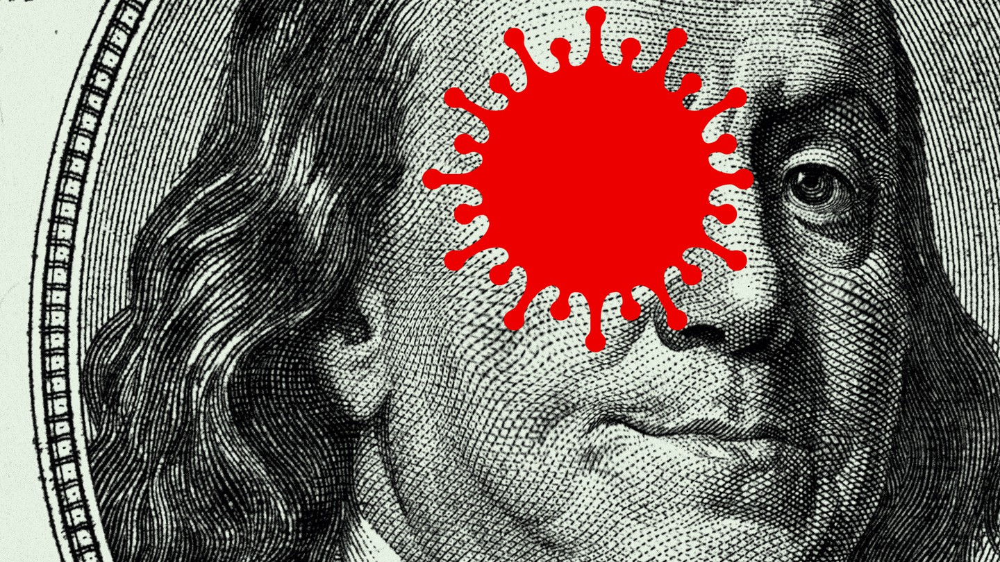
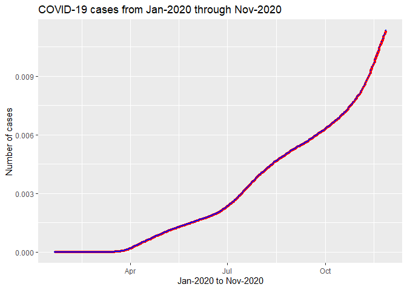
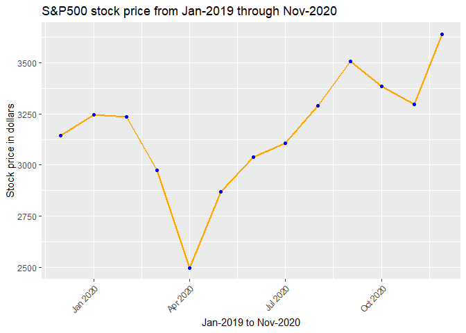
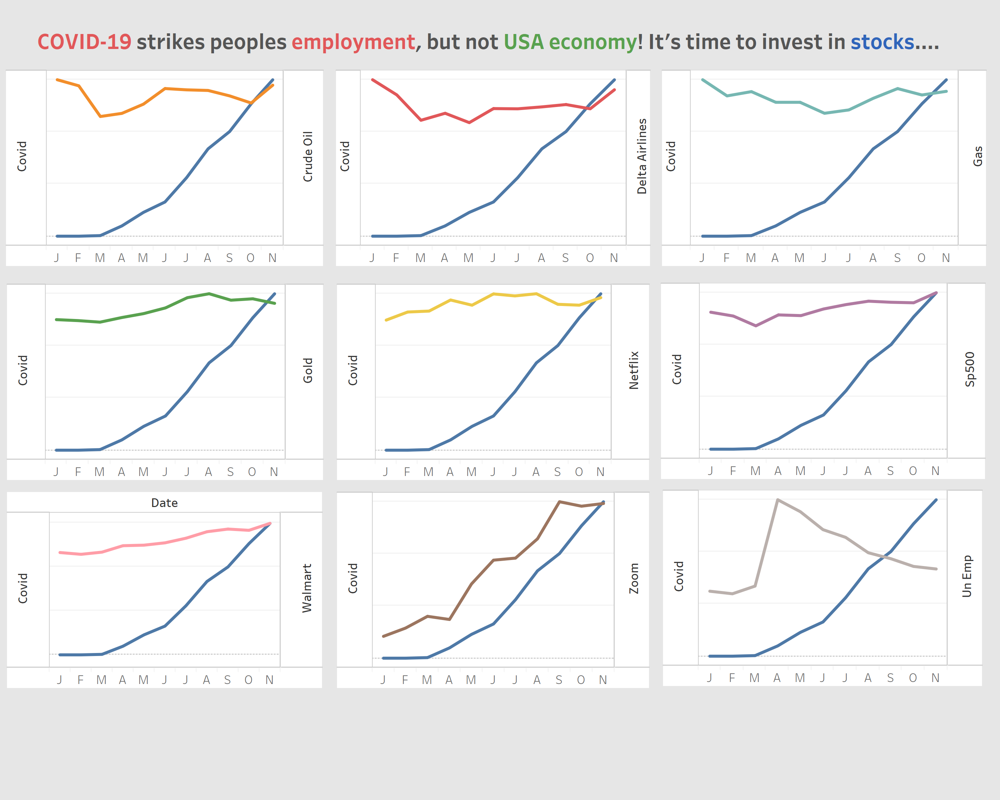

Homework 8
================
Nagesh Bheesetty

CS 625, Fall 2020

Date: 12/11/2020

### Goal:

In HW8, you will take one of the proposed charts from HW7 and refine it
based on storytelling/data journalism techniques so that it is suitable
for presentation.

### Assignment:

You may use Excel, Tableau, R, or Vega-Lite to complete this assignment.

## Report:

**Importing the libraries “tidyverse”, and “lubridate”**.

    ## Warning: package 'tidyverse' was built under R version 4.0.3

    ## Warning: package 'ggplot2' was built under R version 4.0.3

    ## Warning: package 'readr' was built under R version 4.0.3

    ## Warning: package 'lubridate' was built under R version 4.0.3

The library “**tidyverse**” allows statisticians and data scientists to
create work-flow that facilitate communication and result in
reproducible work product. It consists a collection of R packages that
share an underlying design philosophy, grammar, and data structures.
this “tidyverse” makes data processing faster and easier. The most
important packages are:

  - ggplot
  - dplyr
  - tidyr
  - readr The library “**lubridate**” allowed me to edit the date format
    in the datasets.

### Abstract:

Since the World Health Organization (WHO) declared COVID-19 as a
pandemic in February 2020, millions of people were infected globally and
almost every country was hit by massive economy melt-downs. As a result
of unavoidable lockdowns, most of the small businesses were closed and
many people found themselves unemployed or worse homeless. As COVID-19
became rampant again since past couple months that’s considered to be
second wave, it would be an interesting phenomenon to observe its impact
on economy. In my research, a surprising fact was revealed that U.S.
economy was thriving compared to other countries, irrespective of the
COVID consequences. This project demonstrates an evidence-based data
visualization of U.S. economy and its journey in times of COVID. The
conclusion provides the annual comparison of the rise in Corona Virus
cases versus ups and downs of various industries. The goal is to find
out how did the Covid cases influenced/impacted various industries and
its overall impact on the U.S. economy.

#### Motivation:

My project goal was motivated by an article that’s published online. The
details of that article are as displayed below. \`America Failed at
COVID-19, but the Economy’s Okay. Why? [Published date:
November 27, 2020,
Why?](https://www.theatlantic.com/ideas/archive/2020/11/america-failed-covid-economys-ok-why/617223/?utm_source=pocket-newtab)

Based on the above article and few others, I selected my datasets that
are related to COVID case numbers starting from January 2020 to till
date (i.e., November 27, 2020), and various industry statistics stating
from Jan, 2019 to Nov, 2020.

My goal is to understand if the COVID-19 has affected the USA economy. I
have imported multiple data sets as `csv files` to understand the
relations. The list of data sets imported from different sources.
References were given. For my analysis, I have selected stock markets,
commodities like Gold and GAs prices, and companies that are related to
online entertainment, grocery, airlines and online communication
industries.

  - [COVID-19](https://github.com/nytimes/covid-19-data/blob/master/us.csv)
  - [GAS Prices](https://datahub.io/core/natural-gas#resource-monthly)
  - [Gold](https://finance.yahoo.com/quote/GC%3DF/history?period1=1547078400&period2=1606780800&interval=1mo&filter=history&frequency=1mo&includeAdjustedClose=true)
  - [Crude
    Oil](https://finance.yahoo.com/quote/CL%3DF/history?period1=1547078400&period2=1606780800&interval=1mo&filter=history&frequency=1mo&includeAdjustedClose=true)
    <!-- * NASDAQ --> <!-- * DOW Jones -->
  - [S\&P500](https://finance.yahoo.com/quote/ES%3DF/history?period1=1547078400&period2=1606780800&interval=1mo&filter=history&frequency=1mo&includeAdjustedClose=true)
  - [Netflix](https://finance.yahoo.com/quote/NFLX/history?period1=1547078400&period2=1606780800&interval=1mo&filter=history&frequency=1mo&includeAdjustedClose=true)
  - [Walmart](https://finance.yahoo.com/quote/WMT/history?period1=1547078400&period2=1606780800&interval=1mo&filter=history&frequency=1mo&includeAdjustedClose=true)
  - [Zoom](https://finance.yahoo.com/quote/ZM/history?period1=1547078400&period2=1606780800&interval=1mo&filter=history&frequency=1mo&includeAdjustedClose=true)
    (Listed in April-2019)
  - [Delta
    Airlines](https://finance.yahoo.com/quote/DAL/history?period1=1548720000&period2=1606780800&interval=1mo&filter=history&frequency=1mo&includeAdjustedClose=true)
  - [Unemployment](https://www.bls.gov/covid19/employment-situation-covid19-faq-november-2020.htm)

I would like to understand how different sectors are affected by
COVID-19 and how the stock market and the USA economy were affected by
COVID-19.

I am considering the last one year data for COVID-19 (Jan-2020 to
Nov-2020). For the rest of the stocks I am considering the 1 year data
(Nov-2019 to Nov2020).

#### Note points:

One important note point regarding the stock values: The stock value
will keep changing through out the day from the market opening to close
and usually the closing price of the stock can be considered as the
price of the stock. However, I am considering the **opening price** of
the stock as the price value.

For a few stocks the price column is given, in that case I considered
the given price.

For a few stocks the price of the stock column is not given, in that
case I chose the opening price as the stock price.

Since for long period of time there is not much difference in the
prices, I am considering the opening price as the stock value.

**[US economy -
Introduction:](https://www.brookings.edu/research/ten-facts-about-covid-19-and-the-u-s-economy/#:~:text=From%20the%20most%20recent%20peak,%5BBEA%5D%202020a%3B%20authors')**
The coronavirus 2019 disease (COVID-19) pandemic has created both a
public health crisis and an economic crisis in the United States. The
economic crisis is unprecedented in its scale: the pandemic has created
a demand shock, a supply shock, and a financial shock all at once
(Triggs and Kharas 2020). The demand shock resulting from quarantine,
unemployment, and business closures dealt a blow to consumer services.
In this regard, my project attempts to visualize the unemployment rate
due to pandemic, its impact on various industries’ stock prices-either
positive or negative, and what does it reflect on U.S. economy. The
following graphs show the relation between stock values or unemployment
as COVID continues to be prevalent at this point of time.

[**Airline stock
drop:**](https://www.marketwatch.com/story/airline-stocks-suffer-broad-selloff-as-american-delta-fall-to-new-covid-19-lows-2020-05-06%20https://www.cnbc.com/2020/03/12/coronavirus-trumps-europe-travel-ban-is-another-blow-to-airlines.html)
As expected there was a significant drop in travel demand as the
COVID-19 pandemic led to government travel restrictions, stay-at-home
orders and consumer fear of travel. Transportation Security
Administration (TSA) screened a total of just under 164,000 people on
May 4, which is roughly 93% less than last year’s average daily
screenings of about 2.5 million. “The actual number of people traveling
is still about 95% below last year’s levels, and is expected to stay
relatively low until people are comfortable wearing a mask on a plane.
Many airlines swung to a narrower-than-expected loss, but said it
expected free cash flow for the year to be negative due to the impact of
the COVID-19 pandemic.,” This clearly indicates that the demand is not
going to quickly snap back to the levels seen before pandemic. This
article explains how pandemic effected the airlines industry including
aircraft component manufacturing companies. My analysis on COVID
vs. Airlines stock attempted to visualize the turbulent path of stock
from Jan 2020 to November 2020.

[**US
unemployment:**](https://www.thebalance.com/current-u-s-unemployment-rate-statistics-and-news-3305733)
Unemployment is one of the most critical economic issues facing the
country as it balances re-opening with safety months into the pandemic.
In April, after governments shut down the economy, the unemployment rate
reached 14.7%, the highest since the Great Depression. Since then, it’s
gradually improved as businesses have attempted to reopen safely.
According to the [Bureau of Labor Statistics
(BLS)](https://www.bls.gov/eag/eag.us.htm), the current U.S.
unemployment rate is 6.7% for November 2020. The rate is close to double
the 3.5% rate in February, before the COVID-19 pandemic. This comes
after the pace of the U.S. labor market recovery slowed in October with
unemployment at 6.9%. This article including some other statistics
motivated me to examine the ups and downs of unemployment rate with
COVID.

[**Grocery/retail store
stocks:**](https://finance.yahoo.com/news/walmart-ceo-consumers-are-stocking-up-again-as-coronavirus-rages-on-174308762.html)
In regular market share, Walmart claims lion share compared to other
retail stores. The Walmart stock raised exponentially due to people
stocking up on the essentials such as cleaning products and frozen food
that have led to some big quarterly reports from consumer staples this
month. Various types of frozen food, cleaning products, soda and chips,
and paper products all reported strong sales gains in the U.S. for their
most recent quarters. The challenge that grocery stores face is the
dreaded shortage in supply, especially toilet papers and sanitizing
wipes. Store supply chain management have been working closely with key
suppliers to keep shelves stocked, no matter what. This below graph
shows the trend in peoples’ buying habits during uncertain situations.
Since Walmart is the biggest retail currently in U.S., I have chosen to
compare its stock price with COVID.

## Supporting Graphs from HW7 :

**Line Graph for COVID-19:**

    ##         Date cases   Percentage
    ## 1 2020-01-21     1 8.613704e-10
    ## 2 2020-01-22     1 8.613704e-10
    ## 3 2020-01-23     1 8.613704e-10
    ## 4 2020-01-24     2 1.722741e-09
    ## 5 2020-01-25     3 2.584111e-09
    ## 6 2020-01-26     5 4.306852e-09

<!-- -->

**Line Graph for Gold Stock:**

<!-- -->

**Line Graph for Gas Prices:**

<!-- -->

**Line Graph for SP500:**

<!-- -->

**Line graph of `Walmart`:**

<!-- -->

**Line Graph for Zoom Stock:**

<!-- -->

**Line Graph of Netflix Stock:**

<!-- -->

**Line Graph of Crude oil Stock:**

<!-- -->

**Line Graph for DELTA Airlines Stock:**

<!-- -->

**Line Graph for [Unemployment Rate in
USA](https://www.bls.gov/covid19/employment-situation-covid19-faq-november-2020.htm):**

<!-- -->

# Report

I was inspired by the phrase “[A picture may be worth a thousand words,
but words frame a
picture](https://medium.com/multiple-views-visualization-research-explained/a-picture-may-be-worth-a-thousand-words-but-words-frame-a-picture-78d4eee1409e)”.
So I decided to visualize all the questions in one picture and draw the
comparisons. Though COVID-19 is frustrating it is time to move on and
find better alternatives. The goal is to motivate the readers to
understand the real picture of U.S. economy, as there were assumptions
of economy being down because of the pandemic.

**There are several questions that were answered from the individual
graphs in the previous report and now the challenge is to make a
collective graph for comparison purpose and draw conclusions**.

After finding answers to all the questions in the individual graphs, two
interesting questions came up from previous visualizations:

1.  Did COVID-19, really, influence the USA economy?
2.  Which stocks are mostly affected by COVID-19?

On combining both the questions, a new question came up which can
impress the reader.

The title to my new challenge is:

### COVID-19 affected the individuals’ employment, but not the USA economy. Is it time to invest in stocks?

I am expecting to visualize the data as **multilayer** line graph and
**smallmultiples** .

I am expecting to visualize a multilayer line graph and recreate the
same colors and effects on the smallmultiple graphs.

**Draft Sketch of the expected visualization:**

The goal is to recreate the model graph and to make it interactive.

#### One of the questions I have is which sectors (stocks) are mostly affected by COVID-19?

In the visualization class, I have learnt R, Vega-lite, Tableau, and
Excel. Until this point, to generate the individual line graphs I chose
`R`. I was able to format the graphs and change the colors for better
visualization. For combined line graph, I chose `excel` to establish the
relationship between COVID-19 and the stock market in which the former
is one the most important parameter that appeared to impact the **USA
economy**. To generate the graph in excel, I have to manipulate the
data.

Since unemployment and gasoline are independent of stock market, I
isolated them to have real comparison with COVID but not with other
stocks.

#### COVID-19 vs. Gasolin prices:

Due to pandemic, most corporate companies, educational institutions, and
some businesses made their work online. Following the
[stay-at-home](https://www.nbcnews.com/health/health-news/here-are-stay-home-orders-across-country-n1168736)
orders, people hardly traveled, consequently, gas prices per gallon came
all-time down, during summer.

#### COVID-19 vs Unemployment rate in USA:

It is apparent from above graph, since March-20 when President announced
the pandemic, the [unemployment
rate](https://www.thebalance.com/current-u-s-unemployment-rate-statistics-and-news-3305733)
went all-time high since great depression.

`Now, the task is to establish the relationship between COVID-19 and
some select stocks that are influenced by the COVID-19.`

### Smallmultiple Graphs using Tableau:

I decided to create interactive dashboard that can visualize the
required data and in one single view for all the stocks. This graph is a
response to my initial question, “If COVID affected stock market and US
economy”?

**COVID-19 affected the individuals’ employment, but not the USA
economy. Is it time to invest in stocks?**

**Procedures and Design Decisions**

| Idiom:         | Smallmultiple line graphs                          |
| -------------- | -------------------------------------------------- |
| X-Axis:        | Jan-2020 to Nov-2020 (first letters of each month) |
| Y-Axis(left):  | COVID (Number of cases)                            |
| Y-Axis(Right): | Comparison Attributes (Unemployment, Gas, Stocks)  |

### Explanation:

The above combined graph is visualization of COVID versus stock values
of Crude Oil, Delta Airlines, Gold, Netflix, S\&P500, Walmart, and Zoom.
Additionally, gas per gallon prices and unemployment rate were also
observed. In the above graph, the dark blue line in all the
`smallmultiple` graphs represents COVID cases. The above graph would be
explained in four points.

  - COVID vs. Unemployment
  - COVID vs. Gasoline
  - COVID vs. Stocks that were benefited (Bull market)
  - COVID vs. stocks that were deteriorated (Bear market)

**COVID vs. Unemployment**

Though, unemployment can be caused by other reasons, COVID has
skyrocketed the percentage, In April, after governments shut down the
economy, the unemployment rate reached 14.7%, the highest since the
Great Depression. The current [U.S. unemployment
rate](https://www.bls.gov/eag/eag.us.htm) is 6.7% for November 2020
which is close to double the 3.5% rate in the February.

**COVID vs. Gasoline**

During the March 2020 many organizations including corporate, private
and public sectors made work online to reduce the spread of the disease.
Stay-at-home orders added more reason for people to not travel except
for important reasons. As a result,
[gasoline](https://www.usatoday.com/story/money/2020/03/21/gas-prices-drop-u-s-amid-coronavirus-pandemic-and-oil-price-war/2890942001/)
started dropping from Mar-20 and came all-time down by June-20. After
phase-3 opening of the country, slight uptrend started in August-20 and
became stable.

**COVID vs. Stocks that were benefited** [Bull
market](https://www.marketwatch.com/story/we-are-only-in-the-middle-of-the-bull-market-and-a-buying-opportunity-could-come-soon-jpmorgan-says-11607344038)

Grocery and retail stores like walmart, Entertainment media like
Netflix, Online communication tools like zoom has seen absolute profits
by 2nd quarter of 2020. Amid the uncertainty of the pandemic, people
started stocking the essentials beyond requirement, which resulted in
uptrend in [grocery
stocks](https://www.fool.com/investing/2020/10/08/why-is-everyone-talking-about-walmart-stock/).
Similarly, work-from-home option gave people opportunity to binge-watch
movies and shows. This resulted in upraise in Netflix stock. As zoom is
an open-source alternative, for online meetings, compared to its
competitors like skype and webex, its stock became over-night hotcake.

S\&P500 (as shown in the graph above), NASDAQ, and DowJones are going
stable.

**COVID vs. stocks that were deteriorated** [Bear
market](https://www.fool.com/investing/how-to-invest/bear-market/)

As expected there was a significant drop in travel demand as the
COVID-19 pandemic led to government travel restrictions, stay-at-home
orders and consumer fear of travel. Hence Airline stocks, hotel stocks,
tourism suffered severe losses. My analysis on COVID vs. Airlines stock
attempted to visualize the turbulent path of stock from Jan 2020 to
November 2020.

### Conclusion:

There are multitude of opinions on the stability of U.S. economy. But in
my defense, I believe U.S. economy is stable because of the stability in
the stock markets irrespective of businesses closing down due to the
pandemic. The final conclusion is pandemic resulted in partial or
complete downfall of small and medium businesses that gave the snowball
effect of individuals’ employment opportunities and financial stability.
But U.S. economy remained unwavered and experts says it is best time to
invest in stocks like Walmart and airlines as they would continue to
grow.

### References:

**Stock Market Data Sets:** [Yahoo finance](https://finance.yahoo.com/)

**COVID-19 Data Set:**
[COVID](https://github.com/nytimes/covid-19-data/blob/master/us.csv)

**Natural Gas:** [DataHub](https://datahub.io/core/natural-gas)

**Change the Date format:**
[STATMETHODS](https://www.statmethods.net/input/dates.html)

**Add Colors to each line:** [Colors in R]()

**How to Export DataFrame to CSV in R:** [Data to
Fish](https://datatofish.com/export-dataframe-to-csv-in-r/)

**library(tidyverse):**
<https://ggplot2.tidyverse.org/reference/index.html>

**Split the date:** [Stack
overflow](https://stackoverflow.com/questions/4310326/convert-character-to-date-in-r)

**Exploratory Data Analysis:(EDA)** [R for Data
Science](https://r4ds.had.co.nz/)
